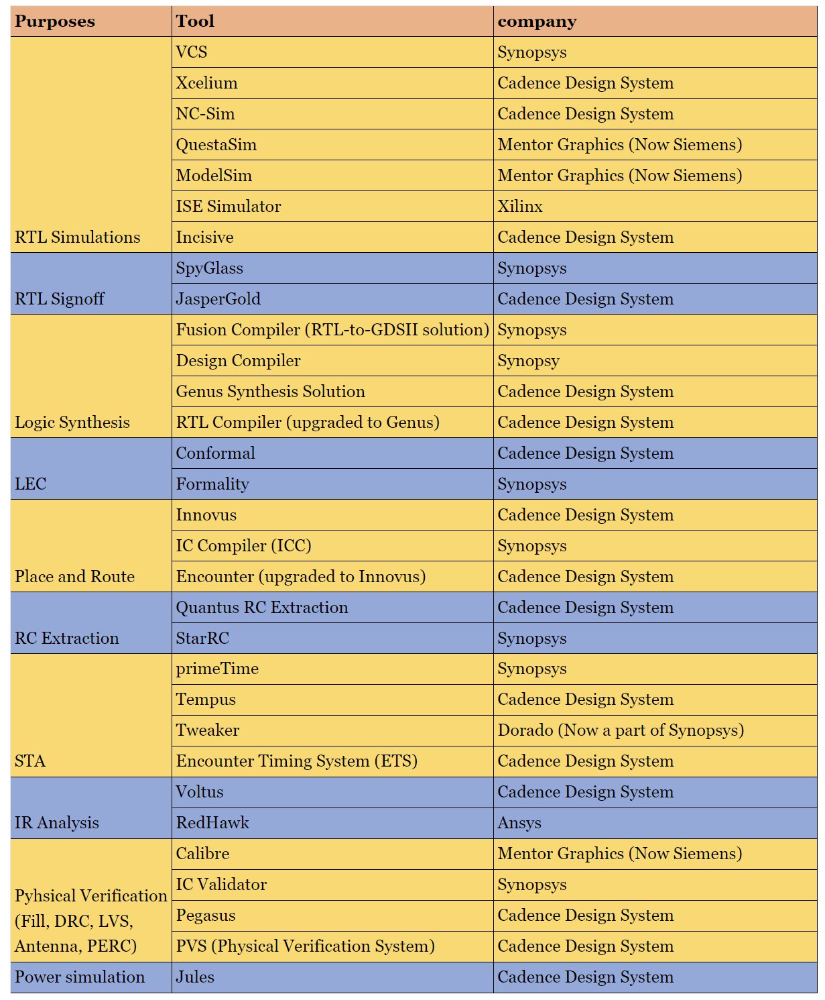
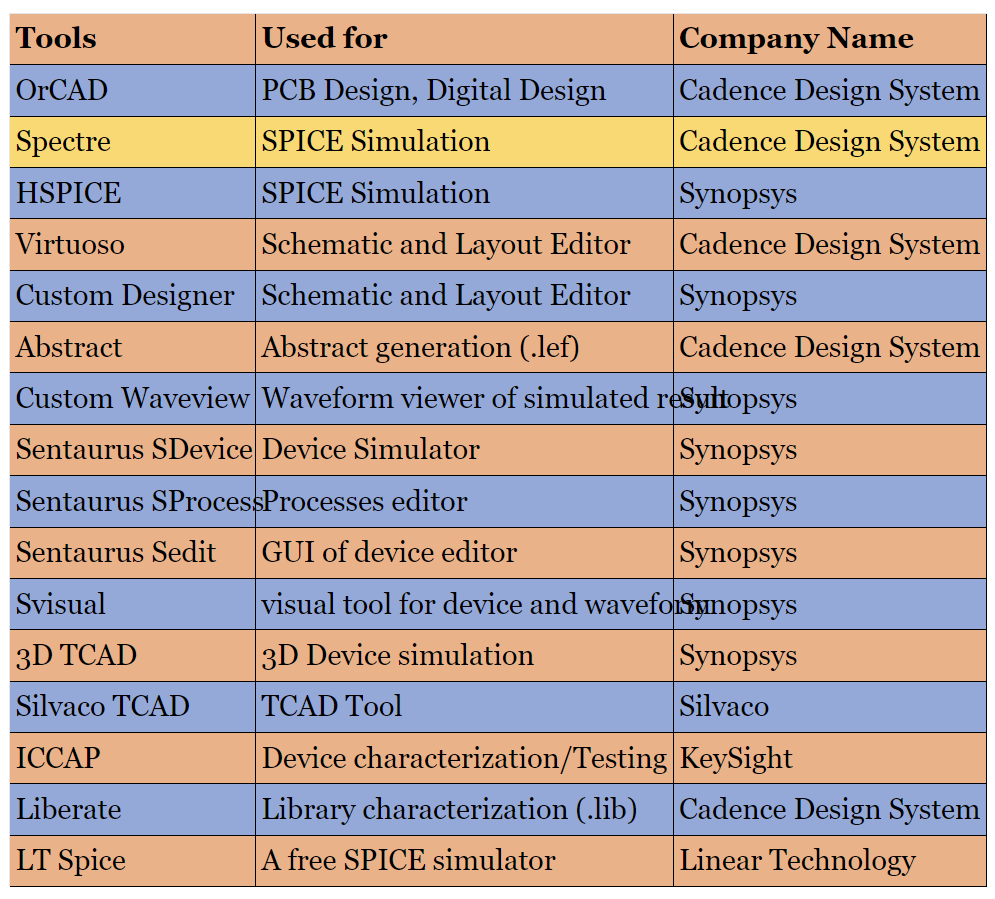

# 在ASIC行业中的EDA工具
April 10, 2021 by [Team VLSI](https://teamvlsi.com/author/team-vlsi)

我们注意到当一个人进入ASIC行业时，他/她会遇到来自不同EDA公司的各种EDA工具。对于有经验的专业人士来说，工具/公司的名称很容易记住，但对于新手来说，他们经常会忘记名称，因为这对他们来说是新的。还注意到，有时面试官会询问候选人所使用的工具名称，只是为了了解他们探索过哪些领域。尽管记住工具的名称并不能定义候选人的智力水平，但如果你不能告诉面试官你所使用的工具名称，那么在面试官面前就不会留下好印象。始终了解一些超出您最初经验范围的信息是有益的。例如，一个人可能只使用过一种STA工具，比如primeTime，但了解行业中还在使用哪些其他工具是很好的。

本文将介绍ASIC行业广泛使用的主要EDA工具，用于不同目的。每个工具都有其在其他工具上的专长之处，但这不是本文的内容。我们不打算对它们进行比较。在这里，我们将了解ASIC行业中用于各种目的的热门工具及其公司名称。

请注意，在该行业中只有少数几家EDA公司存在，因为如果我们回顾EDA公司的历史，我们会发现在过去发生了许多兼并和收购事件。许多新公司过去推出了他们的新创新工具，但不知何故这些公司被这个行业的大玩家收购，最终，该行业中主要的EDA公司数量非常有限，即Cadence Design System、Synopsys、Mentor Graphics（现为西门子）等几家。

在这里，我们将根据实用性对主要工具及其供应商进行分类。我请求我的读者注意，更新正在进行中，每年都会推出许多新工具，因此，如果我遗漏了重要内容，请在评论中添加，我将继续更新列表。

  

这里还有一些有用的工具，如表：

  

## 谢谢

原文链接：https://teamvlsi.com/2021/04/eda-tools-in-asic-industry.html