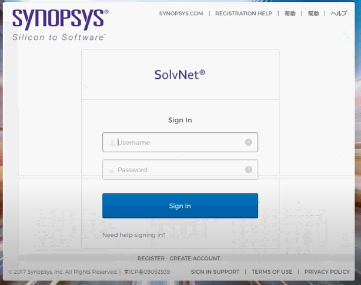
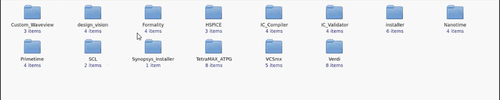
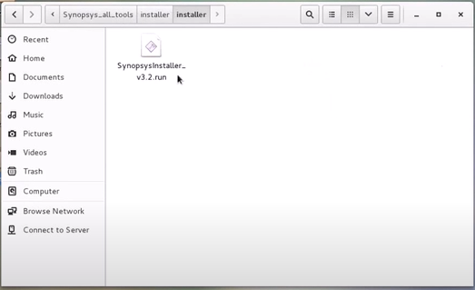
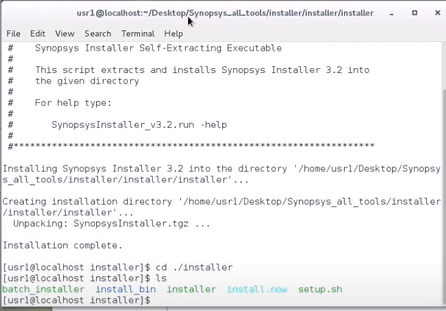
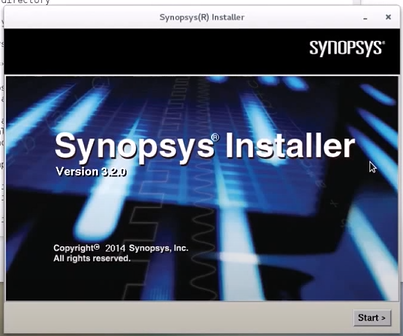
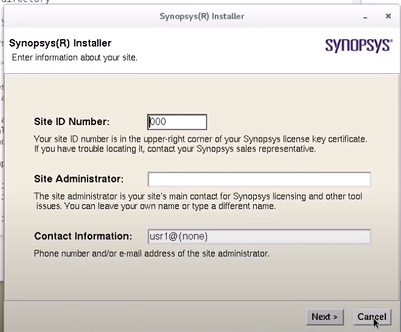
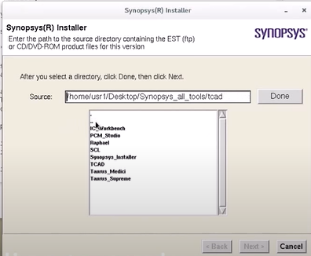
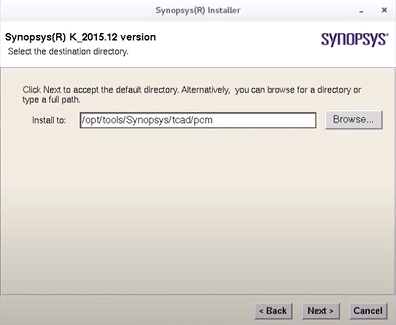

# Synopsys EDA工具的安装
June 5, 2021 by [Team VLSI](https://teamvlsi.com/author/team-vlsi)

大多数在VLSI行业中使用的EDA工具都是为UNIX操作系统设计的。这些工具必须需要许可证才能运行，可以从EDA公司或授权销售和支持公司购买。Synopsys工具可以从www.synopsys.com或授权的销售和支持合作伙伴www.eigen.in（印度）购买。

一旦购买了工具，他们会在他们的网站上提供登录凭据。使用登录凭据可以将许可证和工具下载到您的本地机器/服务器上。我们还可以在许可证到期时更新许可证，并可以使用登录凭据从网站上下载任何工具的最新版本。对于Synopsys工具，我们需要登录到他们的官方网站https://solvnet.synopsys.com下载工具和许可证。

通常，EDA公司提供支持来安装工具并在出现任何问题时提供帮助，但最好了解工具的安装过程和基本调试，以便自己管理工具。接下来的部分将描述如何在本地机器/服务器上下载和安装Synopsys工具。

## 步骤1：下载Synopsys安装程序、SCL和工具设置文件

访问https://solvnet.synopsys.com，并使用您的登录凭据登录。

<div style="text-align:center;">
  
  <h5> Solvenet登录 <h5>
</div>

登录后，您需要下载：

1. Synopsys安装程序（一个提供良好GUI界面以安装工具的应用程序）
2. SCL（Synopsys通用许可证）
3. 您拥有许可证并希望安装的所有EDA工具。
4. Synopsys许可证（如果尚未设置）

<div style="text-align:center;">
  
</div>

## 步骤2：启动Synopsys安装程序GUI

**步骤2.1**：以root权限打开终端，并转到已下载Synopsys安装程序的目录。

<div style="text-align:center;">
  
</div>

**步骤2.2**：为synopsysInstaller提供执行权限。

`chmod 755 synopsysInstaller_V3.2.run`

**步骤2.3**：运行以下命令解压安装程序（-d开关用于创建一个目录）

`./synopsysInstaller_V3.2.run -d installer`

**步骤2.4**：进入上一步创建的安装程序目录，如果看到内容，将如下所示。
```
cd installer

ls installer
```
<div style="text-align:center;">
  
</div>

**步骤2.5**：现在我们必须通过以下命令以GUI模式启动安装程序。

`./installer -gui`

## 步骤3：提供源位置（安装设置目录）和目标位置（您想要安装工具的目录）

**步骤3.1**：在上述步骤之后，将打开一个GUI。现在当我们点击开始时，它将要求提供由Synopsys在购买工具时提供的站点ID。

<div style="text-align:center;">
  
</div>

<div style="text-align:center;">
  
</div>

步骤3.2：接下来，我们需要提供我们要安装的工具存放的源位置。

<div style="text-align:center;">
  
</div>

步骤3.3：接下来，我们需要提供我们要安装工具的目标位置。

<div style="text-align:center;">
  
</div>

步骤3.4：接下来，我们需要接受并继续，之后安装将开始。

以相同方式，我们可以安装所有工具。安装完毕后，我们需要配置许可证并将所有工具的路径设置为一个bashrc/cshrc文件。这将在单独的文章中解释。

## 谢谢

原文链接：https://teamvlsi.com/2021/06/installation-of-synopsys-eda-tools.html