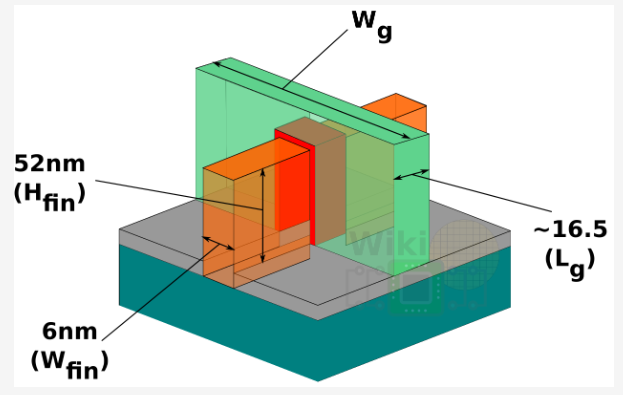

# TSMC 7nm、16nm和28nm技术节点比较
September 24, 2021 by [Team VLSI](https://teamvlsi.com/author/team-vlsi)

在开始本文之前，我想说这个话题非常敏感，我们不应透露任何晶圆厂的数据。因此，与其对你知道但我没有提供的任何数据发表评论，你可以通过邮件与我联系并附上参考链接。撰写本文的目的仅是以简单方式让准备进入VLSI行业的新人了解这个领域。

请注意，本文中未添加任何非公开领域的数据。你会注意到，我有意留空了许多字段，你可能知道，但晶圆厂尚未在公共领域披露这些数据。

因此，本文只是收集了不同网站上可用的各种数据，而不是我的任何数据。我将在本文末尾提供所有参考文献，以及我从中收集这些信息的来源。我已经尽最大努力保持机密性，但如果你发现任何不适合发布的内容，请通过电子邮件告诉我们。

下面的图片可能会帮助你了解FinFET的各种参数。此图片来源于https://fuse.wikichip.org/news/2408/tsmc-7nm-hd-and-hp-cells-2nd-gen-7nm-and-the-snapdragon-855-dtco/

FinFET结构和尺寸

| S.N  | Parameters | 7nm | 16nm | 28nm |
|---|------|------|------|------|
|A|	Transistor wise|
|1|	Transistors|	4th Gen FinFET |	FinFET	|Planner MOSFET
|2|	Gate Length (Lg)|	16 nm	|34 nm	|24 nm
3| Fin Width (Wfin)|	6 nm	|	|NA
4|	Fin Heigth (Hfin)|	52 nm	|37 nm	|NA
5|	Fin Pitch (Pfin)	|30 nm	|48 nm	|NA
6|	Contacted Poly Pitch (CPP)|	57 nm (HD) 64 nm (HP)	|90 nm	|117 nm
7|	W effective|	3.66		
8|	Minimum Metal Pitch (MMP)|40 nm	|64 nm	|90 nm
9|	Standard Cell Height|	240 nm (6T)		
10|	Transistor Density|	91.2 M/mm2|	28.9 M/mm2	
11|	6T SRAM bit cell size|	0.027 um2|	0.074 um2|	0.127 um2 (HD)
12|	Contact Trench Fill|	Cobalt|	Tungsten	
13|	Opertating Voltage|		|750 mV|	800mv and 1V
B|	Metal wise|
14|	Total Metal Layers|	17|	|	10
15|	Double Patern Layers|	7 (Fin, Poly, M0, M1, M2, M3, M4)		
16|	Patterning|	Fins (SAQP) Poly to M4 (SADP) Rest Single	|	|DP
17|	DUV/EUV|	193nm DUV + 13.5nm EUV	|193nm DUV	|193nm DUV
18|	Via Pillers	|Yes	|No	
19|	PG Routing|	Dual M1 PG Structure|	
C|	General|
20|	Mass Production Year|	Q2 2018|	2015|	Q4 2011
21|	Speed Improvement	|30%, comapre 16nm with same power	| 30%, comapre 16nm with same power & 40% , compare to 28nm with same power |40% , compare to 28nm with same power
22|	Power Reduction	|-55% compare to 16nm with same speed	 | -55% compare to 16nm with same speed &  -55% compare to 28nm with same speed | -55% compare to 28nm with same speed
23|	Density |	3.3X compare to 16nm	| 3.3X compare to 16nm
24|	Cut metal | Area reduction through Cut metal layers. Routers are cut metal aware

## 参考文献

https://en.wikichip.org/wiki/7_nm_lithography_process
https://fuse.wikichip.org/news/2408/tsmc-7nm-hd-and-hp-cells-2nd-gen-7nm-and-the-snapdragon-855-dtco/
https://en.wikichip.org/wiki/16_nm_lithography_process
https://www.tsmc.com/english/dedicatedFoundry/technology/logic/l_28nm
https://en.wikichip.org/wiki/28_nm_lithography_process
https://community.cadence.com/cadence_blogs_8/b/breakfast-bytes/posts/tsmc2

## 谢谢

原文链接：https://teamvlsi.com/2021/09/tsmc-7nm-16nm-and-28nm-technology-node-comparisons.html#google_vignette