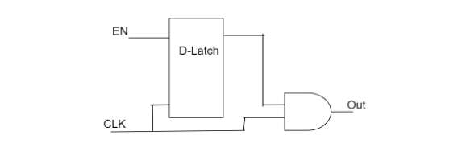
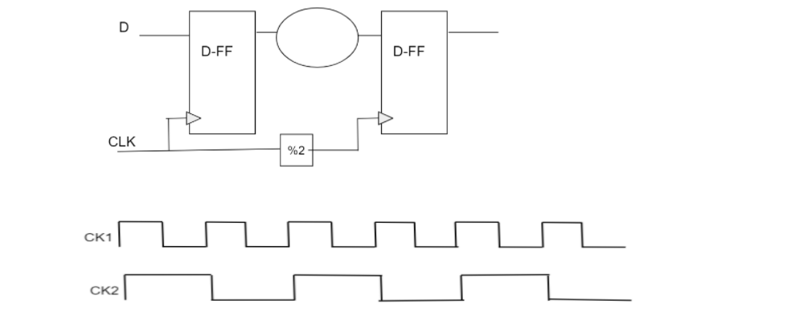
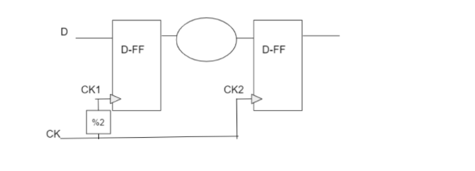

# 面试问题针对具有经验的物理设计工程师，问题集 - 9
September 8, 2021 by [Team VLSI](https://teamvlsi.com/author/team-vlsi)

代码：CDN4Y072021PD

经验水平：4年
职位：物理设计工程师

1. 介绍和物理设计相关经历
2. 您在7纳米和14纳米工艺节点中观察到了哪些主要区别？
3. 这个电路的功能是什么？（他在画图中画了原理图）

4. 您认为上述电路存在问题吗？如果有，您会建议进行哪些改进？
5. 当时钟门控电路添加到设计RTL/Synthesis/PnR中时？
 

6. 在开始布局之前，您要执行哪些检查？
7. 什么是库检查？
8. .lib文件中包含哪些信息？
9. 如何在.lib文件中定义单元的时序？
10. 如果.lib文件丢失但是单元的.lef文件可用怎么办？同样地，如果.lef文件丢失但是.lib文件存在怎么办？
 

11. 我们如何为任何块定义核心区域？
12. 我们如何决定块的高度和宽度？
13. 在宏放置中需要遵循哪些准则？
14. 是否有关于毗邻宏的规则？
15. 工具在布局阶段具体执行哪些步骤？
 

16. 为什么我们要使用边界单元？
17. 为什么我们不能在每一行末尾使用放置块障碍物放置在边界单元上？
18. 您的块中目标延迟是多少，实际达到了多少？
19. 您能解释一下ccopt方法吗？
20. 在时钟树中您使用了哪种Vt单元的类型？
 

21. 在您的不同项目中使用了哪种类型的降额法？
22. 为什么我们在已经使用AOCV降额时开始使用POCV？
23. 什么是网络屏蔽？它是如何工作的？
24. 您在块中使用了屏蔽吗？
25. 什么是NDR？
 

26. 屏蔽和NDR之间有什么区别？我们只能使用这两者中的一个吗？
27. 您将时钟门控单元放在靠近接收端还是发送端处？
28. 您能告诉我将ICG放置在靠近接收端和靠近发送端的优缺点吗？
29. 什么是CPPR？
30. （在画图中绘制了一个图表）在这个图表中，您能告诉我在哪些边缘之间将检查建立和保持时间？

 

31. 如果我们改变情景如下，现在在哪些边缘之间将检查建立和保持时间？

32. 什么是内部功耗和开关功耗？
33. 单元的阈值电压对内部功耗和开关功耗有什么影响？
34. IR降对单元延迟有什么影响？
35. 您如何修复静态IR降？
 

36. 在您最近的项目中，动态IR降的限制是多少？

## 谢谢

原文链接：https://teamvlsi.com/2021/09/interview-questions-for-experienced-physical-design-engineer-question-set-9.html