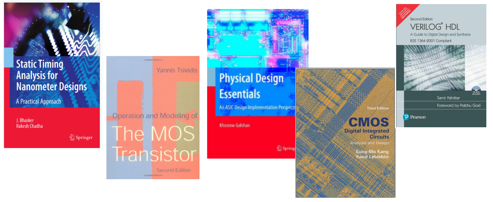

# 对于物理设计工程师来说，最好的5本书
October 8, 2020 by [Team VLSI](https://teamvlsi.com/author/team-vlsi)

如果你想加深对任何领域的理解并在其中成长，书籍可以成为你最好的伙伴。阅读好书是提高理解力、深入了解任何领域知识的有效方法。因此，我想说，半导体行业并不例外。如果你想深入了解，仅凭工作经验和学习是不够的，你必须养成阅读的习惯。

半导体行业在技术发展方面非常迅速。近年来我们见证了许多这样的发展，比如许多低节点、多重曝光、DUV到EUV等。许多基本概念需要从书籍中阅读和理解，许多可以从最近的期刊/会议出版物和文章中阅读。在半导体专业人士和研究人员社区中有许多很受欢迎的好书。在这篇文章中，我想推荐每个物理设计工程师必读的前5本书。

**如果你希望购买任何书籍，我已经搜索到了这些书的畅销版、最佳版本和最优惠价格，并在这里提供了链接。你可以通过这些链接在亚马逊购买这些书籍。**

### 1. "Static Timing Analysis for Nanometer Designs" by J. Bhashkar and Rakesh Chadha

[立即购买](https://amzn.to/2T4ThKW)

在这个列表中，我首先推荐的是一本名为 "Static Timing Analysis for Nanometer Designs" 的非常流行的书，作者是J. Bhashkar和Rakesh Chadha。这本书基本上涵盖了所有与静态时序相关的概念以及许多SDC命令。除了STA之外，还涵盖了许多与标准单元时序和时钟相关的好概念，并且解释得非常好。

这本书的主要内容如下：
- 第1章：介绍
- 第2章：STA概念
- 第3章：标准单元库
- 第4章：互连寄生参数
- 第5章：延迟计算
- 第6章：串扰和噪声
- 第7章：配置STA环境
- 第8章：时序验证
- 第9章：接口分析
- 第10章：稳健性验证

### 2. "Physical Design Essentials: An ASIC Design Implementation Perspective" by Khoshrow Golshan

[立即购买](https://amzn.to/3iPJTSh)

我推荐的第二本书是由Khoshrow Golshan撰写的 "Physical Design Essentials"。这本书对于计划进入物理设计领域的所有新手来说都非常有用。本书解释了行业常见的ASIC设计流程、布局、布线、时钟树合成、路由、验证和测试。

这本书的主要内容如下：
- 第1章：库
    -  1.1 标准单元
    - 1.4 库特性化
- 第2章：布局规划
    - 2.1 技术文件
    - 2.3 设计约束
    - 2.4 设计规划
    - 2.5 垫片放置
    - 2.6 电源规划
    - 2.7 宏单元放置
- 第3章：布线
    - 3.1 全局布线
    - 3.2 详细布线
    - 3.3 时钟树合成
    - 3.4 电源分析
- 第4章：路由
    - 4.1 特殊路由
    - 4.2 全局路由
    - 4.3 详细路由
    - 4.4 抽取
- 第5章：验证
    - 5.1 功能验证
    - 5.2 时序验证
    - 5.3 物理验证
- 第6章：测试
    - 6.1 功能测试
    - 6.2 扫描测试
    - 6.3 边界扫描测试
    - 6.4 故障检测
    - 6.5 参数测试
    - 6.8 存储器测试

### 3. "CMOS Digital Integrated Circuits Analysis and Design" by Sung-Mo Kang and Yusuf Leblebici

[立即购买](https://amzn.to/2Fg6Hga)

这本书是学术界最受欢迎的书籍。这本书从MOS晶体管的基础开始，介绍了尺寸缩放、MOSFET建模、CMOS反相器特性、组合逻辑和时序逻辑、SRAM设计，然后是低功耗CMOS逻辑电路。

这本书的内容如下：

1. 介绍
2. MOSFET的制造
3. MOS晶体管
4. 使用SPICE建模MOS晶体管
5. MOS反相器：静态特性
6. MOS反相器：开关特性和互连效应
7. 组合MOS逻辑电路
8. 时序MOS逻辑电路
9. 动态逻辑电路
10. 半导体存储器
11. 低功耗CMOS逻辑电路
12. BiCMOS逻辑电路
13. 芯片输入和输出电路
14. VLSI设计方法
15. 可制造性设计
16. 可测试性设计

### 4. "The MOS Transistor" by Yanish Tsiwidis

[立即购买](https://amzn.to/30KCQUp)

这本书是学术界和行业中关于MOS晶体管的标准书籍之一。我个人感觉作者Yanish Tswidis是MOS晶体管之神。

第一张图片显示的是印度第三版，我想推荐你如果你还没有读过这本书，你一定要读一读。你可以通过下面的链接购买这本书。

Coursera网站上也有关于这本书的课程。

### 5. "Verilog HDL A Guide to Digital Design and Synthesis" by Samir Palnitkar

[立即购买](https://amzn.to/36LpAmA)

这本书是学习Verilog HDL的非常标准的书籍，非常受欢迎。无论你是在RTL设计上工作与否，你都必须阅读这本书，但你必须对RTL代码有一定的了解。

这本书的内容如下：

1. Verilog HDL的数字设计概述
2. 分层建模概念
3. 基本概念
4. 模块和端口
5. 门级建模
6. 数据流建模
7. 行为建模
8. 任务和函数
9. 有用的建模技术
10. 时间和延迟
11. 开关级建模
12. 用户定义原语
13. 编程语言接口
14. 使用Verilog HDL进行逻辑合成

这只是一份很短的书单，实际上，我的最爱书单还相当长。你可能会觉得我错过了一些重要的书。是的，没错，我将在另一篇文章中涵盖所有这些书。你可以在评论中提及你最喜欢的书的名字。

## 谢谢

原文链接：https://teamvlsi.com/2020/10/top-5-books-recommendation-for-physical.html