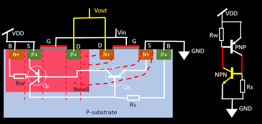
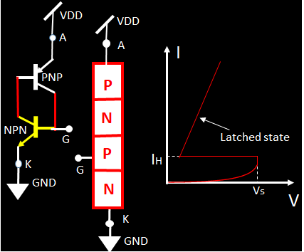
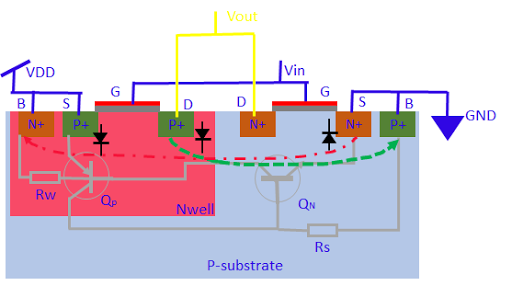

# CMOS逻辑中的Latch-up问题

May 10, 2020 by [Team VLSI](https://teamvlsi.com/author/team-vlsi)

什么是CMOS设计中的Latch-up问题？

简单来说，Latch-up问题可以被定义为在设计中从VDD到GND端形成一条直接路径，这将导致电源和地端之间的巨大电流流动。

## Latch-up形成：

在CMOS（互补金属氧化物半导体）电路内部，会形成两个寄生的BJT（双极晶体管），并以一种这样的方式连接起来，使得这些BJT形成一个PNPN器件或SCR（可控硅）或晶闸管。PNPN器件的形成如下图所示。

  

如上图所示，在n型井上形成了一个pMOS器件，而在p基片区域形成了一个nMOS器件。如果我们看到pMOS器件的源或漏极下方的区域，源或漏极是通过P+植入形成的，然后是n型井，再下面是p基片。因此，在这里形成了一个寄生的PNP BJT，其发射极是pMOS的源极，基极是n型井，集电极是p基片。类似地，在nMOS器件附近形成了一个寄生的NPN BJT，其发射极是nMOS的源极，基极是p基片，集电极是n型井。

这两个BJT以一种使它们形成PNPN器件的方式相互连接。PNP BJT的基极连接到NPN BJT的集电极，而NPN BJT的基极连接到NPN BJT的集电极。

PNPN器件通常处于关闭状态，并且通过它的电流非常小或没有。但是一旦PNPN器件由其门信号触发，就会开始有大电流通过它，并且即使去除了门信号，它也会继续流动。下图显示了PNPN器件的端子和特性。

  

技术上讲，Latch-up是指在CMOS电路中激活寄生BJT的现象，形成了电源和地端之间的低阻抗路径。这种低阻抗路径会吸引大电流并使集成芯片（IC）发热，从而导致IC永久损坏。

## Latch-up触发：

  

CMOS内部形成的PNPN器件可以通过各种方式触发。一旦PNPN器件通过任何方式被触发，Latch-up事件就会开始。以下是一些主要原因。

- 输出端口的噪声
- 静电放电（ESD）事件
- 电离辐射

考虑上图，假设由于噪声，输出电压已经超出了VDD，那么它将正向偏置pMOS的漏极和n型井之间的晶体管。一旦这个结正向偏置，P+区域就会开始向n型井注入空穴，这些空穴将被nMOS的body接触收集，因为它连接到GND。因此，这个事件将导致从pMOS的漏极到nMOS的body流动电流。由于上述电流的流动，nMOS的源端和其下面的基片之间将产生电压降。它将正向偏置nMOS的源和基片之间的pn结。这将再次开始从N+源向基片注入电子，这些电子将被连接到VDD的pMOS的body端收集，如红色虚线所示。因此，最终将启动一个链，接下来pMOS的源端和n型井将被正向偏置。以此方式，这两个BJT都被打开并形成了latch-up。

类似地，如果输出电压低于VDD，首先nMOS的漏极和基片之间的结将被正向偏置，然后它会使pMOS的源和n型井之间的结正向偏置，进一步使nMOS的源和基片之间的结正向偏置，这将使得两个BJT都打开并产生latch-up。

一旦CMOS设计中发生latch-up，大量电流将直接从VDD流向GND，并导致芯片失效。因此，我们必须保护芯片免受latch-up。在下一篇文章中，我们将讨论预防Latch-up问题的方法。

## 谢谢

原文链接：https://teamvlsi.com/2020/05/latch-up-is-in-cmos-design.html