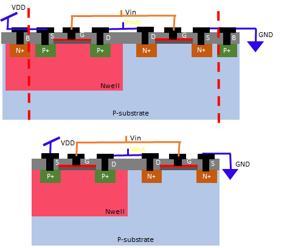
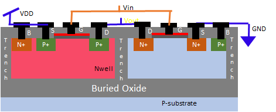
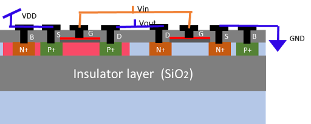

# CMOS逻辑中的防止Latch-up

May 18, 2020 by [Team VLSI](https://teamvlsi.com/author/team-vlsi)

在讨论Latch-up问题的预防技术之前，让我们首先回顾Latch-up问题的关键因素。以下两个因素对Latch-up问题至关重要。

-  n-well和p-substrate的高电阻
- β1 x β2 > 1

  
  <h5>图1 Latch-up的形成</h5>

图1显示了导致Latch-up的寄生BJT形成。n-well和p-substrate的电阻可以通过增加掺杂来减少，但这会严重降低器件性能。但是，我们可以减小寄生BJT的增益（β），从而防止Latch-up问题。一些流行的Latch-up预防技术如下。

- 防护环
- 井接地单元
- 隔离沟槽
- 外延层
- 逆向井掺杂
- 外延层和逆向井掺杂的组合
- mFDSOI技术
- ESD保护技术

## 1. 防护环：

  
  <h5>图2 防护环</h5>

如果输出电压低于VSS，并且nMOS的漏极与p-substrate之间的二极管变为正向偏置，那么来自漏极的电子开始注入到substrate中，并被pMOS的body收集。这会导致一个与电子流方向相反的电流。最终触发图1中所示的Qp晶体管。为了打破这种链条，在n-well中添加两组n+注入物，同时在p-substrate上添加p+注入物，如图2所示。这些将收集从nMOS漏极注入的电子，并阻止来自nMOS漏极流向pMOS body的电流。这样就阻止了触发Qp BJT。

类似地，如果输出电压高于VDD，并且pMOS的漏极开始向n-well注入空穴并被nMOS的body收集，那么会触发Qn BJT。但是通过添加防护环，这些空穴将被防护环收集，并阻止Latch-up。

## 2. 井接地单元：

在无接地标准单元设计中，为了防止Latch-up，我们需要将n-well接地到VDD，将p-sub接地到VSS。这些井接地单元将n-well接地到VDD，p-sub接地到VSS。图3显示了无接地单元和有接地单元的横截面，图4显示了井接地单元和无接地标准单元的布局。

  
  <h5>图3 井接地电池和无接地电池的横截面</h5>

  
  <h5>图4 无接地电池和井接地电池的布局</h5>

井接地电池按照技术库中定义的最大距离规则，在标准单元行中以固定间隔放置。

## 3. 氧化物沟槽隔离：

在这种技术中，nMOS和pMOS使用埋氧化物和氧化物沟槽进行隔离。深处创建水平埋氧化物，然后创建垂直氧化物沟槽，并将两者连接在一起以分隔n-well和p-substrate。氧化物沟槽是绝缘体，因此氧化物沟槽阻止了PNPN器件的形成。图5显示了氧化物沟槽隔离的横截面。

  
  <h5>图5 沟槽隔离的横截面</h5>

## 4. 外延层：

在这种技术中，低掺杂的p-外延层（称为P-）生长在P-substrate（称为P+）上。P-外延层为少数载流子提供低阻抗路径，可防止Latch-up触发。这种技术也称为P on P+。图6显示了CMOS使用外延层的横截面。

  
  <h5>图6 使用外延层的CMOS的横截面</h5>

这项技术的唯一问题是，生长外延层是一个复杂的过程。另一种替代方法是可以使用外延晶片来实现这一目的。

## 5. 逆向井掺杂：

在正常的n-well掺杂过程中，掺杂浓度在表面最高，随着井深度的增加而降低。但是在逆向井掺杂过程中，对掺杂浓度在深度上有非常精确的控制，我们在n-well的深处有峰值掺杂浓度，而不是在表面。图7显示了正常掺杂和逆向井掺杂的掺杂剖面。

  
  <h5>图7 逆梯度井掺杂的掺杂剖面</h5>

逆向井掺杂是在正常n-well底部进行的，如图8所示。该区域具有高掺杂浓度，并且创建了一个低电阻路径。取自N+掺杂的body连接延伸到这个高掺杂区域。因此，在n-well下方形成了一个低电阻路径，阻止了PNPN器件的触发。图8显示了逆向井掺杂的横截面。

  
  <h5>图8 逆梯度井掺杂的CMOS</h5>

## 6. 外延层和逆向井掺杂的组合：
我们可以将外延层和逆向井掺杂两种技术结合使用，这也是一种非常有效的防止Latch-up问题的方法，但是该过程稍微复杂。

## 7. SOI技术：
在SOI（绝缘体硅）技术中，氧化物层位于源漏掺杂下方，并阻止寄生BJTs的形成。因此，SOI技术完全消除了Latch-up问题。图9显示了SOI技术中的CMOS的横截面。

  
  <h5>图9 SOI技术中的CMOS</h5>

我们可以将外延层和逆向井掺杂两种技术结合使用，这也是一种非常有效的防止Latch-up问题的方法，但是该过程稍微复杂。

这些是在CMOS技术中防止Latch-up的方法。每种技术都有其优缺点。

## 谢谢

原文链接：https://teamvlsi.com/2020/05/latch-up-prevention-in-cmos-design.html