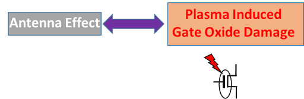
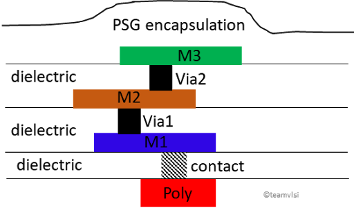
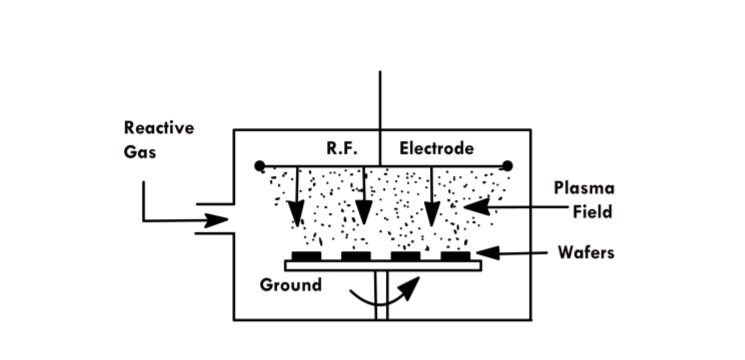

# 在VLSI中的天线效应

May 28, 2020 by [Team VLSI](https://teamvlsi.com/author/team-vlsi)

MOS晶体管的栅氧化物是MOS器件中最敏感的部分。在ASIC的制造过程中需要特别小心，以保护它免受制造过程和ASIC运行过程中的任何损坏。天线效应是一种现象，可能会在制造过程中对MOS的栅氧化物造成损害，特别是由于等离子刻蚀过程。在本文中，我们将详细调查天线效应现象及导致该效应的原因。

### 什么是天线效应？

天线效应这个术语可能不会给您正确的直观感受，可能让您联想到电磁辐射或发射-接收概念，但这里情况不同。因此它还有另一个流行的名称，即“等离子诱导栅氧化物损伤”，这为该效应提供了正确的直觉。正如该名称本身所示，这是由于等离子刻蚀过程中对栅氧化物造成的损害所引起的效应。

  

尽管天线效应发生在芯片的制造阶段，特别是在等离子刻蚀过程中，但预防机制应该在物理设计阶段设定。制造实验室提供了天线规则文件，必须在物理签核阶段进行检查，设计应按照天线规则进行清理。

在芯片制造流程中，首先进行前端制程（FEOL），涉及所有MOS晶体管的制造。一旦FEOL制程完成，就开始进行后端制程（BEOL）的制造，涉及金属互连的制造。天线效应出现在BEOL制程时。

在集成电路制造过程中，等离子刻蚀工艺用于制造金属互连。等离子刻蚀是一种干法各向异性刻蚀过程，用于选择性刻蚀。等离子含有高能离子和自由基，在金属刻蚀过程中会被金属互连收集。图1显示了MOS结构和等离子被互连收集的结构。

  
  <h5>图1 MOS结构和等离子体刻蚀</h5>

电荷积累的数量取决于互连的表面积。这些收集的离子增加了互连的电位，如果互连连接到多晶栅，最终会增加栅极的电位。由于栅极电位的增加，可能会通过栅极氧化物形成漏电路径到衬底，以平衡栅极上额外积累的电荷。如果积累的电荷量较大，通过栅极氧化物的漏电路径可能会破坏栅极氧化物，导致MOSFET永久损坏，或者在栅极氧化物中产生电荷捕获，进而导致许多副作用，如早期栅极氧化物破坏、迁移率下降和阈值电压偏移。

栅极氧化物损坏主要是由于金属互连的等离子刻蚀引起的，因此这种效应也被称为“等离子诱导栅极氧化物损伤”或“天线效应”。收集等离子体（离子）并连接到栅极的金属互连基本上被称为天线。重要的是要了解互连的制造过程，下面将在下一节中进行解释。

### 互连制造过程

  

在多晶硅上，沉积一层介质，然后进行接触切割。在接触上，沉积金属-1并进行图案化和刻蚀多余的金属，并用介质填满整个区域。在制造金属-2之前，对通过介质进行切割并用通过介质填充，然后在通过介质上沉积金属-2。同样的方式再次进行金属2的刻蚀，并用介质填充。这个过程将根据金属层数的数量重复多次。在所有金属处理结束时，进行PSG封装如图所示。

对于每个金属层，通过相应的通孔/接触，基本上执行三个步骤。

- 沉积
- 刻蚀
- CMP

在第一步中，金属被沉积，第二步中，不需要的金属区域被刻蚀掉，第三步，进行CMP（化学机械抛光）。

现在让我们更多地谈谈刻蚀过程。基本上有两种刻蚀过程，一种称为用化学品进行湿法刻蚀，另一种是用气体进行干法刻蚀。干法刻蚀提供完全的各向异性刻蚀，其中横向刻蚀速率为零。最受欢迎的等离子刻蚀是一种干法刻蚀过程，下面简要介绍。

### 等离子刻蚀
这里将简要介绍等离子刻蚀过程，以便了解该过程。等离子刻蚀涉及以适当的气体混合物高速喷射到样品的等离子体流。等离子源称为蚀刻物种，可以是带电离子、中性原子或自由基。在蚀刻过程中，等离子体从目标材料与等离子体生成的反应性物种之间的化学反应中产生挥发性蚀刻产物。等离子刻蚀的基本设置如下图所示。

  
  <h5>图2 等离子刻蚀设置<h5>

  
  <h5>图3 半导体制造中的等离子刻蚀过程置<h5>

顶部和底部电极大小相等且平行。底部电极固定晶圆并接地。由于施加了射频电压和高压（P=100mT至1T），在两个电极之间建立了等离子体。高能电子与气体分子反应，并产生各种反应性物种、中性物种和离子。中性物种提供化学刻蚀，离子提供物理刻蚀，反应性物种和离子的组合提供离子增强刻蚀。

我们将在下一篇文章中讨论天线效应的预防技术。

## 谢谢

原文链接：https://teamvlsi.com/2020/05/latch-up-prevention-in-cmos-design.html