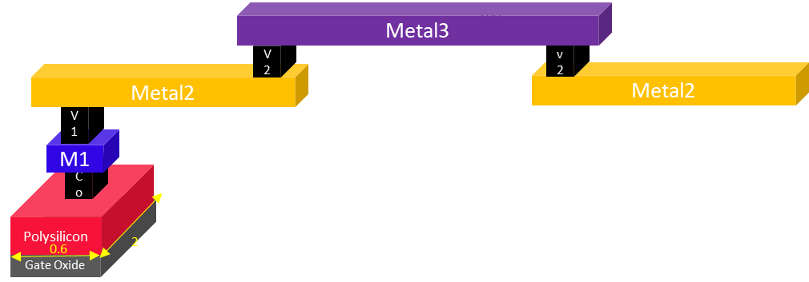
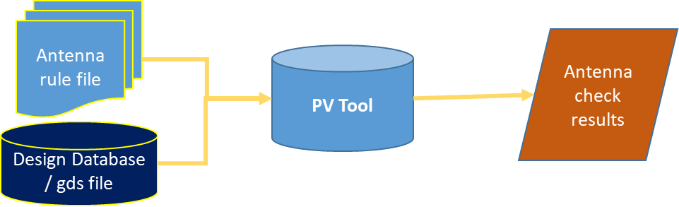
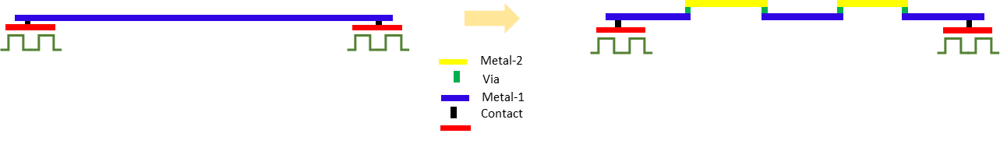
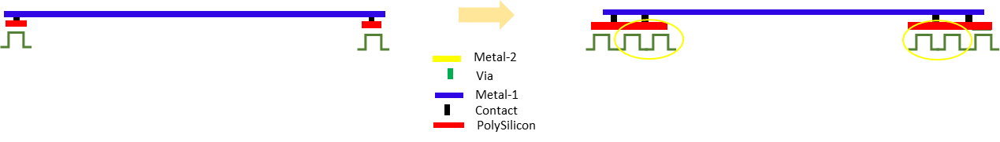

# VLSI设计中的天线预防技术

June 14, 2020 by [Team VLSI](https://teamvlsi.com/author/team-vlsi)

在上一篇文章中，我们讨论了天线违规问题。天线违规是如何发生的，以及引起天线效应或等离子体诱导栅氧化物损伤的机制是什么。因此，在本文中，我们将讨论天线效应的解决方案，即如何预防天线违规。

## 如何预防天线违规？

在讨论预防之前，让我们回顾一下天线效应的根本原因，然后理解预防技术将变得容易。天线效应主要是由于等离子体刻蚀金属互连过程中与晶体管栅极连接的金属互连上过多的电荷积累所致。积累电荷的数量取决于与栅极连接的金属互连的面积。过多积累的电荷通过薄栅氧化物被释放，并导致栅氧化物永久损坏。

基于上述天线违规原因，可以采用以下三种方法来预防该问题。第一种方法是通过减少与晶体管栅极连接的金属互连的面积来减少电荷积累。第二种方法是增加栅区面积，使得（金属面积）/（栅区面积）的比值小于允许的最大金属对栅区面积比。这可以通过将浮动栅连接到相关网络来实现。第三种方法是为排放晶体管栅极上积累的电荷提供替代路径，即添加天线二极管。

预防天线违规的三种基本技术如下：
- 金属跳跃
- 浮动栅连接
- 天线二极管

现在重要的是了解天线规则和违规情况。我们将在查看天线规则后回到这一点。

## 天线规则
流程设计工具包（PDK）附带一些规则文件。天线规则集是规则文件的一部分。在提交前必须检查所有规则集。在天线规则中，最常见的规则是天线比。
- 天线比是连接到栅极的金属面积与栅总面积之比。
- 天线比的定义如下：
  - 天线面积 / 栅面积 < 最大天线比

天线规则违规示例：

  

考虑以下三种情况：

**案例1**：假设金属2的长度为200μm，宽度为1μm，如上图所示，这根金属导线连接到一个晶体管的栅极。该晶体管的栅宽度为2μm，长度为0.6μm。

因此：
- 总金属面积= 200×1 = 200μm^2
- 总栅面积= 0.6×2 = 1.2μm^2
- 天线比= 200/1.2 = 166.2

**案例2**：假设情况与案例1相同，但金属2连接到4个晶体管而不是1个。
- 总金属面积= 200×1 = 200μm^2
- 总栅面积= 0.6×2×4 = 4.8μm^2
- 天线比= 200/4.8 = 41.66

**案例3**：假设金属2被分成两段，每段50μm，并通过金属3连接，如下图所示。这种连接称为金属跳跃。

  

- 总金属2面积=（50×1）×2 = 100μm^2
- 总栅面积= 0.6×2 = 1.2μm^2
- 天线比= 100/1.2 = 83.33

假设天线比规定为100。因此，在上述三种情况中，案例1违反了天线规则，而案例2和案例3没有违反天线规则。

## 如何修复天线违规

上述示例显示，如果通过增加连接的晶体管数量来增加栅面积，将减少天线比。另一种方法是通过减少天线面积来修复天线违规，即在金属之间断开并插入跳线。因此，我们可以通过两种方式减少天线比：
1. 减少天线面积-插入跳线或金属跳跃
2. 增加栅面积-插入虚拟晶体管

### 天线检查（物理验证）

  

- 天线检查验证布局是否符合规则文件中的天线规则。在提交之前，还需要执行许多其他检查，如DRC、ERC、LVS等，这些统称为布局的物理验证。
- 物理验证工具（如Calibre，Assura，IC Validator）针对适用天线规则的所有层验证天线规则。
- 天线规则在很大程度上依赖于工艺节点。

### 天线违规修复措施

**1. 插入跳线或金属跳跃**

  

将长金属线切割成小段，并使用跳线将它们引导到其他金属层中，如上图所示。此过程称为插入跳线或金属跳跃。

**2. 插入虚拟晶体管**

  

如上图所示，可以通过插入虚拟晶体管来增加有效栅面积。这将降低天线比并有助于满足天线规则。在实际情况中，我们可以添加一个浮动的反向器/缓冲器。我们将缓冲器/反向器的输入连接到相关网络，并将输出保持浮动。这将增加有效栅面积并有助于解决天线违规问题。

**3. 插入天线二极管**

  

- 天线二极管-反向偏置
- 放置位置-靠近栅终端
- 等离子体刻蚀400-800摄氏度
- 高温-二极管热不稳定
- 在等离子体刻蚀过程中-反向饱和区
- 在反向饱和区-像电阻路径一样
- 正常操作范围-40到125摄氏度
- 标准单元-天线二极管单元
- 单端口标准单元，N+在Psub上。

本文中讲解了各种预防天线违规的技术。我试图以最简单的方式解释它们，希望您能够全面理解。

## 谢谢

原文链接：https://teamvlsi.com/2020/06/antenna-prevention-techniques-in-vlsi.html