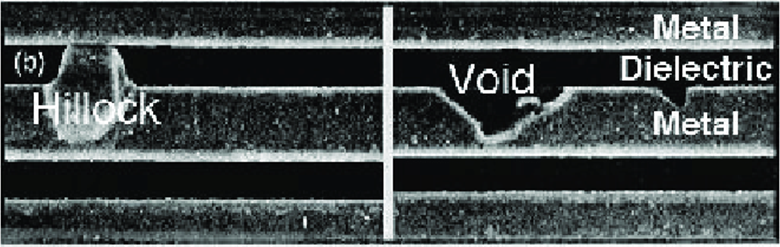

# VLSI设计中的电迁移效应

August 27, 2020 by [Team VLSI](https://teamvlsi.com/author/team-vlsi)

电迁移是一个重要问题，特别是在技术节点较低的情况下，金属互连的横截面积非常小。在本文中，我们将讨论电迁移现象，电迁移的影响以及预防电迁移问题的方法。

### 电迁移：
当高电流密度通过金属互连时，电流载体电子的动量可能在它们之间碰撞时转移到金属离子身上。由于动量转移，金属离子可能会沿电子运动方向漂移。金属离子从原始位置漂移的现象称为电迁移效应。

电流密度J被定义为单位横截面积上的电流。

<b><big> J = I/A </big></b>

其中:

&emsp;I为电流，A为互连横截面积。

随着技术节点的缩小，金属互连的横截面积也在缩小，电流密度在较低节点中大幅增加。自90纳米技术节点以来，电迁移一直是一个问题，甚至在更低的技术节点28纳米或更低的节点中变得更糟。

### 电迁移现象：

  
  <h5>图1 电迁移现象</h5>

图1显示了电迁移效应的现象。在金属互连之间施加电位差，设置一个从阳极侧到阴极侧的电场。这个电场导致电子朝着电场的反方向移动。电子的这种动量引起电流中的流动。这些移动的电子具有动量，当它们与金属离子碰撞时，金属离子感受到两个相反方向的力，如图所示。如果电流密度很高，由于电子风的力大于电场的力。

取决于电流密度，受影响的金属离子开始向电场的反方向漂移。如果电流密度很高，互连可能会立即受到电迁移的影响，或者有时效果可能在几个月/几年的运行后才会出现，这取决于电流密度。因此，ASIC的可靠性将取决于这种电迁移效应。

**失效平均时间**（MTTF）是集成电路寿命的指标。MTTF使用Black方程计算如下。

  

其中：
&emsp;A = 横截面积
&emsp;J = 电流密度
&emsp;N = 缩放因子（通常设置为2）
&emsp;Ea = 激活能
&emsp;K = 玻尔兹曼常数
&emsp;T = 开尔文温度

### 电迁移的影响：
一旦金属离子开始从原始位置移动，它们将在互连中造成问题。这可能导致离子在某个位置过多积累或者离子不足。因此，互连中可能出现膨胀或虚空。

  
  <h5>图2 互连中的膨胀和虚空形成</h5>

图2显示了膨胀和虚空的形成。

**虚空**：如果流入的离子通量小于流出的离子通量，则会在互连中创建一个虚空。虚空可能导致互连中的不连续，导致开路。

**膨胀**：如果流入的离子通量大于流出的离子通量，则会导致离子积聚并在互连中创建膨胀。膨胀可能增加金属互连的宽度并触及相邻的金属互连，可能导致短路。

### 电迁移的预防技术：
随着技术节点的缩小，使用的互连也在改变。最初，纯铝被用作互连，然后行业开始使用Al-Cu合金，后来转向铜互连。与铝互连相比，铜互连可以承受大约5倍的电流，同时保持类似的可靠性要求。

在物理设计过程中，以下技术可用于预防电迁移问题。

- 增加金属宽度以降低电流密度
- 降低频率
- 降低供电电压
- 保持导线长度短
- 减少时钟线中的缓冲区大小

为了预防电迁移问题，物理签收阶段将执行电迁移检查，以符合晶圆厂提供的电迁移规则。

## 谢谢

原文链接：https://teamvlsi.com/2020/08/electromigration-effect-in-vlsi.html