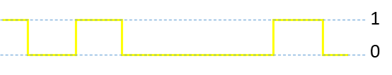
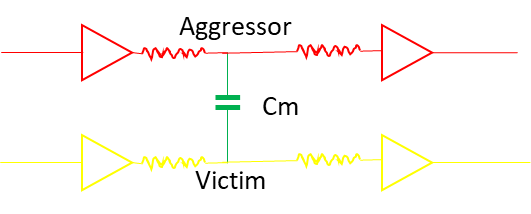
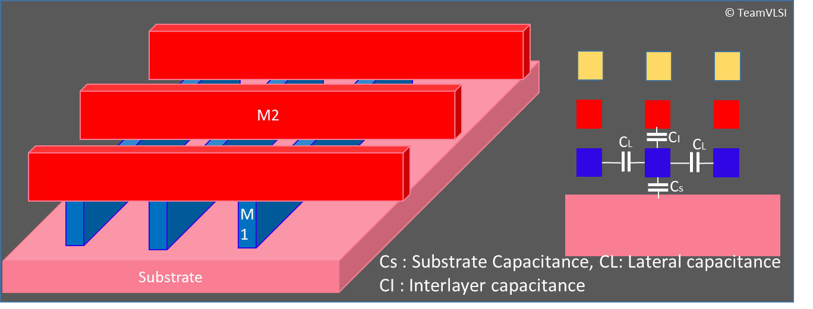

# VLSI中的信号完整性和串扰效应

June 17, 2020 by [Team VLSI](https://teamvlsi.com/author/team-vlsi)

根据Collett International Research Inc.进行的研究，五分之一的芯片由于信号完整性问题而失败。

在本文中，我们将讨论VLSI设计中非常重要的问题，即信号完整性和串扰，这些问题是当今许多ASIC失败的原因。本文将讨论信号完整性和串扰。串扰的影响和预防技术将在接下来的两篇文章中讨论。

### 信号完整性：
信号可以定义为以波/脉冲形式传输的信息，用于两个点之间的通信。在数字形式中，它可以是状态1（高电平）或状态0（低电平），如下图所示。

  
  <h5>图1 数字信号</h5>

根据定义，完整性意味着“完整或未受损”。或者我们可以说，在不失真的情况下，随着时间的推移保持任何事物的实际形式。因此，信号完整性可以定义为在从一个点传输到另一个点时，信号的整体复制而没有任何质量上的失真。或从更广泛的角度来看，我们可以说信号完整性是电信号可靠携带信息并抵抗来自附近信号的高频电磁干扰的能力。

信号完整性解决数字设计中的两个问题：

- 信号的时序 - 信号是否在预定时间到达目的地？
- 信号的质量 - 信号到达时，质量是否良好？

**在高速数字设计中，“时序”非常重要。**

因此，信号完整性的目标是确保可靠的高速数据传输从芯片内的一点到另一点通过金属线路。随着数据速率的提高和技术节点的降低，保持信号完整性是一个巨大的挑战。简而言之，如果信号在网络中传输时没有任何失真，信号完整性就很高；如果有许多噪声添加/失真发生/延迟发生，信号完整性就较低。

信号完整性可能受到各种原因的影响，但主要原因如下：

1. 串扰（延迟和噪声）
2. 地弹跳
3. IR降压
4. 天线效应
5. 电迁移 

在下一节中，我们将讨论串扰问题。

### 什么是串扰？

**串扰可以定义为一个现象，在其中一个网络中传输的逻辑对其相邻网络产生了不希望的影响。** 换句话说，一个网络中信号的切换可能会干扰相邻网络，这就是串扰。当一个信号切换时，它可能会影响相邻网络的电压波形。切换网络通常被称为“侵略者”，受影响的网络被称为“受害者”。图2显示了典型的侵略者和受害者网络的排列方式。

  
  <h5>图2 侵略者和受害者网络</h5>

串扰是一种非常严重的影响，特别是在**较低技术节点**和**高速电路**中，它可能是**芯片故障**的主要原因之一。在下一节中，我们将讨论VLSI设计中的串扰机制。

### 串扰机制

串扰通过两种机制发生：

1. 感应串扰
2. 静电串扰 

感应串扰是由于两个网络之间的互感现象而发生的。一个网络中的变化电流会在网络周围产生变化的磁场。变化的磁场既可以通过发射无线电频率波来辐射能量，也可以与相邻网络耦合。这种磁场的耦合称为感应串扰。

静电串扰是由于两个网络之间的互电容而发生的。一个网络中的电压会在其周围产生电场。如果电场发生变化，它既可以通过辐射无线电波，也可以以电容方式与相邻网络耦合。这种电场的耦合称为静电串扰。

在这里解释的两种机制中，静电串扰机制比感应串扰更显著和有问题。因此，在本节中，我们将讨论静电串扰。

### 与互连相关的寄生电容

串扰的主要原因是互连之间的电容。因此，在本节中，我们将调查与金属互连相关的各种电容。图3显示了ASIC内部形成的各种寄生电容（点击图像以查看更好视图）。

  
  <h5>图3 与互连相关的各种电容</h5>

在FEOL（前端线）制造完成后，在金属-1（M1）层制造之前，在整个基片上沉积了一层厚的SiO2绝缘层。M1和基片之间的绝缘层充当介质，并形成M1和基片之间的电容，这称为基片电容（cs）。 M1被加工，并且不需要的金属区域被蚀刻掉，然后再用SiO2填充空区域。因此，在两个相邻的M1网（相同的金属层）之间形成了寄生电容，称为侧向电容（CL）。在M1上方制造M2层，然后是SiO2层。因此，在任何两个相邻金属层之间形成了互层电容（CI）。互层电容不仅可以形成互连金属之间，还可以形成相距较远的金属之间，例如M2-M4或M2-M5。所有这些电容的值取决于两个因素：公共面积和它们之间的间隙。这些电容与它们之间的公共面积成正比，与它们之间的间隙成反比。

### 总结
本文解释了信号完整性，串扰，串扰机制和与互连相关的寄生电容。串扰的影响包括串扰故障或串扰噪声以及串扰延迟或增量延迟。在下一篇文章中，我们将讨论串扰故障和串扰延迟。

## 谢谢

原文链接：https://teamvlsi.com/2020/06/signal-integrity-and-crosstalk-in-vlsi.html