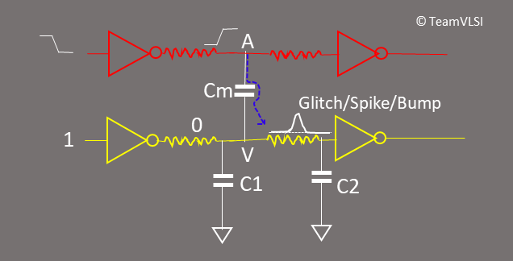
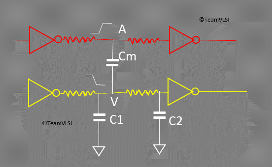
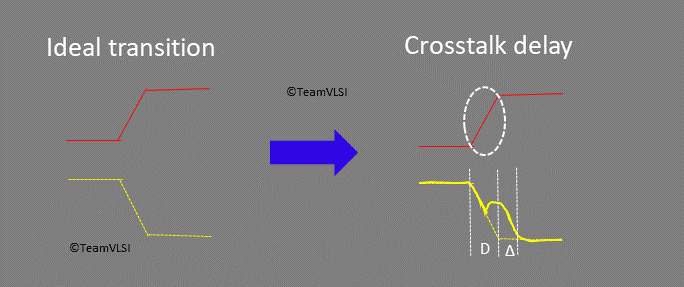
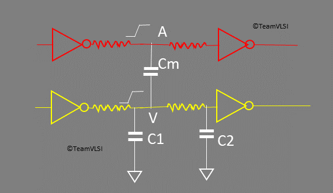
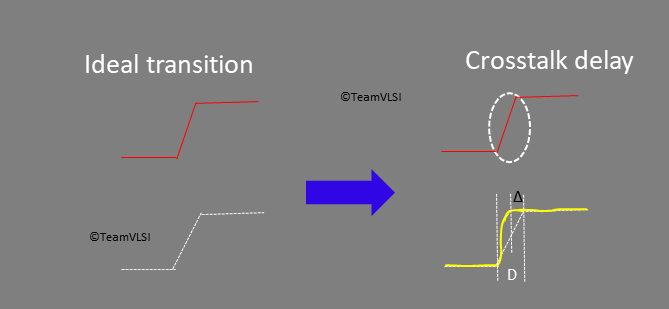

# 交叉干扰噪声和交叉干扰延迟

June 17, 2020 by [Team VLSI](https://teamvlsi.com/author/team-vlsi)

在前一篇文章中，我们已经讨论了信号完整性、串扰、串扰机制以及与互连相关的寄生电容。在本文中，我们将讨论串扰的影响。串扰有两个主要影响：

1. 串扰毛刺或串扰噪声
2. 串扰Δ延迟或串扰延迟

### 串扰毛刺

为了解释串扰毛刺，我们将考虑以下两种情况。可能会有很多类似的情况。

**情况一：侵扰网络从低电平切换到高电平，受害网络保持恒定低电平**

  
  <h5>图1 串扰毛刺（上升）</h5>

在这种情况下，侵扰网络从逻辑0切换到逻辑1，受害网络保持恒定的零，如图1所示。现在考虑节点A、节点V、互电容Cm以及从A到V的路径。随着节点A从低电平开始向高电平切换，互电容之间产生了电位差，互电容Cm开始充电。在这个过程中，由于互电容的漏电特性，会有一些漏电流开始通过互电容Cm从节点A流向节点V，这会提高节点V的电位，从而在受害网络上产生一个上升的尖峰或毛刺，如图1所示。这个电压的大小或毛刺的高度取决于后面将讨论的各种因素。

因此，每当一个网络从低电平切换到高电平，而另一个相邻网络应该保持恒定低电平时，都会受到切换网络的影响，并在其上产生一个毛刺。现在让我们讨论类似于情况一的情况二。

**情况二：侵扰网络从高电平切换到低电平，受害网络保持恒定高电平**

  
  <h5>图2 串扰毛刺（下降）</h5>

在这种情况下，侵扰网络从逻辑1切换到逻辑0，而受害网络保持恒定的高电平，如图2所示。现在考虑节点A、节点V、互电容Cm以及从V到A的路径。随着节点A从高电平开始向低电平切换，互电容之间产生了电位差，互电容Cm开始通过从节点V到节点A充电。在这个过程中，由于互电容的漏电特性，会有一些漏电流开始通过互电容Cm从节点V流向节点A，这会降低节点V的电位，从而在受害网络上产生一个下降的尖峰或毛刺，如图2所示。

因此，在情况一和情况二中，我们看到如果一个网络在切换，而另一个相邻网络保持恒定逻辑，并且它们之间存在互电容，那么另一个网络可能会受到影响，并可能在其上产生突然的上升或下降的颠簸或尖峰。受害网络上的这种尖峰被称为串扰毛刺或串扰噪声。图3展示了出现上升毛刺或下降毛刺的情况。

  
  <h5>图3 串扰中的上升和下降毛刺</h5>

### 串扰毛刺的影响
每个毛刺都不安全吗？答案是取决于毛刺的高度和受害网络的逻辑连接。如果毛刺的高度在噪声保护低（NML）范围内，这样的毛刺被认为是安全的毛刺。如果毛刺的高度超过噪声保护高（NMH），这样的毛刺被认为是潜在不安全的毛刺。如果毛刺的高度介于NMH和NML之间，则这是一个不可预测的情况。图4显示了CMOS反转器传输特性和噪声保护范围。

  
  <h5>图4 CMOS传输特性和噪声保护范围</h5>

随着技术节点的缩小，供电电压也会降低。在较低的供电电压下，噪声保护范围将更小。如果噪声保护范围较小，就更容易出现潜在不安全的毛刺。图5将有助于理解这一事实。

  
  <h5>图5 基于毛刺高度的安全和不安全毛刺</h5>

图5显示了基于毛刺高度的安全和不安全毛刺。安全毛刺对受害网络的下一个逻辑没有影响，并且受害网络的逻辑将被视为正确的逻辑。但在其他情况下，由于毛刺的影响，受害网络的逻辑可能被视为错误的逻辑，从而传播错误数据，可能导致芯片故障。通常，存储器的复位引脚是一个恒定的逻辑，如果该引脚的网络出现不安全的串扰毛刺，存储器可能会被复位。由于不安全的毛刺，可能会发生导致芯片故障的许多其他情况。

但也有一些情况下，串扰毛刺没有影响。例如，考虑一个两输入AND门，其中一个输入连接到恒定的0，另一个输入发生串扰。因此，无论串扰的影响如何，输出始终为零。对于许多组合逻辑来说，也存在类似的情况，串扰不会产生影响。同样，如果毛刺高度在噪声保护低范围内，则也属于上述情况。

### 串扰毛刺高度
串扰毛刺是安全还是不安全取决于串扰毛刺的高度和受害网络所连接的逻辑引脚。因此，让我们调查一下串扰毛刺高度取决于哪些因素。串扰毛刺高度基本上取决于三个因素：

1. 耦合电容
2. 侵扰驱动强度
3. 受害驱动强度

网络越接近，耦合电容就越大。电容越大，毛刺的高度就越大。侵扰网络和受害驱动器的驱动强度也会影响毛刺的高度。侵扰网络的高驱动强度会更大地影响受害网络。如果受害网络的驱动强度很高，那么改变其值就不容易，这意味着串扰的影响会更小。

以上就是关于串扰毛刺或串扰噪声的内容，现在让我们转向第二个影响，即串扰Δ延迟或串扰延迟。

### 串扰延迟
当侵扰网络和受害网络同时切换时，就会发生串扰延迟。它会对设计的设置时间和保持时间产生影响。串扰延迟可能导致设置时间和保持时间违例。因此，重要的是进行串扰延迟分析，并考虑串扰的影响来修正时间。串扰可能会增加或减少单元的延迟，具体取决于侵扰和受害网络的切换方向。我们将考虑两种情况，一种是两个网络同时以相同方向切换（从高到低或从低到高），另一种是两个网络以相反方向切换，并分析串扰延迟的影响。

**情况三：侵扰网络和受害网络以相反方向切换**

让我们考虑侵扰网络从低到高逻辑切换，受害网络从高到低逻辑切换（相反方向），如图6所示。

  
  <h5>图6 由于相反方向切换而引起的串扰延迟</h5>

当节点A开始从低到高转换时，节点V同时开始从高到低切换。在一半的转换过程中，从节点A到节点V会有电位差。节点A和节点V之间存在耦合电容，因此侵扰节点将尝试提升受害节点。这将影响受害节点从高到低的平稳转换，并将在一半的转换后产生一个颠簸，导致受害网络的转换时间增加。图7显示了网络的转换过程。在串扰之后，单元的延迟将增加Δ，新的延迟为D + Δ。

  
  <h5>图7 串扰延迟（增加）</h5>

**情况四：侵扰网络和受害网络以相同方向切换**

让我们考虑侵扰网络从低到高逻辑切换，受害网络也从低到高逻辑切换（相同方向），如图8所示。

  
  <h5>图8 由于相同方向切换而引起的串扰延迟</h5>

当节点A开始从低到高转换时，节点V也开始从低到高切换。假设侵扰网络具有较高的驱动强度和快速转换，一半的转换过程后，从节点A到节点V将产生电位差。节点A和节点V之间存在耦合电容，因此侵扰节点将尝试快速提升受害节点。这将影响受害节点从低到高的平稳转换，并且在一半的转换后产生一个颠簸，导致受害网络的转换时间减少。图9显示了网络的转换过程。在串扰之后，单元的延迟将减少Δ，新的延迟为（D - Δ）。

  
  <h5>图9 串扰延迟（减少）</h5>

### 串扰延迟的影响

串扰延迟对设计的时间具有各种影响。它可能使平衡的时钟树失衡，可能违反设置时间和保持时间。在本节中，我们将讨论其中一些影响。

**对时钟树的影响：**

串扰可能使平衡的时钟树失衡。串扰延迟可能增加或减少时钟路径中时钟缓冲区的延迟，并且平衡的时钟树可能会失衡，如图10所示。

  
  <h5>图10 串扰延迟对时钟树的影响</h5>

假设路径P1的延迟为L1，路径P2的延迟为L2。如果时钟树是平衡的，那么L1必须等于L2。现在假设串扰延迟发生并影响了时钟路径P2中的一个时钟缓冲器。那么现在L1不再等于L2，时钟树就不再平衡了。在此处，我们只考虑了一个时钟缓冲器受到串扰延迟的影响，但实际情况可能存在多处影响。

**对设置时间和保持时间的影响：**

串扰延迟可能违反设置时间。图11显示了数据路径、发射时钟路径和捕获时钟路径。

  
  <h5>图11 串扰延迟对设置时间的影响</h5>

对于设置时间，数据应在捕获器所需的时间之前到达捕获器。因此，如果数据路径或发射时钟路径的延迟增加，可能导致设置违例。如果捕获时钟路径上的延迟减少，也可能导致设置违例。必须考虑这些串扰延迟的影响，并修正时间。

由于串扰延迟，保持时间可能会违反。图12解释了由于串扰延迟而导致保持时间违例的情况。

  
  <h5>图12 串扰延迟对保持时间的影响</h5>

如果数据路径和发射时钟路径中的任何单元的延迟减少，或者由于串扰延迟导致捕获时钟路径中的单元的延迟增加，可能导致保持时间违例。必须考虑这些情况，并修正时间。

本文篇幅过长，因此我们将在此处结束，并在下一篇文章中继续讨论剩余部分，即时间窗口分析和串扰预防技术。

## 谢谢

原文链接：https://teamvlsi.com/2020/06/crosstalk-noise-and-crosstalk-delay-effects-of-crosstalk.html