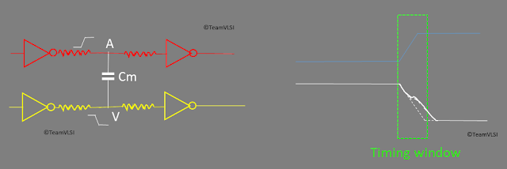
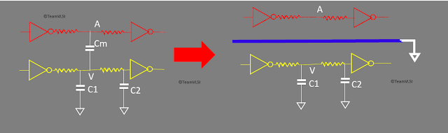

# 交叉干扰时序窗口分析和预防技术

June 21, 2020 by [Team VLSI](https://teamvlsi.com/author/team-vlsi)

在之前的两篇文章中，我们讨论了信号完整性、交叉干扰、交叉干扰机制、与互连相关的寄生电容、交叉干扰噪声、交叉干扰延迟及其影响。在本文中，我们将讨论交叉干扰的时序窗口分析以及交叉干扰的预防技术。

### 时序窗口分析
交叉干扰时序窗口分析基于这样一个概念，即我们需要考虑一个时间窗口，在这个时间窗口内侵扰者对受害网络产生影响。与我们假设侵扰者可以随时切换的无限到达窗口相比，这种分析方法更准确、更不悲观。图1显示了受害网络的切换窗口。如果侵扰者网络的切换窗口与受害网络的切换窗口重叠，那么只有受害单元的延迟会受到影响，否则不会受到影响。

  
  <h5>图1 时序窗口分析</h5>

这里我们展示了失调情况，由于交叉干扰效应，延迟增加，但这个概念在同相转换情况下同样适用，延迟会减少。时序窗口概念在交叉干扰噪声分析中同样适用。在多个侵扰者对受害网络产生影响的情况下，分析将基于时序窗口进行。这是一种更现实的方法。

### 交叉干扰预防技术
有各种方法可以预防交叉干扰，一些众所周知的技术如下。

**1. 增加侵扰者和受害网络之间的间距：**

  
  <h5>图2 间距对交叉干扰的影响</h5>

图2显示通过增加侵扰者和受害网络之间的间距，最终减小它们之间的耦合电容，因为电容与它们之间的距离成反比。因此，通过增加间距可以减小交叉干扰。

**2. 网络屏蔽：**
图3显示了用于防止交叉干扰的屏蔽技术。通常，我们在受害者网络和侵扰者网络之间插入一个屏蔽网络。该屏蔽网络连接到强 VDD 或 VSS。

  
  <h5>图3 网络屏蔽</h5>

通过屏蔽网络，会发生两件事情，一是侵扰者和受害网络之间的直接耦合电容将消失，二是屏蔽网络将保持在恒定逻辑状态，因此没有交叉干扰的可能性。

上述两种技术将可预防交叉干扰，但对面积有影响。这两种技术都需要更多的面积来路由它们。

**3. 增大受害单元的驱动强度：**

如果增加受害单元的驱动强度，侵扰者网络就不容易受到影响。

**4. 缩小侵扰者单元：**

侵扰者单元的驱动强度越高，交叉干扰对受害者的影响就越大。因此，通过减小驱动强度，可以减少交叉干扰的影响。交叉干扰时序窗口分析是基于这样一个概念，即我们需要考虑一个时间窗口，在这个时间窗口内侵扰者对受害网络产生影响。

## 谢谢

原文链接：https://teamvlsi.com/2020/06/crosstalk-timing-window-analysis-and-prevention-techniques.html