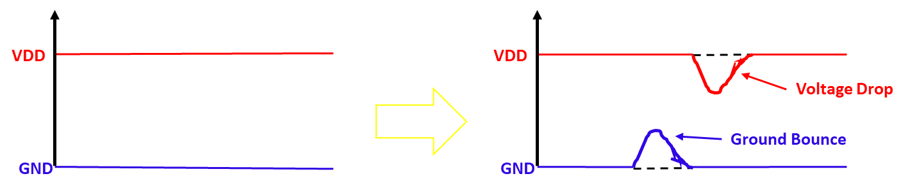

# 物理设计中的IR降压分析
July 10, 2020 by [Team VLSI](https://teamvlsi.com/author/team-vlsi)

在本文中，我们将讨论 ASIC 设计中 IR 降压是什么，为什么会出现 IR 降压问题，IR 降压的影响是什么，以及如何分析和预防 IR 降压问题。

## IR 降压问题是什么：

芯片中的电源（VDD 和VSS）通过金属导轨和条纹均匀分布，这被称为电源传输网络（PDN）或电源网格。PDN 中使用的每个金属层具有有限的电阻率。当电流通过电源传输网络时，根据欧姆定律，应用电压的一部分将在 PDN 中降低。电压降会是 V = I.R，这被称为 IR 降压。图1显示了电源网络中的 IR 降压。任何金属网都可以假设为小 R 和 C 的组合。

  
  <h5>图1 金属网中的 IR 降压</h5>

如果金属导线的电阻率较高或通过电源网络的电流量较大，则电源传输网络中可能会降低大量电压，导致标准单元可用电压少于实际应用电压量。 如果在电源端口施加 V1 电压，并且在具有总电阻 R 的特定网中流动电流 I，则标准单元的另一端可用电压（V2）将为

<b><big>V2 = V1 - I.R</big></b>

 

由于电源传输网络中的 IR 降压，有时标准单元或宏单元无法获得所需的最小工作电压来使其运行，即使在电源端口施加足够的电压。在到达标准单元之前电源传输网络中的电压降称为 IR 降压。

这种降低可能导致芯片性能不佳，因为标准单元的延迟增加，可能导致芯片功能故障，因为建立/保持时间违规。为避免此问题，必须进行 IR 分析，并在设计周期中考虑其在时序分析中的影响。

## IR 降压的类型

ASIC 设计中有两种类型的 IR 降压：
- 静态 IR 降压
- 动态 IR 降压

静态 IR 降压是指当没有输入切换时（即电路处于静态阶段）电源传输网络（PDN）中的电压降。而动态 IR 降压是指当输入连续切换时（即电路处于功能状态）电源传输网络中的电压降。 动态 IR 降压取决于实例的切换速率。

当输入连续切换时，实例中会流动更多的电流，同时也会在PDN中流动更多的电流。因此，在PDN中会有更多的 IR 降压。因此，动态 IR 降压大于静态 IR 降压。

## IR 降压的原因

IR 降压可能由于各种原因而发生，但主要原因有以下一些。
- 电源传输网络设计不佳（金属宽度较小，电源条纹之间间距较大）
- 电源传输网络中适当数量的过孔不足
- 解耦电容单元的数量不足
- 特定区域中高细胞密度和高开关
- 电源传输网络的高阻抗
- 突发电流
- 电压源数量不足
- 用于创建电源传输网络的金属层的高 RC 值

## IR 降压的影响
标准单元的延迟取决于单元的可用电源，如果电源供应减少，则单元的延迟增加。 单元延迟的增加可能影响设计的性能。也有可能，如果标准单元的可用电压降至特定水平以下，则单元可能完全停止运行，导致设计的功能故障。 或者有时，IR 降压在限制范围内，只会增加单元的延迟，从而影响设计的建立和保持时间，并有时导致建立和保持时间失败。

如果由于某个特定区域的大量开关活动，导致当前需求突然增加，VDD 线路也可能会突然下降。此类 VDD 水平下降称为**电压下降**。或可能会导致地线电压水平突然升高，称为**地弹跳**。这些统称为**电源噪声**。 图2 显示了由于 IR 降压导致的电源噪声。

  
  <h5>图2 由于 IR 降压导致的电源噪声</h5>

简而言之，IR 降压可能导致：
- 单元延迟的变化
- 可能违反建立和保持时间
- 引入电源噪声到电源网络

## IR 分析和修复：

每家 EDA 公司都有自己的 IR 分析工具，该工具执行 IR 分析，并基于分析应用 IR 修复技术。工业中使用的两种最流行的 IR 分析工具是：

- Ansys 的 RedHawk
- Cadence Design System 的 Voltus

根据分析，会应用各种修复 IR 降压的技术。通常执行的一些修复措施包括：
- 插入足够数量的解耦电容单元，以增强电源传输网络。
- 如果电源传输网络构建不正确，重新构建电源传输网络。我们可以增加金属条纹的宽度或减小它们之间的间距。
- 我们可以在一个区域内扩展逻辑单元，以便负载可以分布。

## 谢谢

原文链接：https://teamvlsi.com/2020/07/ir-analysis-in-asic-design-effects-and.html