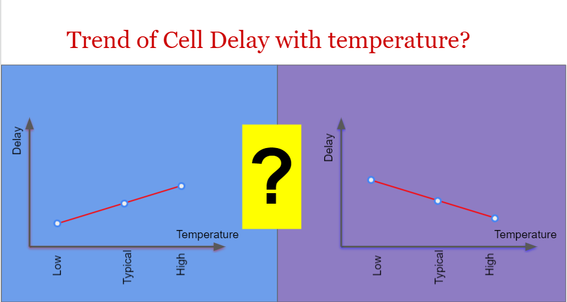
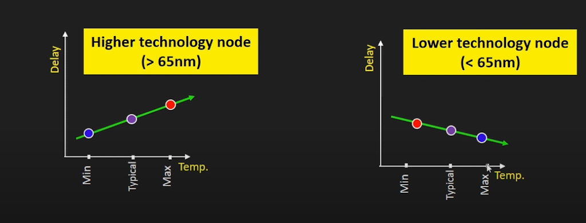
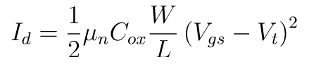
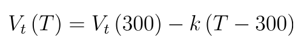

# 在VLSI中的温度反转
May 29, 2021 by [Team VLSI](https://teamvlsi.com/author/team-vlsi)

如果你面临一个简单的问题：“如果温度变化，标准单元的延迟会受到什么影响？” 你会直接回答单元的延迟会随温度增加而增加还是单元的延迟会随温度降低而减少？如果你选择上述任何一种答案，那么你需要在本文中花一些时间理解温度反转的概念。

  
  <h5>图1 随温度变化的单元延迟趋势</h5>

## 什么是温度反转？

一般来说，随着温度升高，由于在较高温度下的迁移率下降，标准单元的延迟会增加。但在较低技术节点中，温度对单元延迟的影响是相反的。在较低节点中，随着温度的升高，单元的延迟会减少。因此，在较低技术节点中，温度对单元延迟的影响是反向的，这种效应称为温度反转。这种反转背后的主要原因在于在较低技术节点中，阈值电压的效应主导了迁移率。

因此，对上述问题的一个恰当答案可能是，我们应该根据技术节点来回答这个问题。可以说，在较低技术节点中，随着温度的升高，单元的延迟会减少。这里的较低技术节点是指65纳米以下的技术节点。为什么问题的这一部分重要，但如果被进一步问及，我们应该等待。在下一部分，我们将学习为什么会发生温度反转。

  
  <h5>图2 温度反转</h5>

下一节将详细解释影响单元延迟及其变化的因素。

## 温度反转的原因

单元延迟简单地是充电/放电负载电容所需的时间。负载电容的充电和放电时间取决于漏极电流。如果漏极电流较大，则充电/放电负载电容所需的时间较短，因此延迟也较短，反之亦然。现在让我们看看漏极电流Id的依赖性。

MOSFET的饱和电流为，

  

漏极电流Id与电荷载体的迁移率成正比。因此，随着温度升高，晶格散射增加，最终导致电荷载体的迁移率降低，从而导致漏极电流Id减小，延迟增加。

现在让我们来谈谈第二个重要因素，上述方程中的项(Vgs - Vt)被称为过驱动电压。阈值电压随温度变化如下式，

  

随着温度升高，阈值电压减小，过驱动电压增加。在较低技术节点中，过驱动电压更具主导作用，因为在较低技术节点中，Vgs和Vt更接近，所以Vt的轻微变化对过驱动电压的影响更大。但在较高技术节点中，由于Vgs远大于Vt，所以Vt的轻微变化不会对过驱动电压造成太大影响。再次强调，Id与过驱动电压的平方成正比。因此，过驱动电压的变化进一步放大，并且在较低技术节点中占据主导地位。

总之，在较低技术节点中，随着温度升高，阈值电压减小，过驱动电压和漏极电流增加，从而导致单元延迟减少。在这里，过驱动电压主导了迁移率因素。但在较高技术节点中，过驱动电压不是很具主导作用，单元的延迟会随着载体迁移率的变化而变化，正如我们已经讨论的，随着温度增加，迁移率减少，漏极电流减小，从而导致单元延迟增加。

因此，驱动单元延迟变化的两个主要因素是迁移率和过驱动电压。在较低技术节点中，过驱动电压更具主导作用，导致温度反转效应。

## 谢谢

原文链接：https://teamvlsi.com/2021/05/temperature-inversion-in-vlsi.html