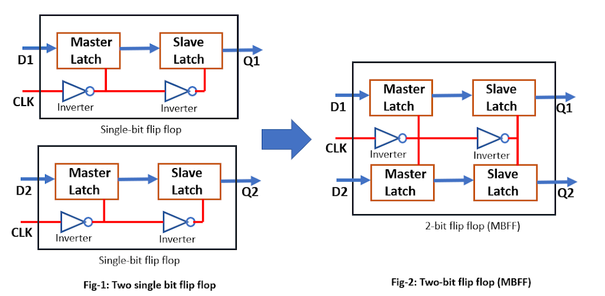
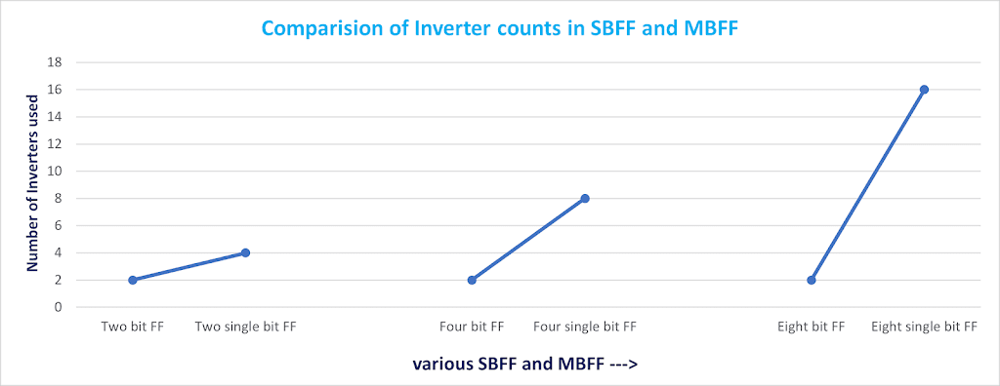
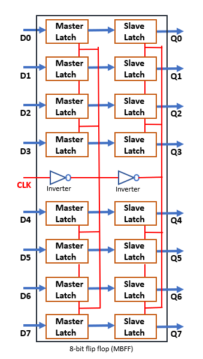
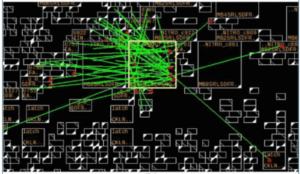

# 多比特触发器与单比特触发器
April 25, 2021 by [Team VLSI](https://teamvlsi.com/author/team-vlsi)

在现代ASIC设计中，多比特触发器（MBFF）的使用增加了，这是由于MBFF相对于单比特触发器（SBFF）具有多种优势。传统上，在我们的学术中只研究单比特触发器。因此，了解多比特触发器的设计、工作原理以及多比特触发器相对于单比特触发器的优缺点变得至关重要。

## 为什么要使用多比特触发器？

多比特触发器由于其架构而具有许多优势，相对于单比特触发器而言。许多最近的研究出版物也展示了这些事实。我们在布局和布线（PnR）实现过程中也见证了这些优势。在这里，我希望以简单的方式解释MBFF的基本事实，不涉及任何详细统计数据。确切的统计数据可以从任何最近的研究出版物中获取。多比特触发器的主要优势如下，这就是为什么现在广泛使用MBFF。

1. 减少面积
2. 降低功耗（对低功耗设计很有前景）
3. 更好的时钟偏移控制
4. 改进时序

因此，我们可以说它改善了面积、功耗和时序。这些优势的原因将在下一节中进行解释。

## 多比特触发器架构：

所有多比特触发器的优势都归功于它们的架构。图1显示了单比特FF和2比特MBFF的原理图。类似的架构也可以想象为更高比特的MBFF。

  
  <h5>图1 多比特触发器</h5>

当我们使用多比特触发器时，与单比特触发器相比，反相器数量会减少。当我们使用更大的MBFF时，这种减少的效果更加明显。图2中显示了SBFF和MBFF中反相器数量的比较。

  
  <h5>图2 SBFF和MBFF中使用的反相器数量</h5>

在8个单比特触发器内部有16个反相器的情况下，一个16位多比特触发器只使用了2个反相器。图3显示了8位MBFF的原理图。

  
  <h5>图3 8位MBFF</h5>

随着MBFF中反相器数量的减少，它节省了时钟功耗和面积。在MBFF转换后，触发器的操作没有发生变化。现在让我们讨论PnR工具如何将SBFF转换为MBFF的机制。

## MBFF转换：

  
  <h5>图4 MBFF转换前的放置</h5>

  
  <h5>图5 转换后的MBFF放置</h5>

图4和图5展示了SBFF转换为MBFF的过程。图4显示了MBFF转换之前的情况，而图5显示了MBFF转换后的情况。在图5中，我们可以看到，与8个不同的SBFF相比，只使用了一个8位MBFF。因此，MBFF通常在尺寸上更大，并且具有多行高度的标准单元。

PnR工具具有算法将SBFF转换为MBFF。该工具从标准单元库中选择等效的MBFF，并根据用户提供的转换输入执行转换。此转换发生在放置阶段。

如果我们谈论Cadence Innovus工具，我们有一个命令

`setOptMode -multiBitFlopOpt true`

这将启用PnR工具进行多比特触发器转换。默认情况下，该转换在工具中是禁用的。工具中有许多类似的命令可以进一步探索。

## 谢谢

原文链接：https://teamvlsi.com/2021/04/multi-bit-flip-flop-vs-single-bit-flip-flops.html