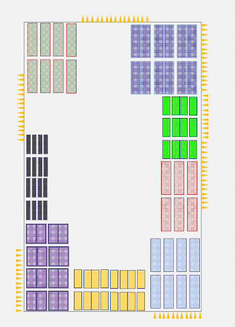
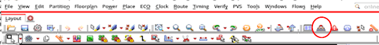
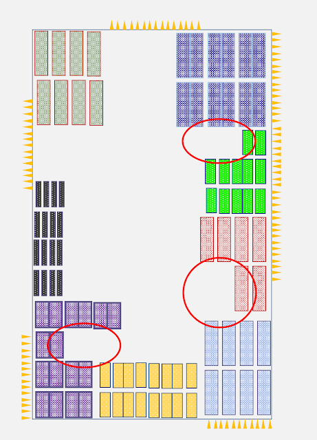
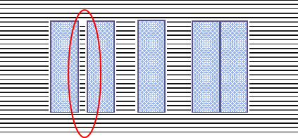
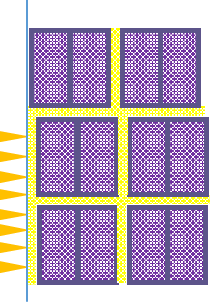

# 宏控制块的Floorplan策略
February 13, 2021 by [Team VLSI](https://teamvlsi.com/author/team-vlsi)

物理设计工程师的主要目标是实现良好的结果质量(QoR)和优化的功耗性能和面积(PPA)。这个旅程的开始是从Floorplan步骤开始的。在PnR的结束时，你将取决于你的Floorplan有多好。在宏控制块的情况下，优质Floorplan的重要性更大。为了在宏控制块中实现良好的Floorplan，可能需要进行多次迭代，并且需要具备良好的经验。需要对数据流、层次结构、宏到输入/输出引脚的连接、逻辑深度等多个因素进行详细分析和理解，以便生成良好的Floorplan。本文将讨论一些基本规则，这些规则有助于生成良好的Floorplan，从而获得良好的QoR。

宏布局的一些基本规则有助于生成良好的Floorplan。只有在第一次Floorplan结果的切割后才能分析出许多事情，宏布局可以在宏控制块中的几次迭代中得到改进。有一些标准规则有助于实现良好的Floorplan。

- 按层次分组宏
- 分析宏到输入/输出引脚的连接
- 宏与宏之间的逻辑深度分析，以及宏与输入/输出引脚之间的逻辑深度分析
- 最大化核心面积
- 避免缺口形成
- 通道间距
- 宏连接
- IO引脚到宏间距
- 宏上的Halo
- 宏上的路由阻塞
- 宏通道和宏到io引脚区域的部分放置阻塞

以上规则是标准的Floorplan规则，通常人们使用这些规则作为更好的时序和阻塞结果的拇指规则。在这里需要理解的是，精心规划的Floorplan可以同时产生良好的时序和阻塞结果，而如果Floorplan规划不当，则可能导致高阻塞和高WNS/TNS/FEPs(最差负毫秒/总负毫秒/失败终点)。因此，遵循宏布局的标准实践以避免高阻塞和坏时序非常重要。

## 按层次分组宏

在分层设计中，必须根据宏的分组放置宏。我们可以根据宏组高亮显示不同颜色的宏以更好地看到宏组。PnR工具提供了按层次查看宏和标准单元的选项。对于Innovus GUI，可以通过**Design Browser –> Modules**进行探索。

我们还可以进一步可视化组大小，并粗略估计任何特定组所需的面积，并在一次性放置完成后更好地放置它们。在宏控制块中，宏计数可能达到几百个，组也可能很大。下面展示了样本图片。

  
  <h5>图1 宏分组</h5>

  
  <h5>图2 Innovus中的设计浏览器</h5>

## 宏到输入/输出引脚连接分析

通常，我们将宏放置在其io引脚附近，如果逻辑级别只有一个，则无法将宏放远离引脚以避免in2reg或reg2out时序冲突。因此，我们需要检查宏的fanin和fanout，并尝试将它们放置在接近连接引脚的位置。

## 逻辑深度分析宏与宏到输入/输出引脚

在宏群组内，宏的顺序必须按照它们的逻辑连接排列。直接交流的宏应该放在一起。同样，如果两个宏组与一个寄存器(只有一级)有逻辑连接，我们不能将它们放远。但是，如果两个宏组互相连接逻辑级别为3、4或更多，我们可以将它们相对独立地放置。

### 最大化核心面积

我们总是试图最大化核心面积，以便标准单元有更多的放置空间。如果有更多的放置空间，就会减少阻塞的机会，最终会短路。通常，我们尝试将所有宏都放置在核心边界附近，并尝试最大化标准单元的中心区域。

### 避免缺口形成

缺口区域没有有效利用，因此它将增加核心的放置密度并增加阻塞。我们总是牢记在布局宏时不应形成缺口，特别是在宏计数高和放置密度也高的情况下。

缺口形成不好，因为它会影响均匀放置密度。因此，我们尝试最大化核心宽度和高度，使核心区域的中心面积最大化。并且，宏单元布局应该使得核心区域的宽度/高度在中心部位达到最大化。下图中的红色圆圈区域展示了缺口形成。

  
  <h5>图3 缺口形成在宏布局中</h5>

### 宏通道间距

两个接近的宏之间的区域称为宏通道间距。在宏通道中，将进行标准单元的放置，并需要电源连接。但是，如果宏间距太小，则电源线可能无法连接到电源带，这是有问题的。

  
  <h5>图4 宏通道间距</h5>

如果面积不足，我们可以将两个宏相邻放置，如图像右侧所示。但是，如果我们不将宏靠在一起，那么在两个宏之间的间距应该最小，其中至少应跨越一个VDD和VSS条。如果通道宽度过低，以至于在这个区域内没有电源带穿过，则该区域的轨道将无法获得电源。上图左侧的通道存在问题，因为坐落在该区域的标准单元可能会失去PG连接。

### 宏连接
如果需要，我们可以将两个宏排列在一起，如上图右侧所示。唯一需要记住的是，在宏接缝处不应该有引脚。引脚应该在非接缝边缘上。

### IO引脚到宏间距
如果核心边界上没有引脚，我们可以将宏放置在边界附近，但在边界上有io引脚，我们应该将宏与引脚分开一些距离，以避免在引脚附近出现阻塞。

### 宏上的Halo
Halo是与宏相关的放置阻塞，因此如果我们移动宏，Halo也会随之移动。为了避免在宏的边缘和基础DRC上出现阻塞，我们避免在宏的边缘放置标准单元。在宏周围放置Halo来阻塞宏周围的区域。

### 宏上的路由阻塞
与标准单元相比，宏设计需要更多的金属层。因此，已经在宏内使用的金属层不能用于在宏上进行路由，并且需要在宏上进行路由阻塞。因此，我们需要在宏上进行路由阻塞。

### 宏通道和宏到io引脚区域的部分放置阻塞
为了避免宏通道中的阻塞，我们在宏通道中应用部分放置阻塞，以便我们可以控制放置密度。如下图所示，在io引脚和宏之间的区域也可以应用部分放置阻塞。所有黄色区域都显示部分放置阻塞区域，我们可以在这些区域设置放置密度。

  
  <h5>图5 部分布局阻塞</h5>

宏布局是PnR中最重要的部分，因为QoR强烈依赖于宏布局。上述规则是通常在宏控制块中遵循的标准规则。

## 谢谢

原文链接：https://teamvlsi.com/2021/02/floorplan-strategies-for-macro-dominating-blocks.html