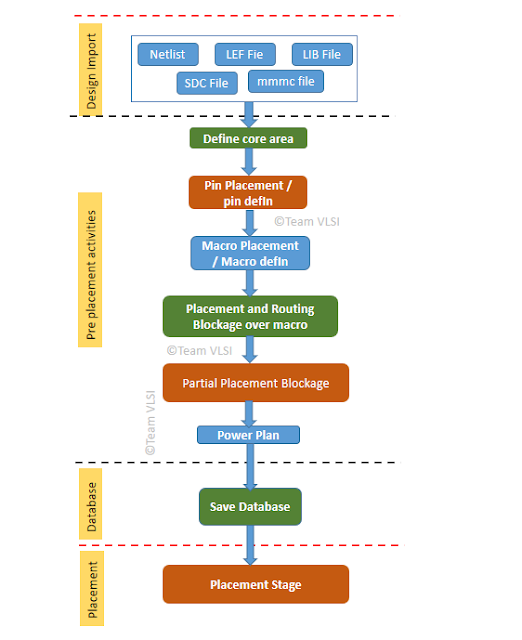
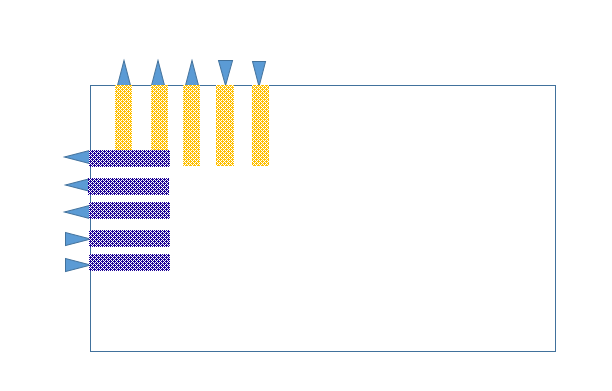

# 物理设计中的预布局活动
February 6, 2021 by [Team VLSI](https://teamvlsi.com/author/team-vlsi)

从更广泛的意义上讲，在物理设计中，PnR（布局和布线）阶段基本上是在定义的核心区域中布局和布线网表中所有实例，以满足设计规则和时序要求。但在实际的自动布局工具PnR工具开始布局实例之前，必须进行某些布局之前必须完成的活动，这些活动被称为预布局活动。在本文中，我们将讨论一些重要的预放布局活动。

  
  <h5>图1 PnR中的预布局活动</h5>

**主要的预布局活动：**
- 引脚放置
- 宏单元布局
- 晕影和布线阻塞
- 电源规划
- 边界单元/端部单元放置
- 井接触单元放置
- 部分放置阻塞/密度屏幕创建

在这里，我们将按照需要执行的顺序详细讨论这些活动。

## 引脚放置：

在块级PnR中，输入输出引脚位置通常由整个芯片的所有者决定，并且引脚定义提供给块所有者。但有时顶层的引脚位置没有固定，与此同时，块所有者需要根据自己的方便放置这些引脚。

PnR工具提供了引脚编辑实用程序，在其中可以轻松放置大量引脚。对于Innovus，我们可以打开引脚编辑器，路径为 编辑->引脚编辑器

基本上，我们需要向引脚编辑器提供以下输入，并显示一个典型的引脚放置图像。

- 引脚列表
- 金属层
- 引脚宽度
- 引脚深度
- 边缘
- 两个引脚之间的间距

  
  <h5>图2 引脚放置在PnR中</h5>

引脚位置可以位于核心边缘或核心内部。如果已有引脚定义，我们只需在pin.def文件中定义即可，在Innovus中，我们可以如下定义引脚定义文件。

`defIn <pin.def>`

一旦所有引脚都放置好，我们可以进行检查。在Innovus中，我们有一个命令。

`checkPinAssignment`

上述命令将提供引脚的总数、合法/非法引脚的数量、已放置/未放置引脚的数量。

有时一些I/O引脚可能会与PG结构短接，我们可以使用以下Innovus命令验证这些短接。

`verify_PG_short -no_routing_blkg -no_cell_blkg
`
如果存在一些短接，我们可以使用以下Innovus命令修复这些问题。

`editPin -pin <引脚名称> -fixOverlap`

一旦所有引脚都放置好，我们可以将引脚输出到文件中以供将来使用。

`selectPin * ; `或 `selectPin [dbGet top.terms]`

`defOut -selected <文件名>`

## 宏单元布局：

宏单元布局是布图的一个重要步骤，PnR的结果质量取决于宏单元的布局。良好的宏单元布局需要对块中的数据流进行彻底分析。糟糕的布图可能导致拥塞和不良的内部时序。特别是在宏单元占主导地位的块中必须遵循一些步骤。有关宏单元布局策略的详细讨论将在本文中解释（即将链接）。

## 晕影和布线阻塞：
宏单元在边缘附近具有高引脚计数，如果标准单元的放置高于此，可能会导致拥塞。为避免这种拥塞，我们需要在宏单元周围放置晕影（晕影将在这里解释，即将链接）。宏单元设计需要比普通标准单元更多的金属层，其引脚位于比标准单元更高的金属层。因此，我们需要为用于宏单元内部的金属层放置布线阻塞。电源轨道在宏单元上方被阻挡，并且电源直接从电源条送到宏单元。

## 电源规划：
电源规划是一个非常健壮的电源网格结构，可向设计中所有宏单元和标准单元提供电源，而电源网格的IR降低很小。电源网格从顶层金属层的凸点获取电源，并将电源传递到标准单元遵循引脚的最低金属层。

电源从凸点进入电源条，电源条将电源传递给VDD和VSS轨道。宏单元直接从电源条获取电源，因为在宏单元的位置没有绘制电源轨。

## 边界单元放置：
每个放置行必须在两端都使用边界单元进行终止。为什么我们需要边界单元以及边界单元的功能，在本文中已经讨论过。

## 井接触单元放置：
为了将p-sub接地和nwell接地到VDD，以避免设计中的锁相问题，我们需要在核心区域定期放置井接触单元。详细讨论井接触单元及其放置已在本文中讨论。

## 部分放置阻塞：
为了避免拥塞，我们需要特别在引脚密度较高的区域放置部分放置阻塞。通常我们在通道区域和io引脚所在的区域放置部分放置阻塞。如果在这个区域中的单元放置密度变得很高，可能会导致拥塞，因为这些区域已经有许多引脚连接。

除了这些主要活动外，还有许多其他需要在特定块上进行的工作，如天线单元放置、TCD单元、PCLAMP单元放置。在低节点上，在宏单元布局步骤之后，我们需要检查基本DRC。

## 谢谢

原文链接：https://teamvlsi.com/2021/02/pre-placement-activities-in-physical-design.html