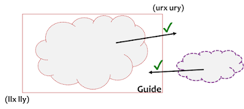
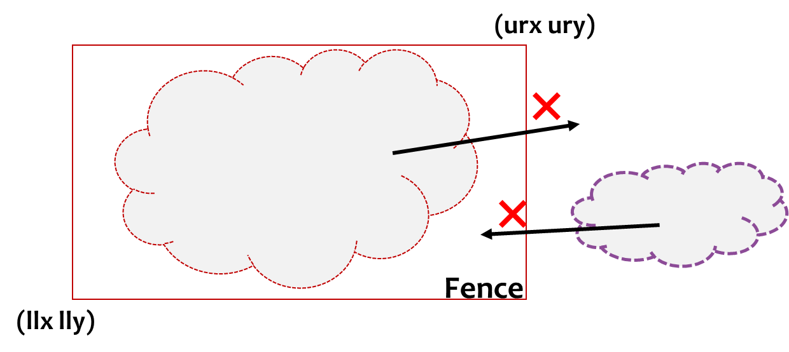
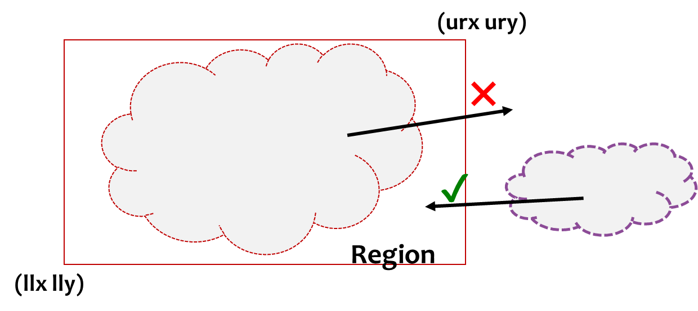

# 模块约束类型：引导、围栏和区域
October 27, 2020 by [Team VLSI](https://teamvlsi.com/author/team-vlsi)

有时，我们需要将特定组的标准单元或模块放置在特定区域（框）中。PnR工具允许我们这样做。如果我特别谈到Cadence Innovus APR工具，它有三种类型的区域，称为**引导（Guide）、围栏（Fence）和区域（Region）**，通过它们我们可以向放置工具提供指导。让我们探索一下这三种放置约束实际上是做什么以及它们之间的区别。

## 引导（Guide）：

  

- 指定设计中的某些单元
- 引导允许指定单元位于框外
- 它也允许其他单元位于框内
- 这是一种软约束。

### Innovus命令：

`createGuide obj_name box`

**示例：**

`createGuide adder9 100.000 200.000 110.000 210.000`

这将为模块adder9创建一个引导到框（100 200 110 210）

## 围栏（Fence）：

  

- 指定设计中的某些单元。
- 围栏不允许被指定的单元位于定义的框外。
- 围栏还不允许其他单元位于框内。因此，该区域专门为被指定单元保留。
- 这是一种硬约束。

### Innovus命令：

`createFence obj_name box`

**示例：**

`createFence SH12 200 400 220 440`

这将为模块SH12创建一个围栏到框（200 400 220 440）

## 区域（Region）：

  

- 指定设计中的某些单元。
- 区域不允许被指定的单元位于定义的框外。
- 如果没有明智选择区域，可能会导致分配区域拥挤。
- 区域和围栏之间唯一的区别是它允许其他单元位于框内。
- 这是一种硬约束。

### Innovus命令：

`createRegion obj_name box`

**示例：**

`createRegion SH7 200 400 220 440`

这将为模块SH7创建一个区域指导，在平面图中显示为区域状态，到框（200 400 220 440）

### 删除模块指导：

- 要删除模块的引导/围栏/区域，请使用**unplaceGuide**命令。

**示例：**

`unplaceGuide SH7`

这将删除SH7模块的模块指导。

## 谢谢

原文链接：https://teamvlsi.com/2020/10/module-constraint-types-guide-fence-and-region.html