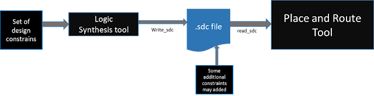
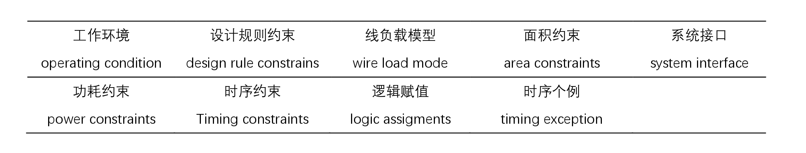
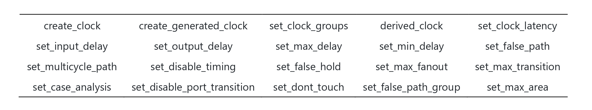
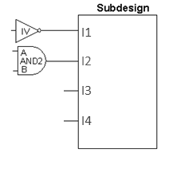
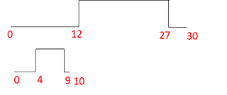
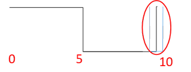

快问快答迅速了解一下SDC的基本内容吧~

## 1 SDC文件是什么？

- SDC 全称 Synopsys Design Constraint，基于**TCL格式**，由Synopsys公司开发定义的。

- SDC是一种**通用的设计约束格式**，几乎所有综合、PnR和其他工具都支持。

- 此文件扩展名为 **.sdc**。

## 2 SDC文件的作用是什么？

SDC设计约束文件用来约束电路的**时序、功耗、面积**等，从而使芯片满足设计要求的规范。

## 3 SDC文件的产生？

SDC文件可以由综合工具**Logic Synthesis tool** 生成，附加一些约束后生成，并使用于**PnR**（Place and Route），即布局和布线环节。

<div style="text-align:center;">
  
  <h4>图1 SDC文件产生流程</h4>
</div>

## 4 SDC文件的内容及其命令

SDC文件包含以下4部分：① 版本；② 基本单位；③ 设计约束；④ 注释部分。其中设计约束是SDC的主要内容，而 ①、②、④ 部分不是必须的。

### (1) SDC版本

此语句指定SDC文件的版本。它可以是2.1、2.0、1.9或更早的版本。版本2.1于2017年12月引入。

示例：

```
set sdc_version 2.1
```

### (2) 基本单位

可以使用set_unit命令指定各种量的单位，如时间、电阻、电容、电压、电流和功率。也可以使用单个set_unit命令设置多个单位。

示例：

```
set_units -time ns -resistance Kohm -capacitance pF -voltage V -current mA
```

### (3) 注释部分

一个SDC文件会在文件开头包含SDC版本号，其次是设计约束，注释（注释以字符＃开始，并在行尾处结束）在SDC文件中可以散布在设计约束中。设计约束中较长的命令行可以使用反斜杠（\）字符分成多行。

### (4) 设计约束

SDC与设计约束相关的命令可分为9类，如下：


------------------------------

#### - 工作环境

工作环境命令 set operating_conditions 用于设置电路最快和最慢情况下所对应的库文件和工作环境。

示例：
```
# 定义工作条件
set_operating_conditions -process "typical" -corner "slow" {
    voltage 1.0
    temperature 25
}

set_operating_conditions -process "typical" -corner "fast" {
    voltage 1.1
    temperature 85
}
```

在这个示例中，我们定义了两种不同的工作条件：一种是在典型工艺、慢角的情况下，电压为1.0V，温度为25摄氏度；另一种是在典型工艺、快角的情况下，电压为1.1V，温度为85摄氏度。

-----------------------------

#### - 设计规则约束

设计规则约束的所有命令如表：



&emsp; &emsp; 1. **create_clock**：定义时钟信号及其特性。
&emsp; &emsp; 2.	**create_generated_clock**：创建由时钟衍生出的时钟。
&emsp; &emsp; 3.	**set_clock_groups**：定义时钟组。
&emsp; &emsp; 4.	**derived_clock**：创建一个派生时钟。
&emsp; &emsp; 5.	**set_clock_latency**：设置时钟路径的延迟。
&emsp; &emsp; 6.	**set_input_delay**：设置输入延迟。
&emsp; &emsp; 7.	**set_output_delay**：设置输出延迟。
&emsp; &emsp; 8.	**set_max_dela**y：设置路径的最大延迟。
&emsp; &emsp; 9.	**set_min_delay**：设置路径的最小延迟。
&emsp; &emsp; 10.	**set_false_path**：指定不需要进行时序验证的路径。
&emsp; &emsp; 11.	**set_multicycle_path**：设置多周期路径。
&emsp; &emsp; 12.	**set_disable_timing**：禁用特定路径的时序分析。
&emsp; &emsp; 13.	**set_false_hold**：设置保持时间约束。
&emsp; &emsp; 14.	**set_max_fanout**：设置路径上的最大负载数。
&emsp; &emsp; 15.	**set_max_transition**：设置信号过渡时间。
&emsp; &emsp; 16.	**set_case_analysis**：定义逻辑混合时的条件和优先级。
&emsp; &emsp; 17.	**set_disable_port_transition**：禁用端口过渡时间约束。
&emsp; &emsp; 18.	**set_dont_touch**：指定不进行任何操作的单元。
&emsp; &emsp; 19.	**set_false_path_group**：指定不需要进行时序验证的路径组。
&emsp; &emsp; 20.	**set_max_area**：设置最大面积约束。

以下是一些常见的SDC中的设计规则约束命令的示例：
```
# 时钟约束：
create_clock -period 10 [get_ports clk]
# 这个命令表示创建一个时钟约束，指定时钟端口为“clk”，时钟周期为10。

# 输入延迟约束：
set_input_delay 2 -clock [get_clocks clk] [get_ports data_in]
# 这个命令表示设置输入延迟约束，数据输入端口为“data_in”，相对于时钟“clk”有一个延迟为2。

# 输出延迟约束：
set_output_delay 1 -clock [get_clocks clk] [get_ports data_out]
# 这个命令表示设置输出延迟约束，数据输出端口为“data_out”，相对于时钟“clk”有一个延迟为1。

# 最大时序路径约束：
set_max_delay 5 -from [get_ports input] -to [get_ports output]
这个命令表示设置最大时序路径约束，从输入端口“input”到输出端口“output”的最大延迟为5。
```

-----------------------------------

#### - 系统接口约束

**设置驱动单元**

指定由技术库中的单元驱动的输入或双向端口的驱动特性。这些命令将库引脚与输入端口关联，以便可以准确地建模延迟计算。

语法：

```
set_driving_load [-lib_cell lib_cell_name] [-library lib_name] [-rise] [-fall] [-min] [-max] [-pin pin_name] [-from_pin from_pin_name] [-dont_scale] [-no_design_rule] [-input_transition_rise rtrans] [-input_transition_fall ftrans] [-multiply_by_facrtor] [-clock clock_name] [-clock_fall] port_list
```

示例：



```set_driving_cell -lib_cell IV {I1}

set_driving_cell -lib_cell AND2 -pin Z -from_pin B {I2} 
```

**设置负载**

该命令设置当前设计中指定端口和网络上的负载属性。负载值的单位将是在文件中定义的电容单位。

语法：

```
set_load value objects [-subtract_pin_load] [-min] [-max] [[-pin_load] [-wire_load]]
```

示例：

```set_load -pin_load 0.001 [get_ports {port[10]}]
```

----------------------------

#### 时间约束

在这部分中，基本上我们设置时钟定义、时钟组、时钟延迟、时钟不确定性、时钟过渡、输入延迟、输出延迟、时序折减等。

**创建时钟**

语法：

```
create_clock [-name clock_name] [clock_sources] [-period value] [-waveform edge_list] [-add] [-comment]
```

create_clock命令在当前设计中创建一个时钟对象。此命令将指定的source_objects定义为时钟源。

示例：


```
create_clock "u13/z" -name "CLK" -period 30 -waveform {12.0 27.0}`\

create_clock -name "PH12" -period 10 -waveform {0.0 5.0}
```

**创建生成时钟**

语法：

```
create_generated_clock [-name clock_name] [-add] source_objects -source master_pin [-master_clock clock] [-divide_by divide_factor | -multiply_by multiply_factor ] [-duty_cycle percent] [-invert] [-preinvert] [-edges edge_list] [-edge_shift edge_shift_list] [-combinational]
```

create_generated_clock命令创建一个生成的时钟对象。可以指定引脚或端口作为生成的时钟对象。生成的时钟跟随主时钟，因此每当主时钟变化时，生成的时钟会自动变化。可以将生成的时钟创建为频率分频时钟、频率倍增时钟、边缘分频时钟或反相时钟。

示例：


```
create_generated_clock -multiplied_by 3 -source CLK [get_pins div3/Q]
```

以上示例将生成一个时钟，该时钟源自名为CLK的原始时钟。生成的时钟频率将是原始时钟的3倍，时间周期将是原始时钟的三分之一（15ns –> 5ns）。

**组路径**

语法：

```
group_path [-weight weight_value] [-critical_range range_value] -default | -name group_name [-from from_list | -rise_from rise_from_list | -fall_from fall_from_list] [-through trough_list | -rise_through rise_through_list -fall_through fall_through_list] [-to to_list | -rise_to rise_to_list | -fall_to fall_to_list] [-comment comment_string] [-priority priority_level]
```

组是一组路径或终点，用于成本函数计算。该组使我们能够指定一组路径进行优化，即使在其他组中可能存在较大的违规。当指定了终点时，所有通向这些终点的路径都被分组。

create_clock命令会自动为新时钟创建一个权重为1.0且与时钟名称相同的组。

示例：

```
group_path -name “group1” -weight 2.0 -to {CLK1A CLK1B}

group_path -name GROUP1 -from [get_ports ABC/in3] -to [get-ports FF1/D]
```

**时钟不确定性**

语法：

`set_clock_uncertainity [object_list | -from from_clock | -rise_from rise_from_clock | -fall_from fall_from_clock -to to_clock | -rise_to rise_to_clock | -fall_to fall_to_clock] [rise] [-fall] [-setup] [-hold] uncertainty `

在定义时钟后，为了处理时钟网络中的差异，添加了时钟不确定性。时钟不确定性为系统增加了一些误差裕量，以考虑由时钟网络和时钟源本身的非理想性引起的时钟网络差异。上述命令可以指定时钟之间的不确定性或简单不确定性。它将不确定性设置为预期的最差时延，以适用于端点或时钟域之间。

示例：



```
set_clock_uncertainty -setup 0.5 [get_clocks clk1]set_clock_uncertainty -hold 0.2 [get_clocks clk1]
```

时钟不确定性也可以为时钟的上升和下降时间添加，如下所示。

```
set_clock_uncertainty -max_rise 0.12 [get_clocks clk1]

set_clock_uncertainty -max_fall 0.12 [get_clocks clk1]

set_clock_uncertainty -min_rise 0.12 [get_clocks clk1]

set_clock_uncertainty -min_fall 0.12 [get_clocks clk1]
```

**时钟延迟**

语法:

```
set_clock_latency [-rise] [-fall] [-min] [-max] [-source] [-early] [-late] [-dynamic jitter] [-clock clock_list] delay object_list
```

时钟延迟指的是时钟信号从时钟源引脚到达顺序元素的时钟引脚的延迟量。有两种类型的时钟延迟，一种是网络延迟（默认），另一种是源延迟（使用-source选项）。

时钟网络延迟是时钟信号从时钟定义点传播到寄存器的时钟引脚所需的时间。而源延迟是时钟信号从实际理想波形起点传播到设计中的时钟定义点所需的时间。源延迟也称为插入延迟。

示例：

```
set_clock_latency 2.35 [get_pins ABC/XYZ/CP]
```

**输入延迟**

语法：

```
set_input_delay delay_value [-reference_pin pin_port_name] [-clock clock_name] [-level_sensitive] [-network_latency_included] [-source-latency_included] [-rise] [-fall] [-min] [-max] [-add_delay] port_pin_list
```

输入延迟定义了输入端口相对于时钟边沿的时间要求。如果未指定，假定输入端口具有零输入延迟。要指定的延迟值是从起点到相对于时钟边沿的对象上设置set_input_delay的对象之间的延迟。

示例：

```
set_input_delay -max 1.35 -clock clk1 {ain bin}
```

**输出延迟 **

语法：

```
set_output_delay delay_value [-reference_pin pin_port_name] [-clock clock_name] [ -clock_fall] [-level_sensitive] [-network_latency_included] [-source-latency_included] [-rise] [-fall] [-min] [-max] [-add_delay] [-group_path group_name] port_pin_list
```

set_output_delay命令设置输出端口相对于时钟边沿的输出延迟要求。如果未指定，假定输出端口具有零输出延迟。

示例：

```
set_output_delay 1.7 -clock [get_clocks CLK1] [all_outputs]
```

上述命令将设置所有输出端口相对于CLK1的正边沿（默认边沿）的1.7单位输出延迟。

```
set_output_delay -max 1.4 -clock {CLK} [get_ports {Y}]

set_output_delay -min 1.0 -clock {CLK} [get_ports {Y}]
```

在上述命令中，-max值指的是最长路径，-min值指的是最短路径。如果没有指定-max或-min值，假定最大和最小输出延迟是相等的。

#### - 时序异常

在这部分，定义了一些重要的约束，如虚假路径、多周期路径、最大延迟和最小延迟。

**多周期路径**

语法：

```
set_multicycle_path path_multiplier [-rise | -fall] [-setup | -hold] [-start | -end] [-from from_list | -rise_from rise_from_list | -fall_from fall_from_list] [-through through_list] [-rise_through rise_through_list] [-fall_through fall-through_list] [-to to_list | -rise_to rise_to_list | -fall_to fall_to_list] [-reset_path]
```

多周期路径是默认单周期时序要求路径的一个例外。在多周期路径中，信号需要超过一个时钟周期才能从起点传播到路径的终点。此命令指定数据路径必须具有的周期数，用于建立或保持检查。以下命令将设置从源点A到终点B的两周期路径约束。

示例：

```
set_multicycle_path 2 -from A -to B

set_multicycle_path 3 -from C
```

我们可以在源点和终点之间添加一个-through点，也可以通过只提及源点或终点来设置所有路径的多周期路径。

**伪路径**

语法：

```
set_false_path [-rise] [-fall] [-setup] [-hold] [-from from_list | -rise_from rise_from_list | -fall_from fall_from_list] [-through through_list] [-rise_through rise_through_list] [-fall_through fall-through_list] [-to to_list | -rise_to rise_to_list | -fall_to fall_to_list] [-reset_path]
```

伪路径是不能传播信号的路径。例如，一个从不被任何输入组合激活的路径是一个虚假路径。应该为时序分析禁用虚假路径。SDC命令set_false_path用于定义虚假路径。虚假路径将被排除在时序分析之外。

示例：

```
set_false_path -from U1/G -to U1/D

set_false_path -from {ff12} -to {ff34}
```

## 总结

本文描述了SDC文件中15个最重要的约束。对于复杂设计，还有更多的约束。这里是所有讨论的约束的总结。

- SDC版本
- 单位

**系统接口**

- 设置驱动单元

- 设置负载

**设计规则约束**

- 设置最大扇出

- 设置最大转换

**时序约束**

- 创建时钟

- 创建生成的时钟

- 组路径

- 时钟不确定性

- 时钟延迟

- 输入延迟

- 输出延迟

**时序异常**

- 多周期路径

- 伪路径

## 引用

1. 《数字集成电路物理设计》P239-241
2. https://teamvlsi.com/2020/05/sdc-synopsys-design-constraint-file-in.html
