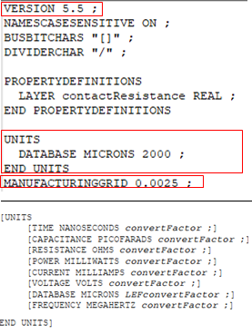
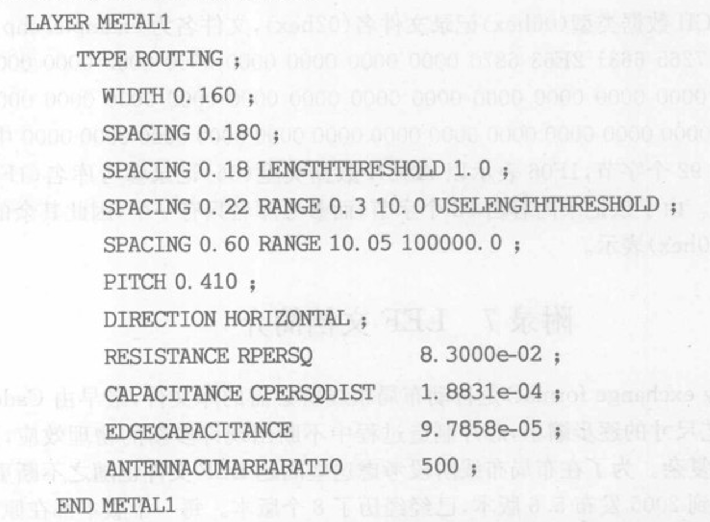
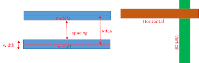
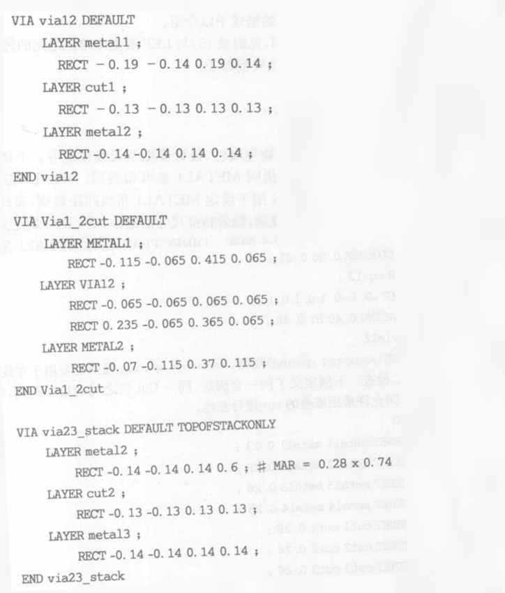
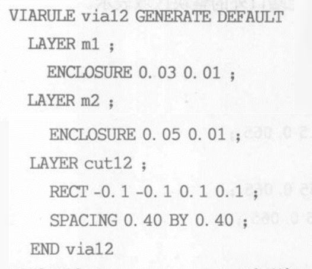
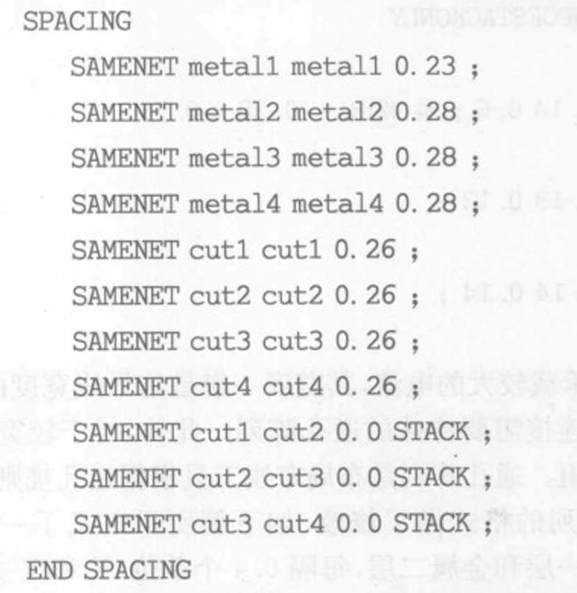
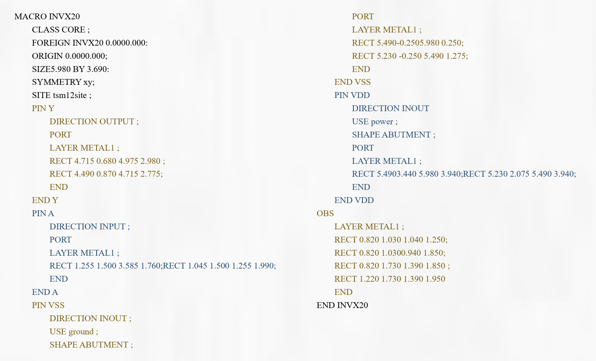

在本文中，我们将讨论在ASIC设计中使用的LEF文件。LEF是库交换格式 [Library Exchange Format] 的缩写。LEF文件采用ASCII格式编写，因此这个文件是可读的，它是由foundry提供的。

LEF是自动布局布线所必须的库文件，随着工艺尺寸的逐步缩小，芯片制造过程中不断出现许多新的物理效应，设计规则也越来越复杂，LEF文件也在不断更新。目前，描述库的LEF文件主要有两部分：

- 技术LEF [Technology LEF]：主要包含工艺信息、设计规则信息、工控信息
- 单元LEF [Cell LEF]:包含单元库中各单元的信息的几何信息

## 1 技术LEF

技术LEF部分包含了所有金属互连、通孔 [via] 信息以及相关设计规则的信息。下面提供了一个示例快照，显示了技术LEF部分下的信息。

  
  <h4>图1 版本、单元</h4>

技术LEF部分包含以下信息：

1. **LEF版本**（例如5.7或5.8）

2. **单位：** 用于国际标准单位与LEF数据库单位之间的转换，目前LEF支持100、200、1000、2000四种单位转换因子。

3. **层信息：** 层名称（如poly、contact、via1、metal1等）+ 层类型（如routing、masterslice、cut等）+ 优先方向（如水平或垂直）+ 间距（PITCH）+ 最小宽度（WIDTH）+ 间隙(SPACING) + 互连层电阻值 (RESISTANCE PRERSQ) + 平板电容值 + 边缘电容值 + 累积天线效应值的定义。

4. **互连线通孔：** 互连线通孔定义的是布层组成的,包括两个互连层和一个cut层，类和选择通孔的规则。

5. **通孔阵列：** 电源、地线和较宽互连线的连接通道，减小通孔电阻。由布局布线工具根据通孔规则自动产生。

6. **相同连线距离（same-net spacing）：** 用于布线或验证工具的DRC检查，定义层内最小间隙。

------------------------------------

### (1) 层的三种类型：

- Routing层：用于布线的层，通常包含金属线、连线等信息，用于连接芯片上的不同元件。

- Masterslice层：表示主切片层，用于定义标准单元和宏单元的版图信息，在芯片设计中扮演重要角色。

- Cut层：用于定义金属化层中的切割区域，通常包含需要在金属层中做孔洞或者切断的区域信息。可以理解为连接两层互连线的接口。

下面提供了一个LEF文件的快照，展示了层部分和金属互连的不同尺寸。

  
  <h4>图2 技术LEF中的层部分和金属互连</h4>

  
  <h4>图3 金属层与cut层</h4>

-----------------------------

### (2) PITCH & WIDTH & SPACING 

- 间距（PITCH）：表示每层的track之间的距离，元件的中心线要卡在track上进行摆放，换句话说即两个相邻元件之间中心线之间的距离。它通常用于描述排列紧密的元件或电路结构的布局。例如，如果两个晶体管的间距为100纳米，则表示这两个晶体管的中心线之间的距离为100纳米。

- 最小宽度（WIDTH）：表示元件或电路结构的最小宽度。它通常用于约束芯片设计中的线宽或金属线的宽度。例如，如果规定某一层的最小宽度为20纳米，则意味着该层上所有的线宽都不能小于20纳米。

- 间隙（SPACING）：表示不同元件或电路结构之间的间隔或空隙。它通常用于约束芯片设计中的线与线、线与物理对象之间的最小间隔。例如，如果规定某一层的间隙为10纳米，则意味着该层上的线与线之间，以及线与其他物理对象之间的最小距离都不能小于10纳米。

  
  <h4>图4 层部分和金属互连信息</h4>

----------------------------------

### （3）互连线通孔via

一个完整的通孔是由三层组成，两个互连层和一个cut层。互连线间有多种通孔类型可供布cut层可以理解为连接两层互连线的接口。通常每两层互连线间有多种瞳孔类型供布线器选择，布线器再不违反DRC的前提下选择最合适的通孔链接两层互连线。

  
  <h4>图5 技术LEF中的互连线通孔</h4>

上例定义了三种不同类型的通孔,第一个通孔名为Via12,用于金属1层与金属2层的连接，由单个cut层组成。第二个通孔名为 Via_2l2cut,同样用于金属1层与金属2互连,但这是一个由双cut层组成的通孔。第三个通孔名为via23 stack,TOPOFSTACKONLY语句决定了该通孔只能在通孔堆叠(stack)时使用。**堆叠**即上下相接两个via可直通布线。RECT表示层的形状为矩形,每个RECT后的四个数值从左到右分别代表矩形左下角X、Y轴的坐标和右上角XY轴的坐标。

--------------------------------------

### （4）通孔阵列

下例所示定义了一个名为via12的通孔阵列,通孔用来连接金属2层和金属3层，每隔0.4个单位(X和Y方向)产生一个cut层。ENCLOSURE定义了Cut层距金属边界的距离。

  
  <h4>图6 通孔阵列</h4>

-----------------------------------

### （5）相同连线距离

下例定义了同一金属层、同一cut层之间的最小距离，STACK表明不同金属层间允许采用堆叠的cut进行互连。

  
  <h4>图7 相同连线距离</h4>

-------------------------------

## 2 单元LEF

单元LEF部分包含标准单元库中每个单元的相关信息，这些信息在不同的部分中分别呈现。文件可以归为两部分,一是采用SITE语句对布局(placement)最小单位的定义,另一部分是采用MACRO语句对单元属性及几何形状的描述。

单元LEF基本上包含以下信息：

- 单元名称（如AND2X2、CLKBUF1等）
- 类别（如CORE或PAD）
- 原点（Origin）0 0
- 尺寸（宽度x高度）
- 对称性（如XY、X、Y等）
- 引脚信息
  - 引脚名称（如A、B、Y等）
  - 方向（如输入input、输出output、双向inout等）
  - 用途（如信号Signal、时钟clock、电源power等）
  - 形状（对于电源引脚来说通常是Abutment）
  - 层（如Metal1、Metal2等）
  - 引脚的矩形坐标（左下角llx lly右上角urx ury）

### （1）SITE语句

SITE定义的是最小的布局单位。如下图，这个最小布局单位的名称tsm12site将在单元(MACRO)的SITE定义中被引用。

  
  <h4>图8 SITE示例</h4>

上面LEF字段定义了site的尺寸大小和方向，size是横向长度，BY是高度，接下来的standard cell会引用该site定义，所有stardard cell横向长度一定是site长度的整数倍，我们不允许非整数倍site长度的stardard cell。

### （2）MACRO语句

**MACRO**是单元定义的关键字，每一个MACRO代表一个单元，**Class Core**说明单元用于芯片的核区。

**FOREIGN**定义了单元原点坐标(版图左下角坐标)与参考原点之间的偏移量。

**ORIGIN**描述的是单元版图的左下角坐标，例子即表明左下角坐标为原点坐标。

**SIZE**确定了单元的面积大小，例子表明其X方向的长度为5.980，Y方向的高度为3.690。**可以看出5.98是site0.46的整数倍。**

**SYMMETRYXY**说明单元可沿X轴Y轴对称放置。

**MACRO内的SITE语句**指定了单元采用预先定义的tsm12site为最小布局单位。

每一个**PIN语句**代表单元的一个端口,描述的内容包括端口的输入输出属性、用途及端口采用的金属层及金属形状。

**OBS**是单元的不可布线区域,对标准单元来说,不可布线区通常是指除单元端口外单元其他所有互连层表示的区域,对于卫模块,不可布线区通常用除单元端口外的整块区域表示。例如，下面提供了一个MACRO语句快照，以更好地理解格式。

  
  <h4>图9 MACRO示例</h4>

LEF文件被布线工具在布局布线 [PnR] 设计中用来获取标准单元引脚的位置，以便正确地进行布线。因此，它基本上是标准单元布局的抽象形式。

## 来源

[1]《数字集成电路物理设计》P243-248
[2] https://teamvlsi.com/2020/05/lef-lef-file-in-asic-design.html