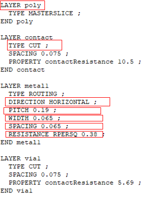
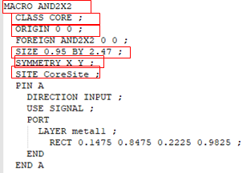

May 9, 2020 by [Team VLSI](https://teamvlsi.com/author/team-vlsi)

在本文中，我们将讨论在ASIC设计中使用的LEF文件。LEF是库交换格式 [Library Exchange Format] 的缩写。LEF文件采用ASCII格式编写，因此这个文件是可读的。描述库的LEF文件主要有两部分：

- 技术LEF [Technology LEF]
- 单元LEF [Cell LEF]

## 技术LEF

技术LEF部分包含了所有金属互连、通孔 [via] 信息以及相关设计规则的信息，而单元LEF部分则包含了每个单元的几何信息。下面提供了一个示例快照，显示了技术LEF部分下的信息。

  
  <h4>图1 技术LEF部分信息</h4>

技术LEF部分包含以下信息：

- LEF版本（例如5.7或5.8）
- 单位（用于数据库、时间、电阻、电容）
- 制造网格
- BEOL（后端层）的设计规则和其他细节
- 层名称（如poly、contact、via1、metal1等）
- 层类型（如routing、masterslice、cut等）
- 优先方向（如水平或垂直）
- 间距
- 最小宽度
- 间隙
- 板材电阻

下面提供了一个LEF文件的快照，展示了层部分和金属互连的不同尺寸。

  
  <h4>图2 技术LEF中的层部分和金属互连</h4>

  
  <h4>图3 层部分和金属互连信息</h4>

## 单元LEF

单元LEF部分包含标准单元库中每个单元的相关信息，这些信息在不同的部分中分别呈现。例如，下面提供了一个快照，以更好地理解格式。

  
  <h4>图4 单元LEF的部分信息</h4>

单元LEF基本上包含以下信息：

- 单元名称（如AND2X2、CLKBUF1等）
- 类别（如CORE或PAD）
- 原点（Origin）0 0
- 尺寸（宽度x高度）
- 对称性（如XY、X、Y等）
- 引脚信息
  - 引脚名称（如A、B、Y等）
  - 方向（如输入input、输出output、双向inout等）
  - 用途（如信号Signal、时钟clock、电源power等）
  - 形状（对于电源引脚来说通常是Abutment）
  - 层（如Metal1、Metal2等）
  - 引脚的矩形坐标（左下角llx lly右上角urx ury）

下面展示了LEF文件中单元部分的一个快照。

  
  <h4>图5 单元LEF的快照</h4>

LEF文件被布线工具在布局布线 [PnR] 设计中用来获取标准单元引脚的位置，以便正确地进行布线。因此，它基本上是标准单元布局的抽象形式。

## 谢谢

原文链接：https://teamvlsi.com/2020/05/lef-lef-file-in-asic-design.html