August 8, 2020 by [Team VLSI](https://teamvlsi.com/author/team-vlsi)

在本文中，我们将讨论一个广泛使用且非常流行的文件，该文件用于从一个电子设计自动化（EDA）工具传输数据到另一个工具。是的，我们将讨论 设计交换格式[Design Exchange Format] 或DEF文件，其扩展名为.def。在本文中，我们将讨论def文件的使用，这个文件包含哪些信息以及信息如何在各个部分中排列。我们还将讨论如何生成这个文件。

## 介绍

DEF文件用于以ASCII格式表示集成电路（IC）的物理布局。DEF文件与 库交换格式 [Library Exchange Format，LEF] 文件密切相关。因此，两个文件都是物理设计正确显示所必需的。DEF文件格式由Cadence Design System开发。每当我们需要将设计数据库从一个EDA工具转移到另一个EDA工具以进行进一步的实现或分析时，我们使用DEF文件来传输设计数据。例如，对PnR数据库进行IR分析或STA分析时，我们以DEF文件的形式传输设计数据库。

DEF文件包含电路的特定设计信息，它是在物理设计过程中任何节点上设计的表示。DEF传达了逻辑设计数据和物理设计数据。

逻辑设计数据包括内部连接性（由网表表示）、组信息和物理约束。物理数据包括组件的放置位置和方向以及布线几何。

## 部分

标准的DEF文件主要包含以下部分，声明的顺序也很重要。

- [ VERSION 声明 ]
- [ DIVIDERCHAR 声明 ]
- [ BUSBITCHARS 声明 ]
- [ DESIGN 声明 ]
- [ TECHNOLOGY 声明 ]
- [ UNITS 声明 ]
- [ DIAAREA 声明 ]  
<br>
- [ ROW 声明 ]
- [ TRACKS 声明 ]
- [ CELLGRID 声明 ]
- [ VIAS 声明 ]
<br>
<br>

- [ NONDEFAULTRULES 声明 ]
- [ COMPONENTS 声明 ]
- [ PINS 部分 ]
- [ BLOCKAGE 部分 ]
<br>
<br>

- [ FILLS 部分 ]
- [ SPECIALNETS 部分 ]
- [ NETS 部分 ]
- [ SCANCHAINS 部分 ]
- [ GROUPS 部分 ]
- [ BEGINEXT 部分 ]
- [ END DESIGN 声明 ]

在这里，我们将拿一个样本DEF文件来描述文件的各个部分。

### 标题 [HEADER] 声明：

<div style="text-align:center;">
  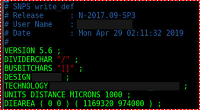
  <h4>图1 DEF文件的标题声明</h4>
</div>

在标题部分，会提到DEF的版本、设计名称、技术名称、单位和 晶圆片 [Die] 面积。

### 行 [ROW] 声明：

语法：

`[ROW rowName siteName origX origY siteOrient [DO numX BY numY [STEP stepX stepY]] [+ PROPERTY {propName propVal} …] … ;] …`

这里是一个DEF文件中行 [ROW] 部分的示例。

<div style="text-align:center;">
  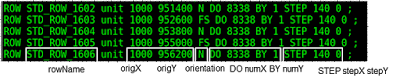
  <h4>图2 DEF文件的行描述</h4>
</div>

- rowName：指定该行的行名。

- siteName：指定用于该行的LEF节点。

- origX 和 origY：指定该行中第一个节点的位置。

- siteOrientation：指定该行中所有节点的方向。

- Do numX BY numY：

    - 指定创建该行的重复节点集。
    - 其中一个值必须为1。
    - 如果 numY 为1，则行将是水平的。

- STEP stepX stepY：

    - 指定水平和垂直行中节点之间的间距。


### 轨道 [Track] 声明：

语法：

`[TRACKS [{X | Y} start DO numtracksSTEP space [LAYER layerName…] ;] …]`

例子：

<div style="text-align:center;">
  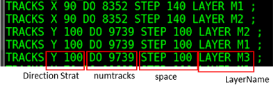
  <h4>图3 DEF 文件中的 Track 语句</h4>
</div>

描述：

- { X | Y } start

    - 指定第一个轨道的方向和位置
    - X 表示垂直线，Y 表示水平线
    - 起点是第一条线的 X 或 Y 坐标
- Do numtracks 
    - 指定网格中要创建的轨道数
- STEP space
    - 指定轨道之间的间距
- LAYER layerName
    - 指定用于此轨道的布线层
    - 我们可以指定多个层

### 全局单元格网络 [GCell Grid] 声明：

语法：

`[GCELLGRID {X start DO numColumns+1 STEP space} … {Y start DO numRows+1 STEP space ;} …]`

例子：

<div style="text-align:center;">
  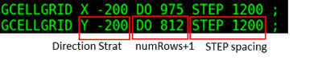
  <h4>图4 DEF 文件中的 GCell 语句</h4>
</div>

描述：

- { X | Y } start

    - 指定第一个垂直 (x) 和第一个水平 (y) 轨道的位置

- Do numColumns+1

- Do numRows+1

    - 指定网格中的列数或行数

- STEP space

    - 指定轨道之间的间距

### 经由 [Via] 声明：

例子：

<div style="text-align:center;">
  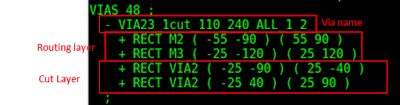
  <h4>图5 DEF 文件中的 Via 语句</h4>
</div>

描述：

所有过孔都由三个层上的形状组成

1. 切割层

2. 两个bu布线 (或主片) 层，通过该切割层连接

### 负差电阻器 [NDR] 声明：

语法：

```NONDEFAULTRULES numRules;

{- ruleName

[+ HARDSPACING]

{+ LAYER layerName

WIDTH minWidth

[DIAGWIDTH diagWidth]

[SPACING minSpacing]

[WIREEXT wireExt]

} …

[+ VIA viaName] …

[+ VIARULE viaRuleName] …

[+ MINCUTS cutLayerNamenumCuts] …

[+ PROPERTY {propNamepropVal} …] …

;} …

END NONDEFAULTRULES
```

例子：

<div style="text-align:center;">
  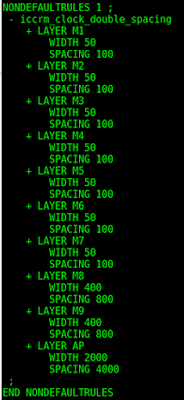
  <h4>图6 DEF 文件中的 NDR</h4>
</div>

描述：

- 它定义了在此设计中使用的任何非默认规则，这些规则未在 LEF 文件中指定。

- 此部分还可以包含默认规则和 LEF 非默认规则定义以供参考。

### 组件部分：

- 定义设计组件、其位置和相关属性
- DEF 文件中的一个大部分

语法：

```COMPONENTS numComps;

[– compNamemodelName

[+ EEQMASTER macroName]

[+ SOURCE {NETLIST | DIST | USER | TIMING}]

[+ {FIXED pt orient | COVER ptorient | PLACED ptorient

| UNPLACED} ]

[+ HALO [SOFT] left bottom right top]

[+ ROUTEHALO haloDistminLayermaxLayer]

[+ WEIGHT weight]

[+ REGION regionName]

[+ PROPERTY {propNamepropVal} …]…

;] …

END COMPONENTS
```

例子：

<div style="text-align:center;">
  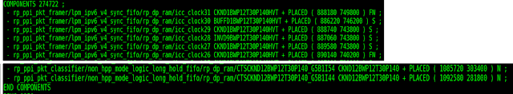
  <h4>图7 DEF 文件中的组件部分</h4>
</div>

### 引脚 [Pin] 部分：

- 定义外部引脚
- 每个引脚定义为外部引脚分配引脚名称，并将引脚名称与相应的内部网络名称相关联
- 引脚名称和网络名称可以相同。

例子：

<div style="text-align:center;">
  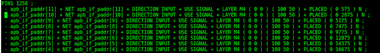
  <h4>图8 DEF 文件中的引脚部分</h4>
</div>

### 障碍物 [Blockage] 部分：

- 定义设计中的放置和路由障碍物
- PUSHDOWN：指定障碍物从设计的顶级向下推入

例子：

<div style="text-align:center;">
  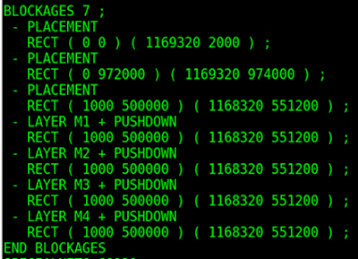
  <h4>图9 DEF 文件中的障碍物部分</h4>
</div>


### 特殊网络 [Special net] 部分：

语法：

```[SPECIALNETS numNets;

[– netName

[ ( {compNamepinName| PIN pinName} [+ SYNTHESIZED] ) ] …

[+ VOLTAGE volts]

[specialWiring] …

[+ SOURCE {DIST | NETLIST | TIMING | USER}]

[+ FIXEDBUMP]

[+ ORIGINAL netName]

[+ USE {ANALOG | CLOCK | GROUND | POWER | RESET | SCAN | SIGNAL | TIEOFF}]

[+ PATTERN {BALANCED | STEINER | TRUNK | WIREDLOGIC}]

[+ ESTCAP wireCapacitance]

[+ WEIGHT weight]

[+ PROPERTY {propNamepropVal} …] …

;] …

END SPECIALNETS]
```

例子：

<div style="text-align:center;">
  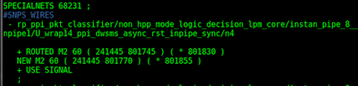
  <h4>图10 DEF 文件中的特殊网络部分</h4>
</div>

### 网络 [Net] 部分：

语法：

```NETS numNets;

[– { netName

[ ( {compNamepinName| PIN pinName} [+ SYNTHESIZED] ) ] …

| MUSTJOIN ( compNamepinName) }

[+ SHIELDNET shieldNetName] …

[+ VPIN vpinName[LAYER layerName] ptpt

[PLACED pt orient | FIXED ptorient | COVER ptorient] ] …

[+ SUBNET subnetName

[ ( {compNamepinName| PIN pinName| VPIN vpinName} ) ] …

[NONDEFAULTRULE rulename]

[regularWiring] …] …

[+ XTALK class]

[+ NONDEFAULTRULE ruleName]

[regularWiring] …

[+ SOURCE {DIST | NETLIST | TEST | TIMING | USER}]

[+ FIXEDBUMP]

[+ FREQUENCY frequency]

[+ ORIGINAL netName]

[+ USE {ANALOG | CLOCK | GROUND | POWER | RESET | SCAN | SIGNAL

| TIEOFF}]

[+ PATTERN {BALANCED | STEINER | TRUNK | WIREDLOGIC}]

[+ ESTCAP wireCapacitance]

[+ WEIGHT weight]

[+ PROPERTY {propNamepropVal} …] …

;] …

END NETS
```

例子：

<div style="text-align:center;">
  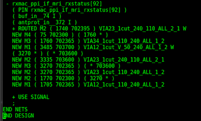
  <h4>图11 DEF 文件中的网络部分</h4>
</div>

## 总结：

解释了 DEF 文件中的各个部分及其示例和语法。了解 DEF 文件对于调试设计和验证组件非常重要。


## 谢谢

原文链接：https://teamvlsi.com/2020/08/def-file-in-vlsi-design-exchange.html