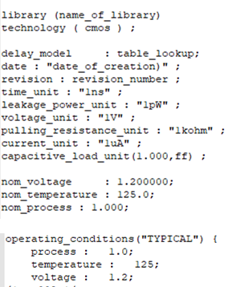
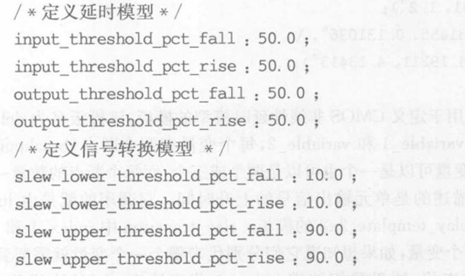
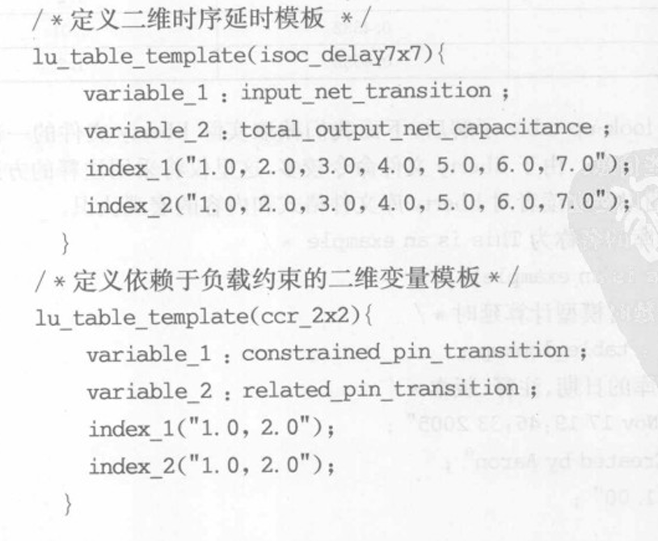
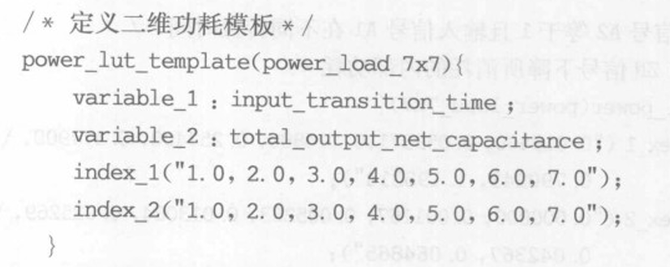
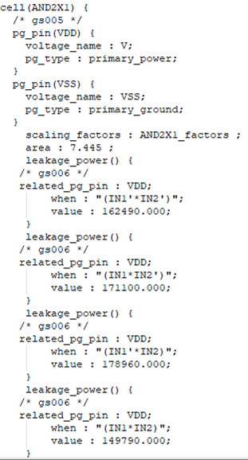

Lib文件是Liberty Timing文件的简称。编写.lib文件遵循Liberty语法。LIB文件是一个ASCII表示形式，包含了特定技术节点的标准单元库内部单元相关的时序和功耗参数。Lib文件基本上是一个时序模型文件，包含有关单元延迟、单元转换时间、单元的建立时间和保持时间要求。因此，Lib文件基本上包含了单元或宏单元的时序和电气特性。**如果晶圆厂提供标准单元库，Lib文件由标准单元库供应商或晶圆厂生成并提供给ASIC设计师。**

为保证数据的精确性多采用**非线性查表(look-uptable)或分段线性**的方法，工具利用在库文件中查找最符合单元真实情况的数据进行延时与功耗计算。由于电路的延时和功耗是输入信号斜率与输出负载的函数，因此完整的表格有一维、二维和三维三种形式，分别表示了一元、二元以及三元三种函数关系。此外采用目前更先进的**CCSM和ECSM模型**建立的liberty库不仅提高了纳米工艺下时序的精确性，而且包含了对单元噪声描述。

liberty库文件通常比较大,但大致可以分为两部分。在第一部分中，定义了单元库的基本属性，第二部分是每个单元的具体信息，包括单元的延迟时间、泄露功耗，内部功耗等。为了更好地理解，可以查看以下Lib文件的快照。

## LIB文件的第一部分

Lib文件的通用部分包含以下内容：

- library 名称和技术名称
- 延迟模型、生成日期、版本
- 单位（时间、功率、电压、电流、电阻和电容）
- 建立时序库工艺、温度、电压，互连线模型

  
  <h4>图1 LIB库名称版本等基本信息</h4>

- 定义延时模型和信号转换模型的参数

  
  <h4>图2 延时模型和信号转换模型的参数</h4>

- 定义二维时序延时模板、依赖于负载约束的二维变量模板、二维功耗模板

  
  <h4>图3 二维时序延时模板、依赖于负载约束的二维变量模板</h4>

  
  <h4>图4 二维功耗模板</h4>

## LIB文件的第二部分

基于工作条件，针对最大值、最小值和典型值情形，有三个不同的lib文件。在Lib文件的第二部分，它包含了每个单元特定的信息。包含单元特定信息的Lib文件部分如下所示。

  
  <h4>图2 LIB文件特定单元信息</h4>

Lib文件中的特定于单元的信息主要包括：

- 单元名称
- PG引脚名称
- 单元面积
- 根据输入引脚逻辑状态的漏电功率
- 引脚详情
  - 引脚名称
  - 引脚方向
  - 内部功率
  - 电容

   
  - 上升电容
  - 下降电容
  - 驱动负载

下面给出了Lib文件中针对引脚部分的一个快照。

  
  <h4>图3 LIB文件引脚部分信息</h4>

单元的时序和功耗参数是通过在各种操作条件下模拟单元获得的，数据在Lib文件中表示。生成Lib文件的主要有两种技术：

- CCS（复合电流源）
- NLDM（非线性延迟模型）

在CCS技术中使用电流源，而在NLDM技术中使用电压源来模型化并推导Lib参数。基于用于表征单元的CCS和NLDM技术，我们将相应的Lib文件称为CCS Lib文件和NLDM Lib文件。由于CCS技术与NLDM技术相比具有更多的控制参数，因此CCS Lib文件更加准确。NLDM Lib文件具有较少的运行时间，即比CCS Lib运行更快，且NLDM文件的大小也小于CCS Lib文件。

## 来源及引用 

原文链接：https://teamvlsi.com/2020/05/lib-and-lef-file-in-asic-design.html

《数字集成电路物理设计》P248-255
