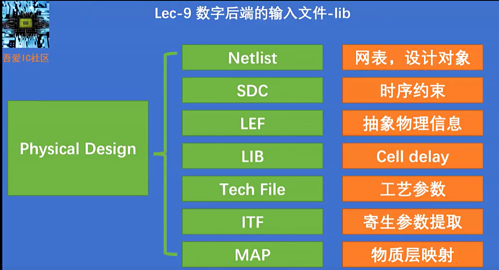

本章，我们将具体介绍VLSI设计中涉及到的**库文件**：LIB、LEF、SDC、CCO。介绍将通过一下**三个维度**展开：

&nbsp; &nbsp;  1. 文件的结构与内容

&nbsp; &nbsp;  2. 文件的来源

&nbsp; &nbsp;  3. VLSI设计中文件的使用

相信本章学习完成后，你们将对VLSI的了解会更加具象化。话不多说，我们开始吧！

    
    <h2 style="font-size: 16px;">图1 芯片设计与制作流程</h2>

LEF 版图信息，Tech LEF 布线布局的工艺要求

-----------------------------------------------------------------------------------------

## 1 文件的结构与内容

Lib文件是Liberty Timing文件的简称。编写.lib文件遵循Liberty语法。LIB文件是一个ASCII表示形式，包含了特定技术节点的标准单元库内部单元相关的时序和功耗参数。Lib文件基本上是一个时序模型文件，包含有关单元延迟、单元转换时间、单元的建立时间和保持时间要求。因此，Lib文件基本上包含了单元或宏单元的时序和电气特性。如果晶圆厂提供标准单元库，Lib文件由标准单元库供应商或晶圆厂生成并提供给ASIC设计师。

Lib文件内的信息可以分为两个主要部分，在第一部分中，它包含了所有标准单元通用的一些信息。为了更好地理解，可以查看以下Lib文件的快照。

  
  <h4>图1 LIB文件通用信息</h4>

Lib文件的通用部分包含以下内容：

- 图书馆 [library] 名称和技术名称
- 单位（时间、功率、电压、电流、电阻和电容）
- 工作条件的值（工艺、电压和温度）—— 最大值、最小值和典型值

基于工作条件，针对最大值、最小值和典型值情形，有三个不同的lib文件。在Lib文件的第二部分，它包含了每个单元特定的信息。包含单元特定信息的Lib文件部分如下所示。

  
  <h4>图2 LIB文件特定单元信息</h4>

Lib文件中的特定于单元的信息主要包括：

- 单元名称
- PG引脚名称
- 单元面积
- 根据输入引脚逻辑状态的漏电功率
- 引脚详情
  - 引脚名称
  - 引脚方向
  - 内部功率
  - 电容
  - 上升电容
  - 下降电容
  - 驱动负载

下面给出了Lib文件中针对引脚部分的一个快照。

  
  <h4>图3 LIB文件引脚部分信息</h4>

单元的时序和功耗参数是通过在各种操作条件下模拟单元获得的，数据在Lib文件中表示。生成Lib文件的主要有两种技术：

- CCS（复合电流源）
- NLDM（非线性延迟模型）

在CCS技术中使用电流源，而在NLDM技术中使用电压源来模型化并推导Lib参数。基于用于表征单元的CCS和NLDM技术，我们将相应的Lib文件称为CCS Lib文件和NLDM Lib文件。由于CCS技术与NLDM技术相比具有更多的控制参数，因此CCS Lib文件更加准确。NLDM Lib文件具有较少的运行时间，即比CCS Lib运行更快，且NLDM文件的大小也小于CCS Lib文件。

## 2 文件的来源

## 3 VLSI设计中文件的使用

## 谢谢

原文链接：https://teamvlsi.com/2020/05/lib-and-lef-file-in-asic-design.html

《数字集成电路物理设计》