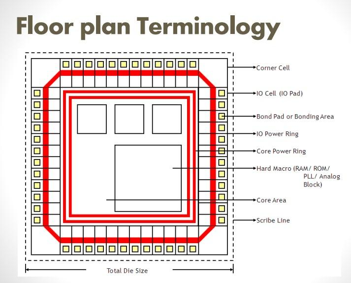
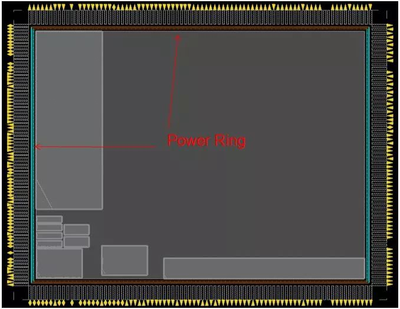
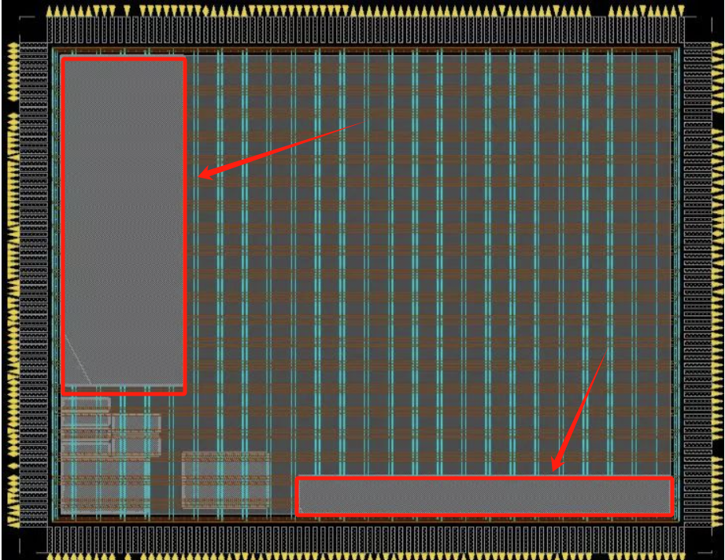
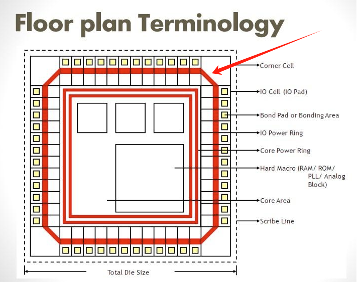
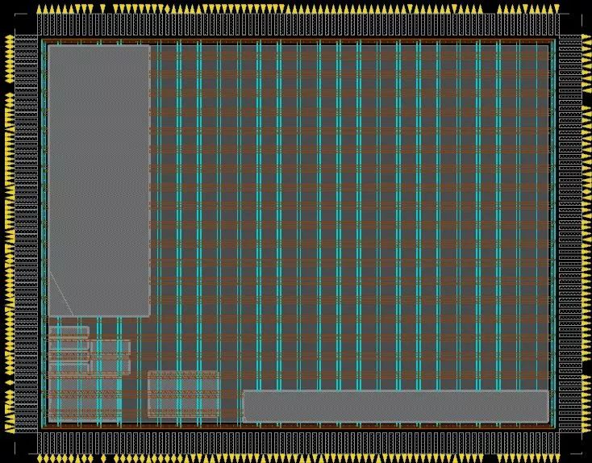
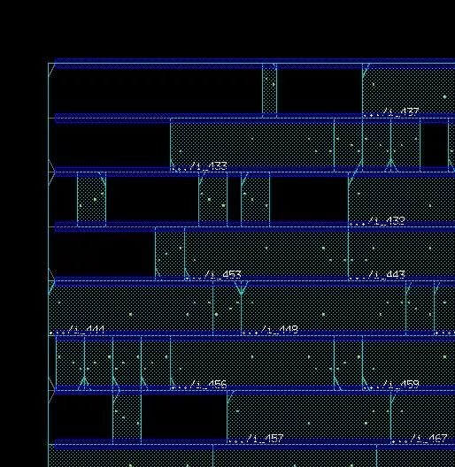

逻辑综合阶段输出了门级网表和设计约束文件（SDC），紧接着步入物理设计阶段。芯片设计的物理设计通常被简称为布局布线（PnR），其实不那么准确。在布局之前的大量工作包括 布图规划（floorplan） 和 电源规划(powerplan) 常常被忽略。

若把芯片制作与建房子做个不完全类比，布图规划相当于房子的初步设计图纸，大致确定建筑的形状大小以及户型；电源规划正如其名，规划建筑的总电源线布置；布局则正式确定每个户型的功能区，每个房间的地漏、电源插口等等的位置，以便于方便后续通管道（布线）。**需要注意的是，布图规划与电源规划和布局三项任务通常是连续进行的，但在工程中往往是穿插反复进行。**


## 1 布图规划

布图规划与布局在芯片设计中占据重要的地位，它的合理与否直接关系到芯片的时序收敛、布线通畅、电源稳定以及良品率。所以在整个芯片设计中，从布图规划到完成布局一般需要占据整个物理设计 1/3 的时间。简单来说，布图规划与布局关键性在于**如何合理的划分区域和摆放单元，使得各种性能尽可能最优。** 下面我们将介绍布图规划的输入文件、主要内容和目标。

### （1）布图规划的输入文件

布图规划输入文件如下：

| 类型       | 种类                                           | 特征                         |
|------------|------------------------------------------------|------------------------------|
| 设计网表   | gate-level netlist (例如, chip_design.v)        | 单个完整文件                 |
| 设计约束文件 | chip_design.sdc                                | 单个完整文件                 |
| 物理库文件 | standard.lef, io.lef, rom.lef, ram.lef         | 与时序要求相关的文件           |
| 时序库文件 | standard.lib, io.lib, rom.lib, ram.lib        | 单个完整文件或多个文件        |
| I/O 文件   | I/O constraints file                          | 单个完整文件或多个文件        |
| 布图要求文件 | floorplan configuration file                  | 单个文件                      |

网表文件和SDC文件是逻辑综合阶段生成的，LEF文件、LIB文件和I/O文件是faundry提供的。

### （2）布图规划的主要内容

<div style="text-align:center;">
  
</div>

- 芯片大小(die size)的规划

- 芯片设计输入输出(I/O)单元的规划

- 大量硬核或模块(hardcore，block)的规划

- ......

在某些不规则的设计中，需要对布线通道进行一些特殊的设置，这些参数的设定也是布图规划中的组成部分。在一些较为复杂的超大规模集成电路设计中，为了尽量减少时钟信号线的偏差、提高芯片的性能，在布局之前便需要对时钟网络进行规划，此时的时钟网络分布与普通的时钟树不同，它也是布图规划的重要组成部分。可见,布图规划的内容是对芯片内部结构的完整规划与设计。

---------------------------

**【注意】hardcore，block，macro区别？**

在芯片设计领域中，"hardcore"、"block" 和 "macro" 这些术语通常用于描述不同级别的 IP 或模块。它们之间的区别如下：

**Hardcore:**

- Hardcore IP 是指在芯片设计中预先设计和实现的 IP 核，通常由芯片制造商提供。
- 这些 IP 核通常是针对特定的硬件架构和流程优化的，具有固定的功能和性能特征。
- Hardcore IP 通常是高度定制化的，集成度高，且难以修改或定制。

**Block:**

- Block 通常是指一个功能上相对独立的区块或模块，可以是硬件设计中的一个单元。
- 这些块可以是通用的、可重用的，也可以是定制的、针对特定功能的。
- Blocks 可以在设计中被组合和重用，常用于构建复杂的系统。

**Macro:**

- Macro 通常是指一个比 block 更大的功能单元，可以包含多个 block 或其他逻辑单元。
- Macros 可以是可重用的、带有接口的功能模块，也可以是定制的、针对特定应用场景的功能单元。
- Macros 提供了一种将复杂功能封装为单个单元以便于使用的方式。

总的来说，hardcore 是已经预先设计好的 IP 核，block 是相对独立的功能模块，而 macro 则是更大的功能单元，可以包含多个 block。这些术语在芯片设计中帮助工程师进行模块化设计和组合，以提高设计效率和复用性。

---------------------------


### （3）布图规划和布局的区别

布图规划和布局都涉及摆放，但是它们摆放的东西不同：

- 布图规划确定模块大小，位置，形状，以及摆放Macro，也就是我们通常见到的随机存储单元RAM、只读存储单元ROM，还有其他IP模块等等

- 布局主要摆放标准单元，而标准单元的高度一定，宽度是site的整数倍 **（不熟悉的请回看LEF文件介绍）**

布图规划相较于布局的难点： 模块的形状与大小可能是一个不确定的变量，需要权衡结果来反推这个变量。

布局相较于布图规划的难点：整体数据量并不是十分庞大，换句话说，标准单元忒多了。


### （4）布图规划的目标

布图规划做好了，那么如何判定它“可以”了呢？这就涉及到布图规划的目标了。四个目标如下：

- **确定芯片的面积。** 出于成本的考虑，芯片的面积越小，每张硅片(wafer)上产出的裸片(die)数量将增大，从而平均到每个芯片上的成本会降低，但是如果布图规划设定的裸片面积太小，则会造成拥塞程度高，难以布线，从而会导致长周期的设计迭代，一个合理的面积设定是在保证布线的同时尽量节约产品成本，所以布局的最初目标是估计芯片面积的大小。

- **确保时序的收敛。** 在数字集成电路设计中，所有的工作都是在时钟节拍的控制下完成，所以从一个寄存器到达另外一个寄存器的路径长短决定了芯片的性能。在芯片设计的布图规划阶段，设计者就要考虑到最终芯片是否能满足设计的标准时序约束(SDC)的要求，实现时序的收敛，满足芯片所需要实现的性能，因此在布图规划阶段需要对芯片的延迟进行预估。

- **保证芯片的稳定。** 芯片能稳定地工作是芯片价值的重要组成部分，芯片输入输出单元的静电保护和输入输出单元的供电设计都是保证芯片输入输出稳定的重要条件。电源规划也是保证芯片内部电源分布均匀、供电充足、芯片工作稳定的必要条件。

- **满足布线的要求。** 布图规划与布局完成了芯片的器件摆放，而芯片功能的实现需要将所有的器件按照要求连线，故布图规划的目的是为了方便走线，在保证布线通畅的同时，尽量缩短走线的长度，也即减小互连线的延迟，从而有效地提高芯片的性能。这需要设计者对逻辑设计及其功能有一定的了解，如各个模块之间的连接关系、数据通路结构等，一个好的布图规划和一个差的布图规划在时序上的差别甚大。

**# 若想拓展学习“I/O接口单元的放置与供电、布图规划方案与延迟预估和模块布放与布线通道”，请看《数字集成电路物理设计》P58-67。**

## 2 电源规划

芯片设计中，在布图规划后需要进行电源设计。对于较小的芯片，它的过程是建立一些简单的电源网线，因此，电源设计常常被认为是布图规划所捎带的一部分工作。随着芯片的尺寸增大，电源设计也更为复杂，它已不仅仅局限于“网格"设计，拟称它为“电源(地)规划”则更能反映出当代设计的实际情况。因此，在物理实施的过程中，从数据输入到时钟树综合之前，内容上可分成三大项内容，即**布图规划、电源规划和布局**。

### （1）[电源规划的目标](https://blog.csdn.net/Tao_ZT/article/details/102456851)

- 产生一个可以满足IR drop(电压降)，EM(电迁移)的供电网络

&nbsp; &nbsp;&nbsp;&nbsp;&nbsp;&nbsp;芯片供电是通过I/O单元来实现的，在做电源规划和电源网络设计时，首先要做电源预算(power budgeting)，商用产品惯例认为总的误差应当控制在士5%之内。它包括从电源网络和 PCB 板级到封装bonding之间的波动(约为士1%)，再到电源 I/O单元和电源环之间的波动(约为士1%)和最终直至标准单元之间的电压降(约为士3%)。

- 尽量减少 routing track的资源

- 做到 DRC clean

### （2）电源网络介绍

#### 全局电源连接关系

即是alobalnet connect，是指把相应的端口和网络连接到合适的电源和接地网络上去。这些终端和网络的连接信息一部分包含在Verilog网表中，另一部分则包含在相应的LEF文件当中。在工具中，其实就是globalNetConnec整个命令。

```
globalNetConnect VDD -type pgpin -pin vdd! -all
```

上述两条命令就说明了所有instance的vdd!和gnd! pin需要连接到全局的VDD和GND网线上。

#### 电源环线(power ring)

指为了均匀供电，包围在整个core内部的电源环。如下图中电源core外围一圈即是power ring



#### 硬核电源环

硬核的电源环设计，如图所示：



#### I/O单元power ring

I/O 供电单元电源环的设计，如图所示：



其中，供电单元与电源环的连接，称为I/O单元power

#### 电源条线(power stripe)

芯片内部纵横交错的电源线称为电源条线，它的用途是将电源输送到芯片内部各个macro上，如下图所示:



#### followpin(power rail)

标准单元的供电网络，如下图蓝色线条所示：



#### ring pins:

芯片内部的电源网格(power stripe)与硬核电源环连接的pin


## 引用

[1] 《数字集成电路物理设计》P67-78
[2] https://blog.csdn.net/Tao_ZT/article/details/102456851
[3] https://mp.weixin.qq.com/s?__biz=MzU5NzQ1NDI5Nw==&mid=2247483900&idx=1&sn=f8807031da4d2aefd403ca8be449b38a&chksm=fe527d4ac925f45c4c7fbac3643bd6e98f00391762389f62e53014291e929cc6a1840d26171f&scene=21#wechat_redirect