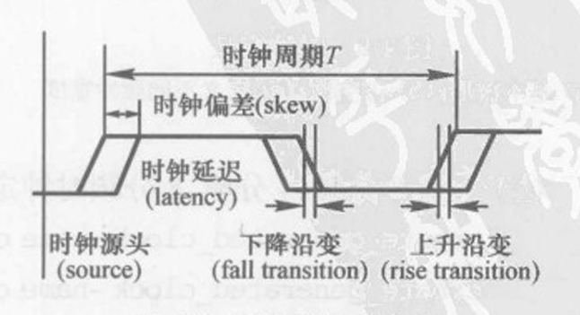
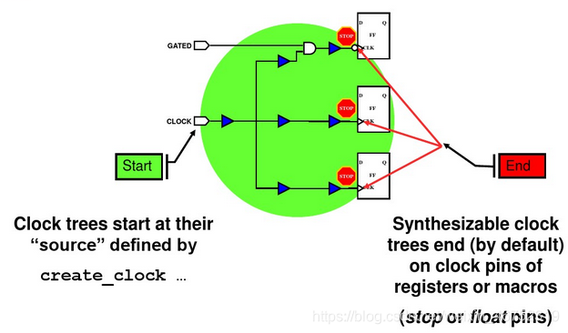
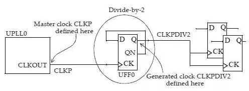
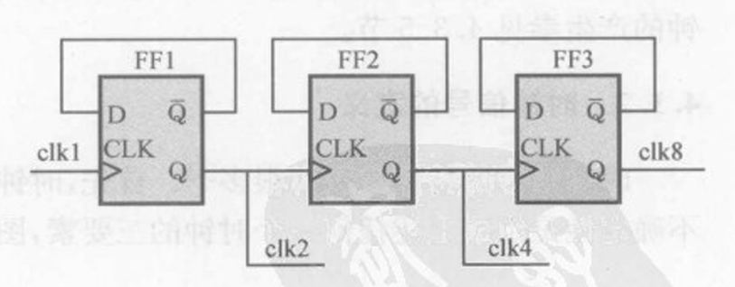
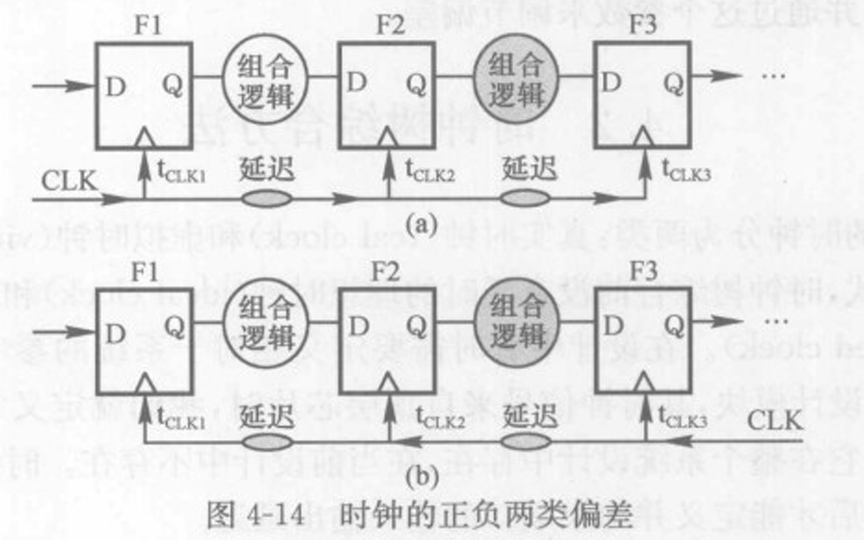
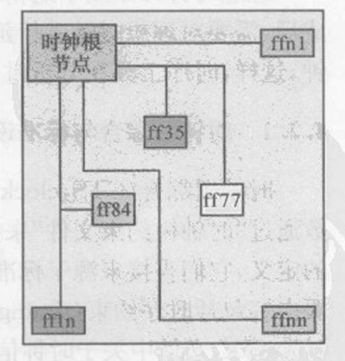
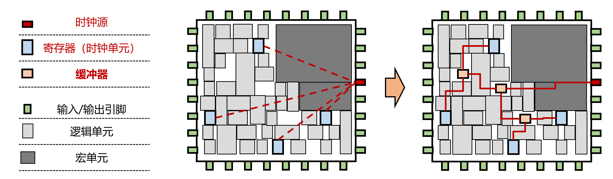
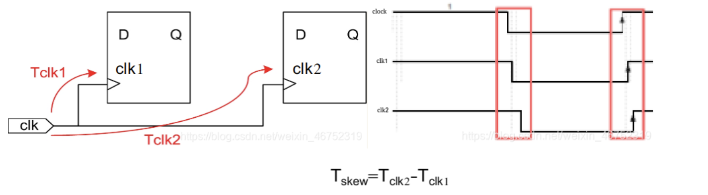
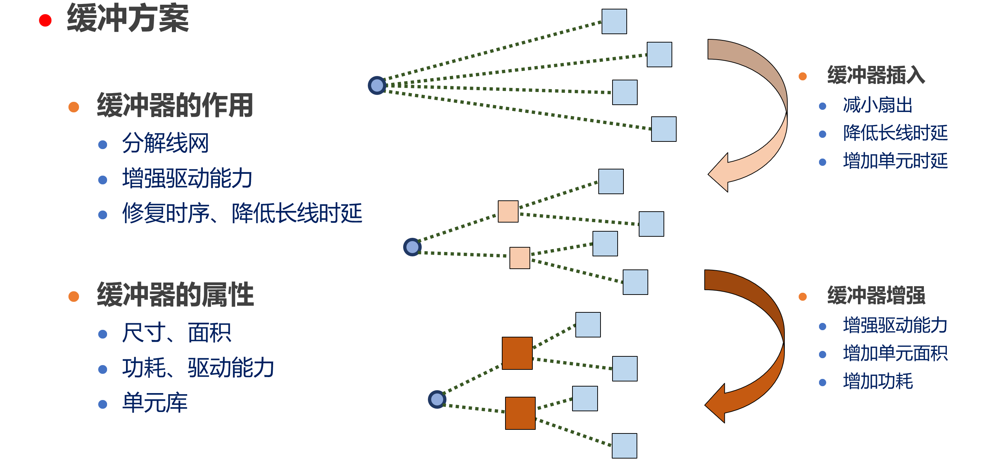
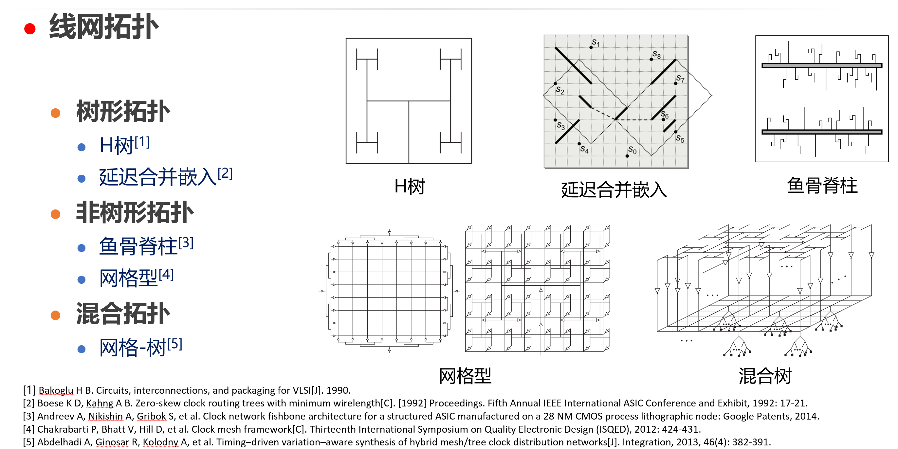

布局后紧接着进行时钟树综合。时钟树综合问题：给定时钟单元分布，构建时钟网络（树）以实现时钟源到达各个寄存器的时序需要，期间需满足给定的各类约束，并尽可能节约设计资源。我们先从时钟信号的生成出发，认识时钟信号的定义，再来谈谈时钟树综合问题。

## 1 时钟信号的生成

时钟的生成有很多种方法，在VLSI设计中，常用的方法是采用外部晶振输入（详细了解可[点击这里](https://blog.csdn.net/weixin_58634335/article/details/118884018)）。对于高频时钟，常采用专用的锁相环PLL电路进行倍频。

除此之外，时钟生成的方法还有DLL、振荡环电路等等（详细了解可查阅《数字集成电路物理设计P93-95》）.

## 2 时钟信号的定义

时钟信号的特性参数有很多，但它的三要素为时钟的周期（频率）、时钟延迟以及时钟信号的不确定性。这三要素通常在SDC文件中用 create_clock 和 create_generated_clock 设计约束命令来定义。



**时钟周期（Clock Period）：** 时钟周期是指时钟信号的一个完整周期所持续的时间长度。在数字系统中，各个逻辑元件的操作都是由时钟信号的上升沿或下降沿来驱动的。时钟周期定义了在一个周期内信号从一个状态变化到另一个状态所需的时间。时钟周期的逆（即频率的倒数）则表示时钟信号的频率，通常以赫兹（Hz）为单位表示。

**时钟延迟（Clock Latency）：** 时钟延迟是指信号在到达一个电路元件时钟输入端与该元件相应输出端的时间差。时钟延迟通常包括由于信号传输、逻辑电路延迟和时序相关性等因素引起的时间延迟。时钟延迟对于确保电路的正确性和性能至关重要，因为不同的信号路径可能具有不同的延迟，可能会导致时序错误。

**时钟信号不确定性（Clock Signal Uncertainty）：** 时钟信号不确定性指的是时钟信号到达不同部分的逻辑电路时存在的不一致性或波动性。这些不确定性可能由于信号传输路径不同、时钟缓冲引起的抖动、时钟分配网络的不均匀性等原因而产生。时钟信号不确定性会影响电路的稳定性和性能，因此在设计中需要考虑并尽量减小这种不确定性。

### （1）时钟的定义

- 基本时钟定义



一般时钟从时钟源（source）出发，在寄存器CK端结束。定义此种时钟，用命令 create_clock 定义时钟的 root点。如下图所示，CLKP的定义为：



```
Icc_shell>create_clock -name CLKP  [get_pins UPLL0/CLKOUT]
```

- 生成时钟

生成时钟（generated clock）由普通时钟通过PLL倍频得到，那普通时钟称为生成时钟的主时钟（master clock）。上图的CLKP即为生成时钟CLKPDIV2的主时钟。定义此生成时钟的root点命令：

```
Icc_shell>create_generated_clock  -name CLKPDIV2  -source UPLL0/CLKOUT   -add    -master_clock CLKP  -divide_by 2 [get_pins UFF0/Q]
```

-------------------
***Source clock 与 master clock 区别？***
Source clock通常是指芯片外部提供的时钟信号，也称为输入电路的时钟信号。例如，一些芯片可能需要外部输入的参考时钟信号来同步其内部运行的所有模块。在这种情况下，输入的参考时钟就是source clock。在设计电路时，需要确保源时钟满足芯片规格书中的时序要求，才能保证电路功能的正确性。

Master clock通常指芯片内部的主时钟信号，也称为系统时钟或本地时钟。主时钟是芯片内部各个模块的同步时钟信号，用于确保芯片内部各种逻辑元件的时序性和同步性，以提供可靠的电气性能。通常芯片会有一个主时钟产生电路，生成一个基础的时钟信号，然后通过频率分频、相位调整等方式来产生不同的时钟域，以满足不同逻辑单元的时序要求。

因此，source clock和master clock都是时钟信号，但source clock通常指芯片外部输入的时钟信号，而master clock则是芯片内部使用和分配的主时钟信号。它们在电路设计中扮演不同的角色，需要根据具体的芯片设计要求来进行正确的选择和使用。

----------------------------------------



对于上述2分频、4分频、8分频时钟定义如下:

create generated clock -name clk2 -source clk1 -divide by 2 FF1/Q

create generated clock -name clk4 -source clkl -divide by 4 FF2/0

create generated clock -name clk8 -source clk1 -divide by 8 FF3/0

### （2）时钟信号延迟(latency)

时钟信号延迟（latency）包括时钟源（clock source）插入延迟（insertion delay）和时钟网络（clock network）插入延迟。

时钟源插入延迟：系统（即时钟源或来自芯片）到当前芯片（或到当前模块）时钟根节点（clock root pin）之间的延迟；

```
set_clock_latency 2.0 -source [get_clocks {cpu_clk}]
```

时钟网络插入延迟：时钟树的延迟；

```
set_clock_latency 2.0 [get_clocks {cpu_clk}]
```

总插入延迟：时钟源到时钟树寄存器的插入延迟；

总插入延迟 = 时钟源插入延迟 + 时钟网络插入延迟

时钟源插入延迟 与 时钟网络插入延迟 的定义通过 -source 选项加以区分。

### （3）时钟信号抖动（jitter）

时钟抖动(jitter)定义为信号时间与理想事件时间的偏差(deviation),抖动中含有确定抖动(DJ,deterministic jitter)成分和随机抖动(RJ,random jitter)成分。

时钟信号的抖动又称为时钟的不确定性(uncer-tainty),在时钟树综合时无法对时钟抖动进行相应的优化,只能考虑到其影响,由此可见抖动是先天存在的,不确定性是人为定义的。在建立理想时钟时我们用set clock uncertainty这个参数来设定抖动值。例如:
```
set clock ucertainty 0.3 [get clock{*}]
```

该句定义了所有的时钟信号上存在了0.3ns的不确定性。一般情况下,在逻辑设计阶段,将时钟的不确定性设置得较大,从而给时钟树综合的偏差(skew)值预留一定的范围。在时钟树综合之后,可以将该值设定得较小,一般根据工艺与设计的情况而定。在时钟树综合之后,真实时钟代替了理想时钟,在不考虑时钟抖动的情况下,把它的值设为零,若考虑时钟抖动,则把抖动值设定为相应工艺条件下的时钟的真实抖动值。

### （4）时钟信号偏差（skew）

时钟信号的偏差指同一时钟到达该时钟域内不同寄存器之间的时间偏差，也即 $$skew = max (|t_i-t_j|), 0<i,j<n$$

t<sub>i</sub>，t<sub>j</sub> 分别为时钟根节点到达叶节点的时间，n 为同一时钟域中时序单元的个数。时钟树综合的目的就是为了减少偏差，它的值有正负两种。



偏差的实例如下图所示,由于时钟走线长度的不同，从时钟的根节点到达几个叶节点的时间是不同的。设到达ff35的时间是最早的,而到达ffnn的时间是最晚的,任意两者的时间差都叫做偏差。在时钟树的应用中,也将最晚到达ffnn 的时间定义为“最大插入延迟”(maxinsertion delay),将最早到达ff35的时间定义为“最小插入延迟”(mininsertion delay),两者之差定义为“最大偏差”(max skew)。在大规模集成电路设计中,数万个叶节点的大面积分布会造成这个偏差的值非常大，从而导致芯片性能的损失。传统实现时钟树综合的一个重要指标就是达到理论上的“零偏差”(zero skew)。



时钟从根节点到达触发器 ff1n,ff2n,…,ffnn 等叶节点的时间即为时钟延迟。可见时钟延迟是存在于最大(插入)延时和最小(插入)延时范围内(图4-16)。实际的偏差一般服从正态分布(图4-17),在建立理想时钟时,需要提出一个最大偏差值。时钟树综合之后,在时序分析时,将时钟设定为传播时钟,从而使实际时钟代替了理想时钟。

理想时钟的延迟定义用于控制时钟树上插人的驱动单元的级数,一般当延迟较大时，时钟偏差会比较小,但是插人的buffer会比较多,时钟树上的功耗会较大。当延迟的值较小时,可能无法满足时钟偏差的要求,所以在时钟树综合时,需要权衡功耗和时钟偏差的要求,从而选择一个合适的延迟。有时候对于一些特定的设计,两个时钟域之间还需要有一定的相位差,并通过这个参数来调节偏差。

## 2 时钟树综合问题介绍



时钟树综合的过程，即构建一个时钟源到寄存器的时钟树使得各个路径的时序满足设计需要。工具试图将某个clock所属的所有sinks做到相同长度，即尽可能的使一个时钟信号到达各个终端节点的时间相同。如图，时钟树解决方案主要由插入缓冲器和构建线网拓扑组成。

在没有进行时钟树综合之前，时钟树暂未生成，时钟逻辑结构如左图所示，一个时钟源端（root）最终扇出到很多寄存器的时钟端。但是我们知道，时钟源到达不同寄存器所经历路径的驱动和负载的不同，使得时钟信号到达各个寄存器时钟端的时间也不一样，将到达不同寄存器的时间偏差称为偏差（skew），传统CTS就是为了减小skew。



经过了时钟树综合，通过加入如右图中橙色小方块（缓冲器）等方式形成一个时钟树，时钟信号会先到达各级buffer使得最终到达各个寄存器时钟端的时间几乎相同。

所以，时钟树综合的目的有两个：

1. clock skew尽量小，特别是对时钟质量要求比较高或者高频时钟；

2. clock latency尽量短。

## 时钟树综合实现方式

### （1）插入缓冲器 buffer

在时钟线网中，缓冲器可以起到分解线网的作用，例如图中通过插入两个缓冲器可以将原来4个扇出的结构转换为三个2扇出结构。

缓冲器还能够增强驱动能力，因为信号在传播过程中高低电平的转换是需要时间的，缓冲器可以有效减少转换时间，增强驱动能力。

如果使用驱动能力较强的缓冲器就可以在较短的时间内完成信号转变，在较长的导线从插入缓冲器可以有效减小时延，连续插入多个缓冲器能够增大路径时延，因此插入缓冲器对时序的影响十分显著。



**不同的缓冲器会有不同的属性:**

我们会关注缓冲器的尺寸、面积，因为这会影响到版图资源利用率

同时我们关心它的功耗情况和驱动能力，一般情况下驱动能力越强面积也越大，对设计而言功耗也会更高一些。

这些属性都在缓冲器对应的单元库中，它对于不同线网情况的时延也是通过单元库查表得到。


### （2）构建线网拓扑



早期的时钟树设计规模较小，在某些情况下不需要考虑使用缓冲器来平衡时序和解决驱动能力的问题，因此时钟树在线网拓扑方面的研究是较为充分的，发展出了许多类型的构建方法，大体上可以分为3类：

- 第一类是树形拓扑

比较典型的是**H树**，利用分形特性可以构建一个完全对称的平衡树结构，因此时钟偏差很小，但这类树的总线长较大延迟。

另一类是**延迟合并嵌入算法**，它每次合并两个子树或者节点，每一次合并都计算出父亲节点的可行解区域，直到时钟源，从而确保时钟偏差始终在允许范围内。主要用到贪心或者给定图结构的合并方法。

- 第二类是非树型的拓扑

鱼骨脊柱型拓扑利用金属主干和分支直接驱动负载单元，该方法线长较短，延迟较低，但是只有负载单元分布较为集中时才能有效控制时钟偏差。

网格型拓扑利用二维网格结构具有很好的稳健性和可扩展性，但它设计成本大，同时难以进行验证和时序分析。

第三类是混合拓扑

这类拓扑结合了网格和树进行分层设计，能够将他们的优缺点进行权衡。

详细可点击这里看[视频](https://www.bilibili.com/video/BV1rT4y1W7JF/?spm_id_from=333.999.0.0&vd_source=2ac617c241afd7f9774b0add4e647179)。


                        
原文链接：https://blog.csdn.net/weixin_46752319/article/details/107387584