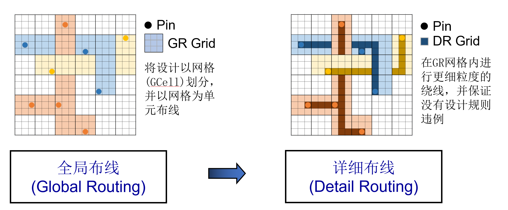
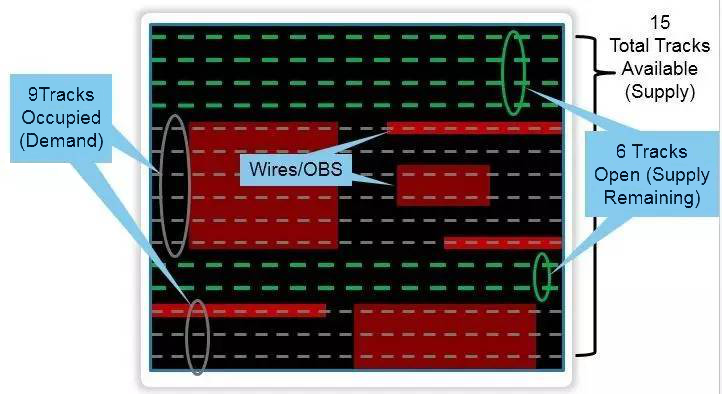
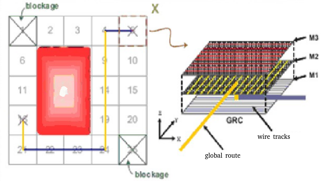
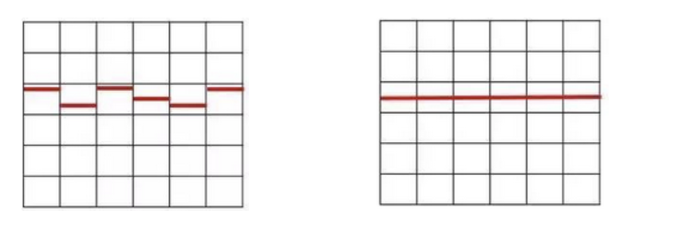
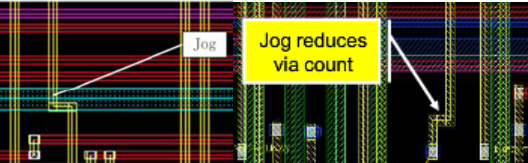
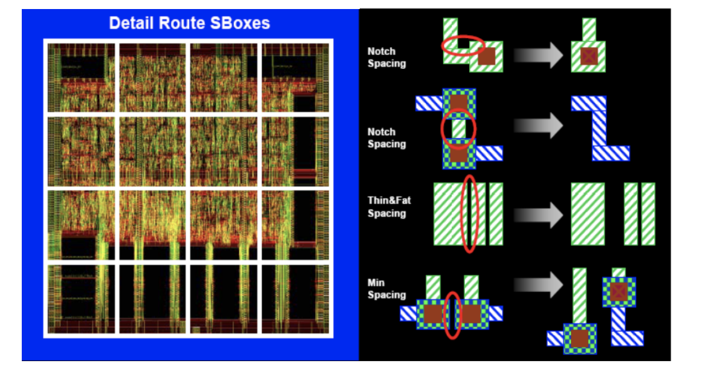
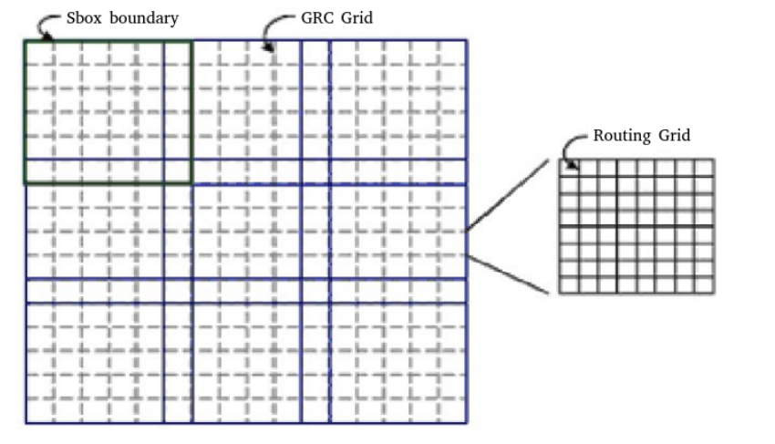

布局和时钟树综合之后进行布线操作。主要内容：完成标准单元的信号线的连接，布线工具需要考虑到布线拥塞消除、优化时序、减小耦合效应、消除窜扰、降低功耗、保证信号完整性等问题。**由于电路规模庞大（百万，千万条），布线问题复杂，直接求解时间复杂度高，所以将布线分为全局布线和详细布线。**

## 1. Gcell Grid

Gcell Grid是一个网格结构，用于在芯片布局中进行网格化的管理。它将芯片表面划分为一系列规则的方形或正交网格单元，每个单元称为一个Gcell。Gcell Grid的目的是简化布局、布线和实现流程，确保设计的时序和布线规则得到满足。

**现在我们用通俗的话讲讲为什么要构建一个 Gcell Grid。** 如果把布线工程比作1000块拼图工程，显然我们需要把大拼图划分成一个个具有不同特征的区块（Gcell Grid），再讲散落的拼图按区块进行划分，分成若干堆（全局布线），再对每个堆实现拼接（详细布线）。Gcell Grid另一个用出在于评判拥塞程度，具体看 2 Global Routing 部分。

基于格点的布线理论，网格的长宽都定义在Lef或者floorplan文件(.def)中，当然初始时工具会根据设计和tech lef中情况自动生成。如图所示，全局布线时，每个黑框即为一个Gcell，相同颜色的需要进行布线，具体的布线则在详细布线时发生。

## 2 Global Routing

全局布线Global routing，简称GR。它对整块芯片的走线做布局规划，并没有进行任何实际的走线（not lay down any metal traces）

GR会为指定的金属层和Gcells分配线路，并根据分配线路的多少评判拥塞程度（congestion）。

上图为一个GRC中的示例图，如图所示，一个GRC中包含了15条tracks（通常一个gcell中会占有10几个track，根据design的不同有所变化），其中由于wires或OBS（route blockage）等被占用9条而其余6条属于可使用。global routing的目标是使得每个gcell的容量占有率在85%左右。

此图的demand = 9，supply = 15，则congestion = demand - supply = -6 （负值表示不拥塞，正值越大，拥塞程度越高）

网格上的数字表示拥塞程度，global route以gcell cell作为绕线参考网格，工具在绕线时会试图避开拥塞程度高的gcell并寻找gcell中的最短path。在global route时，软件只知道起点和终点，可以简单理解为两个具有连接关系的pin。但是不知道如何从起点走到终点。但是GR会避开拥塞高以及blockages和P/G（rings/straps/rails）等区域，这样就能大概的设计出一个走线的大致路径。

## 3 Track Assignment

GR是基于gcell的分析，主要是分配绕线资源，根据global routing结果可以看看congestion情况，就是总体看绕线资源是否足够，是否合理，它并没有将绕线分配到具体的track上。布线通道分配（Track Assignment，简称TA）将GR设计的每一连线分配到一定的track上，并且对连线进行实际布线，这个阶段不做DRC检查。

如上图所示，左图是GR形成的net，并没有首尾连线，而经过经过track assignment后，形成右图完整的net。并且，在track assignment阶段，布线尽可能走长直的金属连线，但同时会减少孔的个数。为了减少孔的个数，会形成jog（小范围地改变布线方向，如下图所示）。

TA阶段不做DRC的检查，即走线会产生许多DRC：Wire spacing；Wire width；Via rules（size；density；stackable etc..），这由Detail Route修复。

## 4 Detail Route

Detail route的工作主要将TA产生的DRC violation移除。方法：使用固定尺寸的switch box（sbox）来修复违规。Sbox是整个版图平均划分的小格子，工具对每一个小格子内部的DRC进行修复，但是边界上的DRC修复不了。

Sbox由GRC构成,每个Sbox边缘会重叠一个GRC宽度（Sbox由GRC组成，两个sbox交叠的宽度为一个GRC的宽度）。

## 5 Search and repair

Search and repair（布线修补），通过逐渐增大Sbox的尺寸寻找和消除Detail routing中没有完全消除的DRC违规。

## 引用
[1] https://vlsi.pro/physical-design-flow-iv-routing/
[2] https://blog.csdn.net/Tao_ZT/article/details/102456868
[3] https://blog.csdn.net/sinat_41774721/article/details/123430167
[4] 《数字集成电路物理设计》P128-138