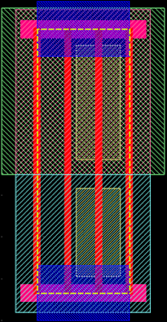

# ASIC设计中的边界单元

August 30, 2020 by [Team VLSI](https://teamvlsi.com/author/team-vlsi)

在芯片制造过程中，标准单元放置在边界处的晶体管很容易受到损坏。为了防止边界处的这种损坏，标准单元库中有一种特殊类型的单元，称为电容器单元 [cap cell] 或 边界单元 [boundary cell]。边界单元不仅可以保护边界处晶体管的损坏，还可以起到许多其他作用。本文将讨论边界单元布局的必要性、边界单元的结构和布局。

## 电容器/边界单元的放置位置：

电容器单元或边界单元放置在每个放置行的两端以终止该行。它还被放置在块级别的顶部和底部行，以便与其他块集成。一些标准单元库还具有 角落边界单元 [corner end cap cell]，用于放置块的角落。边界单元具有固定属性，因此这些单元在优化过程中无法移动。图1显示了在行末端放置边界单元的典型布局。

  
  <h4>图1 在行末端放置边界单元的布局</h4>

## 为什么需要放置电容器/边界单元？

放置端盖单元的原因如下：

- 在制造过程中，保护靠近边界处的标准单元的晶体管免受损坏。
- 避免边界处的基础层DRC（Nwell和植入层）。
- 与其他块进行正确对齐。
- 一些标准单元库具有作为解耦电容单元的端盖单元。

## 电容器/边界单元的布局：

边界单元是仅具有物理功能的单元，因此这些单元不是网表的一部分。边界单元主要具有Nwell层、植入层、虚拟多晶层和金属导轨，如图2所示。

  
  <h4>图2 边界单元的结构</h4>

## 放置方法：

边界单元是在宏放置和站点行创建之后放置的。边界单元是在标准单元放置之前放置的，因此被称为预放置单元。电容器单元可以通过GUI界面或通过工具命令添加。以下是在Innovus和ICC工具中添加端盖单元的命令。

### 对于Innovus工具：

`setEndCapMode -reset`

`setEndCapMode -rightEdge <CellName> -leftEdge <CellName> -topEdge <CellName> -bottomEdge <CellName>  -rightTopEdge <CellName> -rightBottomEdge <CellName> -leftTopCorner <CellName> -leftBottomCorner <CellName>`

`addEndCap -prefix <name>`
`verifyEndCap -report <reportName>`

### 对于ICC工具：

`insert_boundary_cell`

有关这些命令和相关开关的详细信息，请参考工具的命令手册。

## 谢谢

原文链接：https://teamvlsi.com/2020/08/end-cap-cell-in-vlsi-boundary-cell-in.html