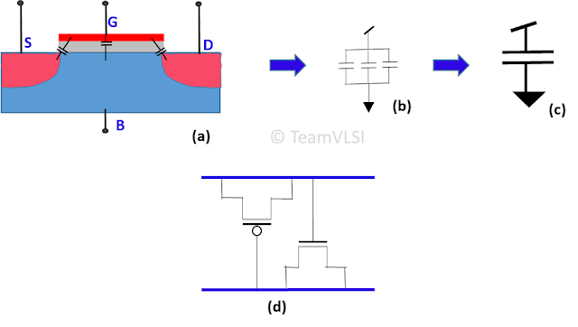
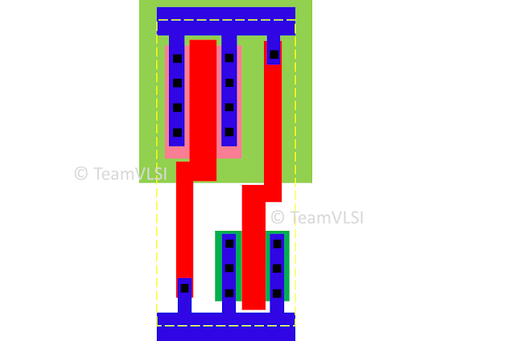

# 物理设计中的DeCap单元

August 30, 2020 by [Team VLSI](https://teamvlsi.com/author/team-vlsi)

Decap [Decoupling Capacitor : 解耦电容器] 单元基本上是由电容器制成的充电存储设备，用于支持电源传递网络中的瞬时电流需求。电路中存在瞬时大电流需求的原因有很多，如果没有采取足够的措施来处理这些需求，可能会出现电源下降或地面反弹。这些电源下降或地面反弹将影响恒定电源供应，并最终影响标准单元的延迟。为了支持电源传递网络应对这种突发电力需求，Decap单元被插入整个设计中。在本文中，我们将讨论Decap单元的结构和布局、使用Decap单元的必要性以及放置Decap单元的位置。

## Decap单元的原理图和布局：

可以使用各种方法将MOS晶体管制成电容器，但最常用的结构如图1所示。

  
  <h4>图1 MOS电容和Decap单元原理图</h4>

图1（a）显示了MOS晶体管内部的各种电容，如果将源、漏和体端子连接在一起，则所有这些电容将配置为并联电容，如图1（b）所示，并形成单个等效电容，如图1（c）所示。图1（d）显示了使用pMOS和nMOS晶体管的Decap电容器原理图。从这个原理图中，我们可以说由nMOS和pMOS引起的电容将并联并相加形成一个大电容器。图2显示了最简单的Decap单元的布局。

  
  <h4>图2 Decap电容器布局</h4>

pMOS晶体管的源和漏被短接在一起并连接到VDD，门连接到VSS。同样，nMOS晶体管的源和漏连接到VSS，门连接到VDD。

## Decap单元的使用：

在CMOS逻辑操作中有一个输入转换区域，在这个区域内，nMOS和pMOS同时导通，如图3（a）所示。瞬间会流过大的短路电流Isc。如果大量这样的单元放置在一起并一起切换，则需要大量电流，如图3（b）所示。这种大电流需求可能会降低VDD或增加地面电压，这称为电压下降或地面反弹，如图3（c）所示。

  
  <h4>图3 Decap单元的使用</h4>

电压下降或地面反弹可能会导致连接的标准单元的延迟发生变化。因为延迟与供应电压成正比。延迟的变化可能会进一步影响设计的时序，如果供应电压下降很大，则标准单元的功能可能会受到影响。因此，为了支持电源传递，我们添加了Decap单元。Decap单元作为电荷储备池，支持电源传递网络并使其更加健壮，如图3（d）所示。

## Decap单元的放置：

Decap单元通常放置在电源规划之后、标准单元放置之前，即在预放置阶段。在此阶段，在整个设计中均匀地放置这些单元。如果需要，Decap单元也可以放置在后路阶段中。

Decap单元唯一的问题是会出现泄漏，并增加设计的泄漏功率，因此必须谨慎使用。

## 谢谢

原文链接：https://teamvlsi.com/2020/08/decap-cell-in-physical-design.html