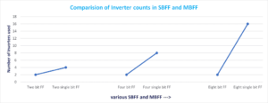
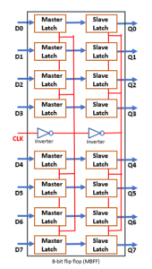

# 多比特触发器与单比特触发器的比较

April 25, 2021 by [Team VLSI](https://teamvlsi.com/author/team-vlsi)

在现代ASIC设计中，多比特触发器 [multi-bit flip flops : MBFF] 的使用增加了，因为它相对于单比特触发器 [single-bit flip flop : SBFF] 有许多有吸引力的优势。传统上，我们在学术中只研究单比特触发器。因此，了解多比特触发器的设计、工作原理以及多比特触发器相对于单比特触发器的优缺点变得很重要。

## 为什么使用多比特触发器？

多比特触发器由于其架构优势而具有许多优点。也有许多最近的研究出版物显示这些事实，并提供了适当的统计数据。我们在布局和布线（PnR）实现过程中也看到了这些优点。在这里，我想简单地解释一下MBFF的基本事实，不涉及详细的统计数据。确切的统计数据可以从任何最新的研究出版物中参考。多比特触发器的主要优点如下，这也是为什么现在广泛使用MBFF的原因。

1. 减少面积
2. 降低功耗（对低功耗设计有吸引力）
3. 更好的时钟偏移控制
4. 提高时序

因此，可以说它改善了面积、功耗和时序。这些优势的原因将在下一节中解释。

## 多比特触发器架构：

多比特触发器的所有优点都是由于其架构所致。图1显示了单比特触发器和2比特多比特触发器的原理图。同样的架构也可以想象用于更高比特的多比特触发器。

  
  <h4>图1 多比特触发器</h4>

人们可以注意到，与单比特触发器相比，当我们使用多比特触发器时，反相器数量会减少。当我们使用更大的多比特触发器时，这种减少的效果更加明显。图2显示了SBFF和MBFF中反相器数量的比较。

  
  <h4>图2 SBFF和MBFF中使用的反相器数量</h4>

在8个单比特触发器中有16个反相器，而在16比特触发器中只使用了2个反相器。图3显示了8比特多比特触发器的示意图。

  
  <h4>图3 8比特多比特触发器</h4>

由于多比特触发器的反相器数量减少，它节省了时钟功耗和面积。在MBFF转换后，触发器的操作没有发生变化。现在让我们讨论PnR工具如何将SBFF转换为MBFF的机制。

## MBFF转换：

  
  <h4>图4 MBFF转换之前的放置情况</h4>

  
  <h4>图5 MBFF转换之后的情况</h4>

图4和图5显示了将SBFF转换为MBFF的过程。图4展示了MBFF转换之前的情况，而图5展示了MBFF转换之后的情况。在图5中，我们可以看到，使用了一个8比特的MBFF，而不是8个不同的SBFF。因此，MBFF通常比较大，并且具有多行高度的标准单元。

PnR工具具有将SBFF转换为MBFF的算法。该工具从标准单元库中选择等效的MBFF，并根据用户提供的转换输入执行转换。这个转换过程发生在布局阶段。

如果我们谈论Cadence Innovus工具，我们有一个命令：

`setOptMode -multiBitFlopOpt true`

该命令启用了PnR工具进行多比特触发器的转换。默认情况下，该工具禁用此转换功能。该工具中还有许多其他命令可供进一步探索。

## 谢谢

原文链接：https://teamvlsi.com/2021/04/multi-bit-flip-flop-vs-single-bit-flip-flops.html