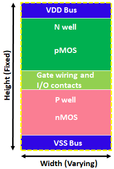
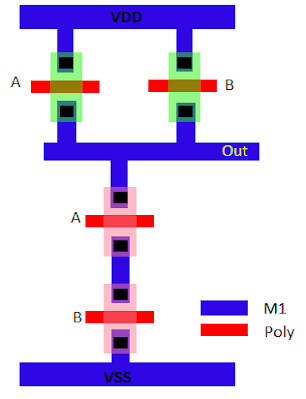
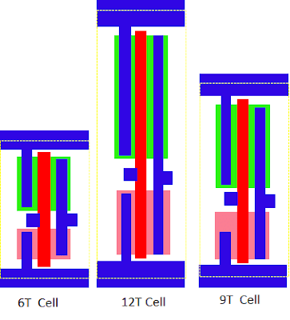

# ASIC设计中的标准单元

May 18, 2020 by [Team VLSI](https://teamvlsi.com/author/team-vlsi)

标准单元是在ASIC [特定应用集成电路] 设计流程中使用的明确定义和预特性化的基本构建单元。所有这些单元在高度上都相等，并且可以轻松地适应标准单元行中。标准单元具有高度的可重用性，可以节省大量ASIC设计时间。

## 标准单元布局
所有标准单元的高度相等，宽度各不相同。标准单元的主要特征在下图中进行了解释。

  
  <h4>图1 标准单元布局样式</h4>

在标准单元的顶部有VDD电源线，底部有VSS电源线。这两个电源线绘制在金属1层上。在VDD电源线和VSS电源线之间有三个主要区域，n型井区、n型井和p型井之间的间隙以及p型井区。n型井区靠近VDD电源线，而p型井区靠近VSS电源线。pMOS晶体管构建在n型井内，因此所有pMOS晶体管都位于单元的上半部分，类似地，所有nMOS晶体管都位于标准单元的下半部分。

原理图的布局可以以多种方式绘制。例如，NAND门的布局可以以以下两种不同的样式绘制。

  
  <h4>图2 NAND门的原理图</h4>

  
  <h4>图3 NAND门的布局</h4>

  
  <h4>图4 NAND门的布局</h4>

图2显示了NAND门的原理图，图3和图4显示了图中原理图的两种不同布局。在图3中，两个nMOS不处于同一水平上，它们被堆叠在一起，但在图4的布局中，所有nMOS都位于一个水平上，所有pMOS都位于一个水平上。而且在图3中，门是水平绘制的，而在nMOS和pMOS中不共享。但是在图4中，所有多晶硅栅极是垂直绘制的，同时对nMOS和pMOS都是共用的。

选择像图4中的布局样式的原因有很多。其中一些原因包括：

1. **节省设计面积**：所有标准单元的n型井和p型井都位于同一水平，因此它们可以容易地相邻并形成一个共用井，从而节省了大量面积。
2. **对于APR工具的易放置**：所有标准单元具有相同的高度，可以轻松地放置在标准单元行中，因此对于自动放置和布线（APR）工具来说很容易。它们还在所有标准单元的相同位置上具有电源线，因此电源线也可以容易地相邻。
3. **易于布线**：所有标准单元的引脚都位于水平和垂直轨道的交叉点上，因此APR工具可以轻松地进行布线。

## 标准单元中的轨道

轨道可以定义为绘制金属层的线。一个轨道表示一个M1间距。标准单元的高度通常以轨道数量来测量。例如，一个6T的标准单元意味着标准单元的高度为6个M1轨道。下图显示了一个13T高度的标准单元示例。

  
  <h4>图5 一个13T高度的标准单元</h4>

在上面的示例中，一条轨道的高度为190纳米。因此，单元的总高度为13T = 2470纳米（13 x 190），宽度为5T = 950纳米（5 x 190）。

通常，有各种不同轨道尺寸的标准单元库。根据ASIC的使用情况选择标准库的轨道高度。通常有三个标准单元库集合，分别称为小型晶体管标准单元、大型晶体管标准单元和中型晶体管标准单元。下面是6T、12T和9T大小的标准单元的示例。

  
  <h4>图6 不同高度的标准单元</h4>

小型晶体管标准单元用于高密度设计，具有低功耗。大型晶体管标准单元占用面积大，但性能非常好。中型晶体管标准单元在大型晶体管和小型晶体管之间取得平衡。因此，在面积/功耗和性能之间存在权衡。下图显示了比较。

  
  <h4>图7 各种高度标准单元的性能和面积权衡</h4>

这些单元的各种应用如下：
- 小型晶体管单元（6T单元）
  - 最小面积和低功耗
  - 移动应用
  - 超低功耗应用
  - 嵌入式微控制器
- 大型晶体管单元（12T单元）
  - 占用面积大
  - 高性能和速度
  - 高速计算
  - 关键块
- 中型晶体管单元（9T单元）
  - 面积和性能之间的平衡
  - 通用计算
  - GPU
  - 通用电路

## 谢谢

原文链接：https://teamvlsi.com/2020/05/standard-cells-in-asic-design-standard-cells-in-vlsi.html