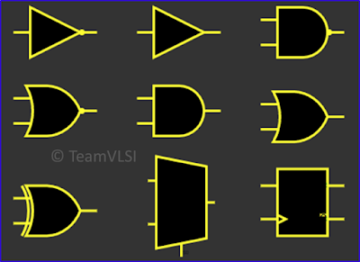
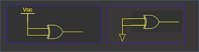
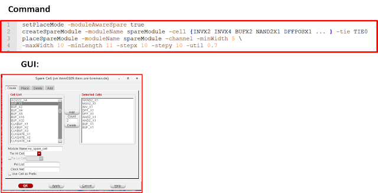

# 物理设计中的备用单元

August 30, 2020 by [Team VLSI](https://teamvlsi.com/author/team-vlsi)

一旦芯片被制造出来，如果在芯片中发现任何功能问题或需要在下一次制造中进行某些功能增强，则可能是一项非常具有挑战性的任务。但是，在预先放置备用单元的帮助下，这些更改可以非常容易地完成。在本文中，我们将讨论物理设计中的备用单元。

## 备用单元：

备用单元通常由一组标准单元组成，主要包括反相器、缓冲器、NAND、NOR、与、或、异或、多路复用器、触发器，以及可能是一些特殊设计的可配置备用单元。理想情况下，备用单元不在设计中执行任何逻辑操作，仅作为填充单元。下面显示了一组备用单元。

  

备用单元的输入通过绑定电池（VDD）或接地（VSS）的连接单元连接在一起，而输出则保持漂浮状态。输入不能保持漂浮状态，因为漂浮的输入会容易受到噪声的影响，并且这可能导致备用单元中不必要的开关动作，从而导致额外的功率损耗。

  

## 备用单元的用途：

备用单元使我们能够通过最小化掩膜更改来修改/改进芯片的功能。我们可以使用附近位置已放置的备用单元，只需修改金属互连。不需要更改基础层。使用金属 ECO [Engineering Change Order : 工程变更操作]，我们可以修改互连金属连接并利用备用单元。我们只需要更改一些金属掩膜，而不是基础层掩膜。

  

例如，假设在上述电路中，我们需要将电路中间部分的最后一个OR门替换为一个EXOR或AND门，则可以仅通过金属ECO重新连接靠近此处的备用单元。

## 备用单元的布局：

备用单元可以通过网表或PnR工具命令（或GUI）添加。在物理设计中，我们倾向于使用工具命令添加备用单元。这些单元在整个设计中的标准单元放置之前添加。以下解释了在Innovus和ICC工具中添加备用单元的方法。

### Innovus工具：

### ICC工具：

## 备用单元的优缺点：

### 优点：

- **重复利用性：** 
只需更改一些金属和透过掩膜，因此基础层掩膜可以在芯片制造中重复使用。

- **灵活性：**
可以非常容易地对设计进行小的更改。

- **节省成本和时间：**
对于新设计，我们只需要少量互连掩膜，这可以节省大量芯片制造成本。使用金属ECO，我们不需要运行完整的设计周期，因此节省设计时间。

### 缺点：
- **漏电功率：**
备用单元增加了设计中的漏电功率损耗。

- **面积：**
备用单元在设计中增加了额外的面积开销。

## 谢谢

原文链接：https://teamvlsi.com/2020/08/spare-cells-in-physical-design.html