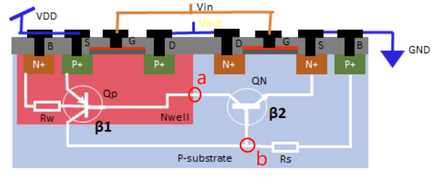
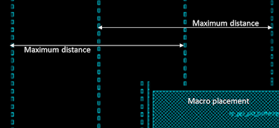

井栓单元 [well tap cell]（或Tap单元）用于防止CMOS设计中的锁存现象。在第4部分闩锁效应中有所涉及。井栓单元将nwell连接到VDD，将p-衬底连接到VSS，以防止锁存问题。井栓单元没有逻辑功能，只是为nwell和p-衬底提供了一个连接，因此井栓单元被称为仅物理单元。在本文中，我们将讨论井栓单元的结构、井栓单元的需求以及如何在物理设计流程中放置它们。

## 1 井栓单元：

井栓单元没有逻辑功能，只有两个连接。

- nwell到电源（VDD）
- p-衬底到地（VSS）

井栓布局的典型结构如图1所示。井栓单元没有输入和输出引脚，因此它被称为物理单元。

<div style="text-align:center;">
  
  <h4>图1 井栓单元的布局</h4>
</div>

## 2 为什么需要井栓单元：

latch up(门锁效应)，在CMOS工艺中，由于npn和pnp型晶体管的存在，以及寄生电阻Rw和Rs的存在使两个晶体管相互耦合组成一个SCR。一旦某个晶体管具有足够的基极偏置电压，使SCR进入工作状态，将电流不断放大，将导致电源和地之间形成极大的导通电流，烧坏芯片。

Tap Cell的一个作用：通过固定间距对衬底施加偏置电压减小衬底的寄生电阻，使三极管无法达到导通要求从而切断闩锁效应的正反馈环路，消除闩锁效应。

<div style="text-align:center;">
  
  <h5>图2 tap cell在闩锁效应中的作用</h5>
</div>

为什么MOS管的源极有两个有源区（NMOS的源极多了一个P+，PMOS的源极多了一个N+）？应该是为了让衬底电压钳位到0或者钳位到1，防止产生闩锁效应。即使得图2中的a点高电压不致使得PNP管导通，保持b点低电压不致使该NPN管导通。

为什么MOS管源区的源极两个有源区（重掺杂区）是不同类型的，例如NMOS的源极左侧的有源区是P+,而不是N+？他本身是防止闩锁的，如果都用N+，那么就会额外多形成一个寄生双极晶体管结构，没起到作用，反而会帮倒忙。

但是如果每个mos管都做一个钳位电极，那么standard cell的面积将会显著增大，不利于design的PPA；那么此时一种叫做“batch mode”（中文意思是“批处理”）的思想发挥作用了。能不能不要每个standard cell都做钳位电极，而是把钳位电极单独做成一个standard cell，然后让每隔一定距离的区间（常用的是50um）的standard cell共用一个钳位电极，这就是所谓的batch mode 思想。那么此时well tap应运而生。

早期没有井栓单元的概念，标准单元设计中每个标准单元内部都有nwell到VDD和p-衬底到VSS的连接。但这种标准单元设计占用了更多的面积，为了节省空间，后来演变出了无井电池单元的概念。在无井电池单元中，标准单元内部没有井铺设，井铺设是由一个称为井栓单元的单独标准单元提供的。因此，井栓单元是无井标准单元库的一部分。图3显示了传统标准单元和无井标准单元的结构。

<div style="text-align:center;">
  
  <h5>图3 传统标准单元和无井标准单元的结构</h5>
</div>

Well tap用于防止 CMOS 设计中的闩锁问题。Well tap将 nwell 连接到 VDD，将 p well连接到 VSS，以防止闩锁问题。在well tap cell没有逻辑功能，因此well tap也是一种phyisical only cell。

## 3 井栓单元的放置：

井栓单元放置在宏单元布局和电源轨道创建之后。这个阶段称为**预放置阶段**。井栓单元在每一行（row）放置时间隔放置。井栓单元之间的最大距离必须符合特定技术库的DRC规则。图4显示了井栓单元的典型放置。井栓单元作为一种标准单元，它的长度为site的整数倍。

<div style="text-align:center;">
  
  <h4>图4 井栓单元的放置</h4>
</div>

井栓单元通常在交替行中以直线列放置，形成棋盘格模式以提供井栓的最大覆盖范围。如果一个宏位于垂直列的路径上，那么垂直列的放置将与宏一起移动，如图所示。

该放置使用PnR工具命令执行。对于ICC和Innovus工具，使用以下命令来放置井栓单元。

### 对于Innovus工具：

```
set_well_tap_mode -rule <> -bottom_tap_cell <cellName> -top_cell_name <cellName> -cell <>

addWellTap  -cell <cellName> -cellInterval <maxGap> -prefix <prefixName> -checkerBoard -fixedGap

verifyWellTap -report <reportName>
```

有关更多详细信息，请参考Innovus工具的用户指南。

### 对于ICC工具：
```
add_tap_cell_array –ignore_soft_blockage true –master_cell_name $tapCell–distance $tapPitch –connect_power_name VDD –connect_ground_name VSS –respect_keepout-pattern stagger_every_other_row –tap_cell_identifier WELLTAP
```

## 链接

[1] https://teamvlsi.com/2020/08/well-tap-cell-in-asic-design.html

[2] https://zhuanlan.zhihu.com/p/569209182