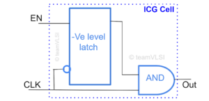
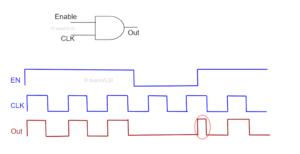

在如今科技飞速发展的时代，低功耗应用场景需求日益增多，尤其是对于手持电子设备。在众多手持产品中，用户都希望能够拥有更长的电池寿命。我们只有确保嵌入设备中的片上系统（SoC）耗电更低，才能够实现这一目标。目前，低功耗设计中采用了多种技术来降低应用特定集成电路（ASIC）的功耗。其中，集成时钟门控（ICG）技术就是广泛应用于低功耗设计的一项重要技术之一。本文将详细介绍ICG电路的架构、功能和布局。

## 为什么使用ICG电路？

使用ICG电路的原因是，芯片功耗中有高达40%甚至更多是由时钟树消耗的。时钟树在系统中的切换频率最高，且包含许多时钟缓冲，它们具有高驱动强度以最小化时钟延迟。同时，即使输入和输出保持不变，接收时钟的触发器也会消耗一定的功耗，特别是动态功耗。为了减少时钟网络的功耗，最直接的方法是在不需要时钟时将其关闭，即利用门控时钟：clock gating。通过在ICG电路中引入低电平时钟使能信号，可以有效减少时钟信号在电路中的传输，这被称为时钟门控。当某个大型逻辑单元不需要被操作时，可以利用ICG电路阻止时钟信号传播至该单元。ICG电路的使用有助于降低动态功耗，因为时钟树对动态功耗的贡献很大，而ICG电路允许在其后停止时钟信号的传播。因此，使用ICG电路是一种有效降低芯片功耗的方法，能够提高芯片性能并延长设备的电池寿命。

## ICG电路的架构：

ICG电路是一种用于控制时钟信号传输的电路，可以有效降低芯片功耗。一种常见的ICG电路设计是基于锁存器和AND门的结构。

在这种设计中，一个锁存器（Latch）用于存储时钟信号，并与一个AND门相连。AND门的另一个输入端连接到一个使能信号（EN）源。当使能信号为高电平时，AND门的输出会受到时钟信号的控制，时钟信号会传播到电路的其他部分。而当使能信号为低电平时，AND门的输出会被关闭，时钟信号就无法传播。

这种基于锁存器和AND门的ICG电路的工作原理如下：当使能信号为高电平时，AND门的输出与锁存器的输入相连，时钟信号能够通过锁存器并传播到电路的下一级。而当使能信号为低电平时，AND门的输出为低电平，即使时钟信号存在，也无法通过锁存器传播，从而实现了对时钟信号的门控。

这种ICG电路设计的好处是，在不需要时钟信号传输时，可以利用使能信号将时钟信号关闭，从而减少了时钟网络的功耗消耗。特别是在大型逻辑单元不需要操作时，通过控制使能信号，可以将时钟信号阻止传播到这些单元，进一步降低了芯片的动态功耗。

  
  <h4>图1 基于锁存器和AND门的ICG电路</h4>

防止毛刺是ICG电路的一个特点。基于锁存器和AND门的ICG电路在这方面表现良好，因此这种时钟门控电路的架构被广泛使用。虽然有多种ICG电路的架构，但本文仅限于讨论该架构。

## ICG电路的功能：

节省功耗：ICG电路主要功能之一是通过控制时钟信号传输，减少芯片功耗。在一个大规模的集成电路中，时钟树消耗的功耗可以达到整体功耗的相当大比例。通过使用ICG电路，当某些逻辑单元不需要操作时，可以阻止时钟信号传播到这些单元，从而减少了时钟树的动态功耗。这种能力使得芯片在工作负载较轻的时候能够更加高效地利用能源，延长电池寿命。

提高性能：ICG电路在某些情况下可以提高芯片的性能。通过对某些逻辑单元进行时钟门控，可以减少不必要的时钟开销和时钟延迟，从而加快数据的传输和处理速度。当逻辑单元不需要被操作时，关闭时钟信号可以避免浪费时钟周期，并提高芯片的工作效率和响应速度。

减少噪音和功耗浪费：ICG电路还可以减少芯片中的时钟噪音和功耗浪费。在某些情况下，时钟信号在不需要的逻辑单元之间传播，可能导致电磁干扰和功耗浪费。通过使用ICG电路，可以有效地控制时钟信号传输，避免噪音干扰和不必要的能量消耗。

  
  <h4>图2 ICG单元的波形</h4>

如上图所示，它提供了无毛刺的时钟门控输出。只有在使能信号高电平时才传递时钟信号，并在使能信号低电平时停止时钟传播。

## 为什么不能使用AND门作为时钟门控？

首先，AND门的输入是逻辑表达式的两个条件同时满足时才会输出高电平。这意味着只有当所有的门控信号同时为高电平时，时钟信号才会传递给逻辑单元。在某些情况下，这可能会导致问题。例如，在某些电路中，可能需要多个条件的组合才能启用逻辑单元。使用AND门作为时钟门控可能无法满足这种需求，因为它仅在所有条件同时满足时才会传递时钟信号。

其次，AND门的使用可能限制了设计的灵活性。在实际设计中，可能需要在不同的时钟门控条件下独立地控制逻辑单元的操作。使用单个AND门的设计往往需要将所有的条件放在一起，可能会导致逻辑复杂化并增加维护难度。另外，如果在未来方案中需要更改门控条件，那么可能需要重新设计电路，增加了开发成本和工作量。

AND门作为时钟门控存在问题，它无法提供无毛刺的输出，而无毛刺的时钟波是非常理想的。

  
  <h4>图3 AND门作为时钟门控</h4>

如果在时钟信号低电平时时钟使能信号发生变化，对门控时钟没有影响。但如果在时钟信号高电平时时钟使能信号发生变化，门控时钟将出现毛刺。为了抑制这种毛刺，更倾向于使用基于锁存器和AND门的ICG电路。

## 参考：

[1] https://teamvlsi.com/2021/08/integrated-clock-gating-icg-cell-in-vlsi.html
[2] https://blog.csdn.net/weixin_50518899/article/details/136280198