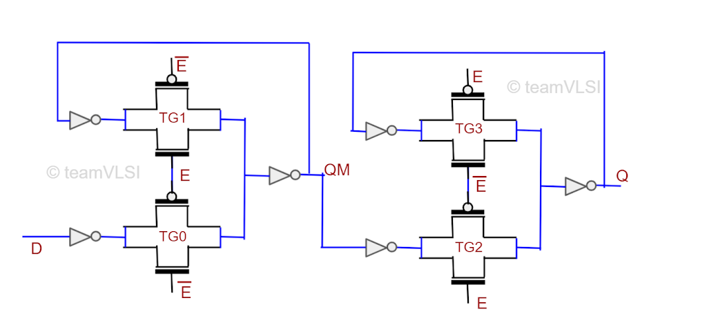
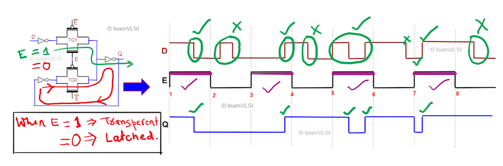
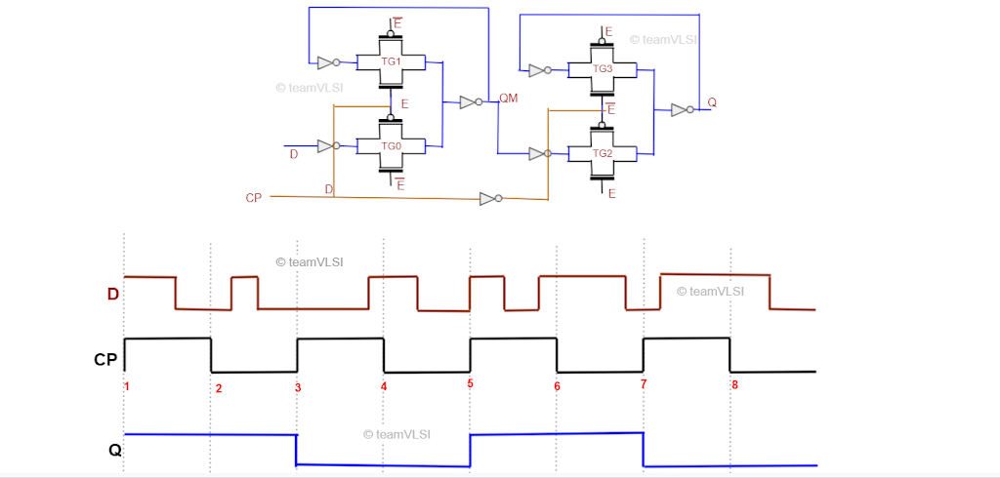

Flip-flop是任何ASIC设计中最常用的时序元件，尤其是D型触发器。在D触发器中，D代表延迟，意味着输出是输入D的延迟版本。而Latch是最简单和基本的时序元件。一般来说，需要使用两个Latch来制作一个Flip-flop。Flip-flop对时钟沿沿河敏感，而Latch对时钟电平敏感。接下来的部分将解释Flip-flop和Latch的内部结构和操作。在本文中，我们将仅讨论ASIC设计中最常见的D型Flip-flop和D型Latch。可优先查看链接[2]视频合集。

## Latch和Flip-flop的原理图

最简单的设计Latch和Flip-flop都有3个引脚，一个输入数据引脚（D），一个输入时钟/使能引脚（CP/E），一个输出引脚（Q）。还可能有设置和复位引脚，但为简单起见，我们在讨论中不包括这些内容。Latch和Flip-flop的符号表示如图1所示。

  
  <h4>图1 Latch和Flip-flop的符号表示</h4>

在图1中，显示了正电平敏感的D-Latch的符号和正边缘触发的D Flip-flop的符号。在负Latch和Flip-flop中，E/CP引脚之前只出现一个点。从高层面上看，我们可以将Latch和Flip-flop视为2:1多路复用器。可以使用2:1多路复用器实现Latch，而要实现Flip-flop，则需要两个多路复用器。图2显示了正电平敏感的D-Latch和正边沿触发Flip-flop的架构，以多路复用器的形式表示。

  
  <h4>图2 使用多路复用器的正D-Latch和Flip-flop</h4>

在正电平敏感Latch中，输出馈入到多路复用器的I0输入，如图2所示。同样，在负电平敏感的D-Latch中，输出Q馈送回输入I1。正边沿触发的D触发器由两个负电平敏感的D-Latch背靠背连接而成。在负D触发器的情况下，需要两个正电平敏感的D-Latch。如果我们深入多路复用器并进入晶体管级别，我们会发现正电平敏感的D-Latch和正边沿触发的D Flip-flops的晶体管级原理图，如图3所示。

  
  <h4>图3.a 使用传输门的正电平敏感D-Latch</h4>

  
  <h4>图3.b 使用传输门的正边缘触发D Flip-flop</h4>

2:1多路复用器由两个传输门组成，传输门使用一对pMOS和nMOS晶体管制成，如上图所示。Latch具有两个传输门，其中一个传输门的输入连接到输出。Flip-flop由两个Latch（即四个传输门）背靠背连接而成，如图3所示。从上图可以看出，与Latch相比，Flip-flop具有更多的晶体管（双倍），因此Flip-flop的面积是Latch的两倍。理解Latch和Flip-flop的工作方式是最重要的部分，将在下一节中讨论。

## D-Latch的工作原理
这里只讨论正电平敏感D-Latch的工作原理，并借助输入和输出波形进行说明。Flip-flop的工作原理将在下一节中讨论。

  
  <h4>图4 Latch的输入-输出波形</h4>

D-Latch中使用了两个传输门。在正电平敏感D-Latch的情况下，输出反馈到TGO传输门的输入。传输门由一个nMOS和一个pMOS组成，如上图所示，并由实际上是时钟信号的使能信号E控制。当使能信号高时，TG1的nMOS和pMOS处于导通状态，同时，TG0的两个晶体管都处于断态，反之亦然。当使能信号高时，从引脚D到引脚Q建立了直接路径，这被称为Latch处于透明状态。但是当使能信号变低时，TG1门处于断态，建立了从Q到TG0输入的反馈环路，确保在输入引脚D发生变化时输出Q不发生变化，这称为Latch状态。图5显示了Latch何时处于透明状态以及何时处于锁存状态的工作原理。

  
  <h4>图5 正电平敏感D-Latch的工作原理</h4>

正电平敏感D-Latch的工作原理很简单，在其使能信号E高时，它将输入D传递到Q，当使能信号低时，它将保持输出Q不变。如图5所示，只有在输入发生变化且使能信号为高时，输出才会变化。

## D Flip-flop的工作原理

在正边沿触发的D Flip-flop中，有两个负电平敏感的D-Latch背靠背连接，第二个Latch的使能信号与第一个Latch相比是反转的。第二个Latch的反转使能信号确保两个Latch永远不会同时处于透明状态或锁存状态。为了更好地理解，图6展示了典型的输入输出波形。

  
  <h4>图6 正D Flip-flop的输入输出波形</h4>

假设时钟信号低时，第一个Latch处于透明状态，输入D传输到QM点。但与此同时，由于获得反转时钟信号，第二个Latch将处于锁存状态，因此输出Q将与QM锁存。在这段时间内，输出Q不会发生变化。

下一个瞬间，当时钟信号从低电平过渡到高电平时，第一个Latch会从透明模式转换为锁存模式，第二个Latch会从锁存模式转换为透明模式。因此，在时钟从低电平过渡到高电平时，先前在QM处采样的信号将传输到输出Q。

下一个瞬间，当时钟信号为高时，不再传输输入信号D，以前在QM处采样的信号将可在输出Q处获得。

当时钟信号从高电平过渡到低电平时，第一个Latch将从锁存模式转换为透明模式，第二个Latch将从透明模式转换为锁存模式。因此，在时钟过渡边沿处，输出不会发生变化。

正D Flip-flop的工作可以总结为，在上升时钟边沿时输出才会发生变化，此时输入D会传输到输出Q，而在其他时刻输出保持不变。因此，与Latch相比，它更容易避免毛刺，但在面积上更大，更容易受到工艺变化的影响。请观看此播放列表以获取详细操作和比较。

## 链接：

[1] https://teamvlsi.com/2021/08/flip-flop-and-latch-internal-structures-and-functions.html
[2] https://www.bilibili.com/video/BV1oL411D77D/?spm_id_from=333.337.search-card.all.click&vd_source=2ac617c241afd7f9774b0add4e647179